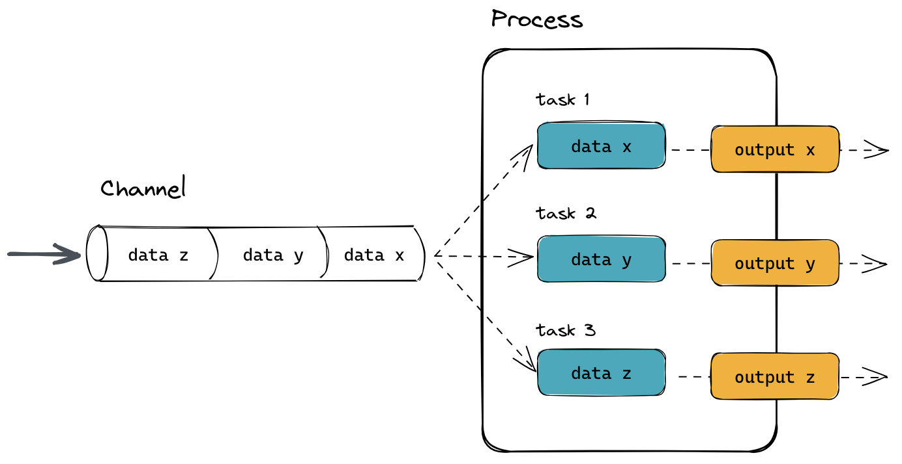
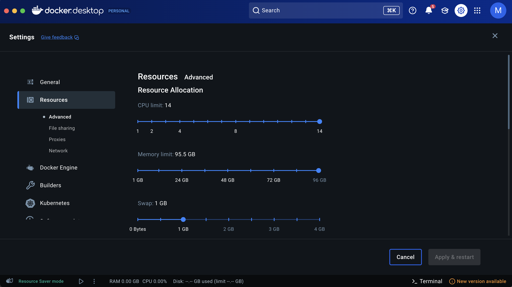
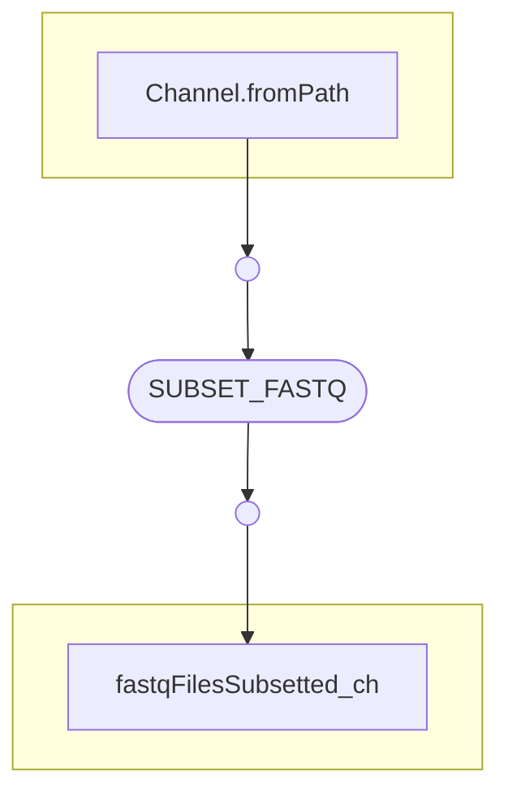
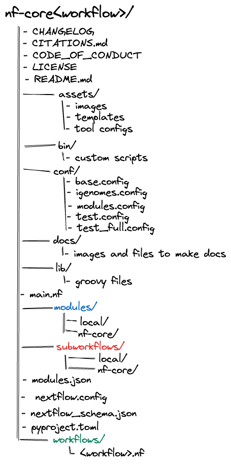
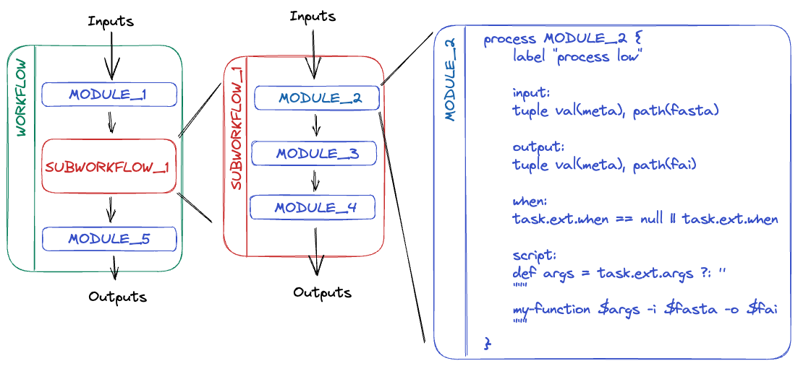

# Nextflow Notes

Some tips / things of notes for myself while I'm learning Nextflow

## What is Nextflow?

Nextflow is a framework used for writing parallel and distributed computational pipelines, common in bioinformatics, genomics, and other fields where complex data analysis pipelines are common. It simplifies the process of creating complex workflows that involve processing large volumes of data.

Nextflow pipelines are partitioned into channels, processes, and workflows. Channels represent data streams, processes perform computations on that data, and workflows orchestrate the execution of processes and manage the flow of data through the pipeline.



The central tenant of Nextflow is generating pipelines with 100% reproducibility. Most bioinformatic studies use multiple softwares and languages all with different versions. This makes reproducibility very difficult as you have to go back and figure out what softwares, versions and what dependancies were used. Worst off different softwares might not work on certain machines or even can work differently depending on what machine you are running the analysis on, resulting in different statistical calculations and outputs from the same input data (see https://doi.org/10.1038/nbt.3820 for more information). With Nextflow, if you use it correctly and follow all the best practices, your data analysis pipelines should be fully reproducible regardless of when or where it is run.

## Running Nextflow

Nextflow pipelines need to be written into files with the `.nf` extension.

Example, create a file called `main.nf` and provide it the following code:

```nextflow
#!/usr/bin/env nextflow

process FASTQC {
    input:
    path input

    output:
    path "*_fastqc.{zip, html}"

    script:
    """
    fastqc -q $input
    """
}

workflow {
    Channel.fromPath("*.fastq.gz") | FASTQC
}
```

> [!NOTE]
> The shebang (`#!/usr/bin/env nextflow`) is a line that helps the operating system decide what program should be used to interpret this script code. If you always use Nextflow to call this script, _this line is optional_.

Nextflow can then run by using the following command

```bash
nextflow run main.nf
```

Only run it like this the first time. If you run it again it will begin running the entire workflow over again. It's better to not rerun processes that don't need to be rerun to save a lot of time.

When you run a Nextflow pipeline, you will get an output like this in your terminal

```
N E X T F L O W  ~  version 23.10.0
Launching `main.nf` [focused_noether] DSL2 - revision: 197a0e289a
executor >  local (3)
[18/f6351b] process > SPLITLETTERS (1)   [100%] 1 of 1 ✔
[2f/007bc5] process > CONVERTTOUPPER (1) [100%] 2 of 2 ✔
WORLD!
HELLO
```

This is what this all means

```
N E X T F L O W  ~

# THE VERSION OF NEXTFLOW THAT WAS USED FOR THIS RUN SPECIFICALLY
version 23.10.0

# THE NAME OF THE SCRIPT FILE THAT WAS RUN WITH NEXTFLOW
Launching `main.nf`

# A GENERATED MNEMONIC WHICH IS AN RANDOM OBJECTIVE AND A RANDOM SURNAME OF A FAMOUS SCIENTIST
[focused_noether]

# THE VERSION OF THE NEXTFLOW LANGUAGE
DSL2

# THE REVISION HASH, WHICH IS LIKE AN ID OF YOUR PIPELINE.
# IF YOU CHANGE THE NEXTFLOW SCRIPT CODE, THIS REVISION ID WILL CHANGE
- revision: 197a0e289a

# THE EXECUTOR FOR THE PIPELINE
executor >  local

# NEXTFLOW'S GUESS AT HOW MANY TASKS THAT WILL OCCUR IN YOUR PIPELINE
(3)

# A LIST OF PROCESSES AND TASKS
[18/f6351b] process > SPLITLETTERS (1)   [100%] 1 of 1 ✔
[2f/007bc5] process > CONVERTTOUPPER (1) [100%] 2 of 2 ✔

## EVERY TASK WILL HAVE A UNIQUE HASH
## EVERY TASK IS ISOLATED FROM EACH OTHER
## THESE HASHES CORRESPOND TO DIRECTORY NAMES WHERE YOU CAN GO AND VIEW INFORMATION ABOUT THAT SPECIFIC TASK
[18/f6351b]
[2f/007bc5] # BY DEFAULT NEXTFLOW SHOWS THE HASH OF 1 TASK PER PROCESS.

# THE WORKFLOW OUTPUTS
WORLD!
HELLO
```

### Rerunning Nextflow

When using the `-resume` flag, successfully completed tasks are skipped and the previously cached results are used in downstream tasks.

```bash
nextflow run main.nf -resume
```

In practice, every execution starts from the beginning. However, when using resume, before launching a task, Nextflow uses the unique ID to check if:

- the working directory exists
- it contains a valid command exit status
- it contains the expected output files.

The mechanism works by assigning a unique ID to each task. This unique ID is used to create a separate execution directory, called the working directory, where the tasks are executed and the results stored. A task’s unique ID is generated as a 128-bit hash number obtained from a composition of the task’s:

- Inputs values
- Input files
- Command line string
- Container ID
- Conda environment
- Environment modules
- Any executed scripts in the bin directory

## Nextflow overall structure

An basic, overall professional Nextflow pipeline structure should look like this:

```
.
├── main.nf
├── modules
│   ├── local
│   └── nf-core
├── subworkflows
│   ├── local
│   └── nf-core
└── workflows
    ├── illumina.nf
    ├── nanopore.nf
    └── sra_download.nf
```

Terminology:
- Module:
    - An atomic process
        - e.g. a module containing a single tool such as FastQC
- Subworkflow:
    - A chain of multiple modules with a higher-level of functionality
        - e.g. a subworkflow to run multiple QC tools on FastQ files
- Workflows:
    - An end-to-end pipeline
    - DSL1: A large monolithic script
    - DSL2: A combination of individual modules and subworkflows
        - e.g. a pipeline to produce a series of final outputs from one or more inputs.
- `main.nf`: 
    - The entry point for Nextflow 
    - Where all the workflows will be called from 

> [!NOTE] 
> DSL1 and DSL2 refer to two versions of the Nextflow Domain Specific Language (DSL).

## Configuring Nextflow

The first thing that Nextflow looks for when a workflow is run is configuration files in multiple locations. Since each configuration file can contain conflicting settings, the sources are ranked to determine which settings are applied. Possible configuration sources, in order of priority:

1. Parameters specified on the command line (`--something value`)

2. Parameters provided using the `-params-file` option

3. Config file specified using the `-c my_config` option

4. The config file named `nextflow.config` in the current directory

5. The config file named `nextflow.config` in the workflow project directory

6. The config file `$HOME/.nextflow/config`

7. Values defined within the pipeline script itself (e.g. `main.nf`)

> [!NOTE] 
> Precedence is in order of 'distance'. A handy guide to understand configuration precedence is in order of **'distance from the command-line invocation'**. Parameters specified directly on the CLI `--example foo` are "closer" to the run than configuration specified in the remote repository.

When more than one of these options for specifying configurations are used, they are merged, so that the settings in the first override the same settings appearing in the second, and so on.

This is an example of a Nextflow configuration in a file called `nextflow.config`

```nextflow
propertyOne = 'world'
propertyTwo = "Hello $propertyOne"
customPath = "$PATH:/my/app/folder"
```

> [!NOTE]
> The quotes act like they do in bash. Variables inside single quotes remain literal. Variables inside double quotes get expanded (including environment variables)

### Config scopes

Configuration settings can be organized in different scopes by dot prefixing the property names with a scope identifier, or grouping the properties in the same scope using the curly brackets notation. For example:

```nextflow
alpha.x = 1
alpha.y = 'string value..'

beta {
     p = 2
     q = 'another string ..'
}
```

### Config params

The scope `params` allows the definition of workflow parameters that override the values defined in the main workflow script.

This is useful to consolidate one or more execution parameters in a separate file.

`nextflow.config`

```nextflow
params.foo = 'Bonjour'
params.bar = 'le monde!'
```

`snippet.nf`

```nextflow
params.foo = 'Hello'
params.bar = 'world!'

// print both params
println "$params.foo $params.bar"
```

Any variables that are set using `params.` can be modified through the command line when executing Nextflow using two dashes (`--`)

E.g.

```bash
nextflow run snippet.nf -resume --foo "Bye"
```

> [!NOTE]
> In Nextflow, single dashes (`-`) in command line arguments refer to Nextflow commands (e.g. `-resume`), while double dashes (`--`) refer to workflow parameters

> [!NOTE] 
> Values assigned to a the config params `params.` will be treated as _value channels_ (see more information below on value channels)

### Config env

The `env` scope allows the definition of one or more variables that will be exported into the environment where the workflow tasks will be executed.

```nextflow
env.NCBI_SETTINGS = params.settings_file
```

### Config process scopes and process directives

Process directives allow the specification of settings for the task execution such as `cpus`, `memory`, `container`, and other resources in the workflow script.

This is useful when prototyping a small workflow script.

However, it’s always a good practice to decouple the workflow execution logic from the process configuration settings, i.e. **_it’s strongly suggested to define the process settings in the workflow configuration file instead of the workflow script_**.

The process configuration scope allows the setting of any process directives in the Nextflow configuration file:

`nextflow.config`

```nextflow
process {
    cpus = 10
    memory = 8.GB
    container = 'biocontainers/bamtools:v2.4.0_cv3'
}
```

The above config snippet defines the cpus, memory and container directives for all processes in your workflow script. Depending on your executor these things may behave differently.

### Process selectors

The `withLabel` selectors allow the configuration of all processes annotated with a label directive as shown below:

```nextflow
process {
    withLabel: big_mem {
        cpus = 16
        memory = 64.GB
        queue = 'long'
    }
}
```

The above configuration example assigns 16 cpus, 64 Gb of memory and the long queue to all processes annotated with the `big_mem` label.

Labels can be added using the `label` directive

e.g.

````nextflow
process bigTask {
    label 'big_mem'

    ```
    <task script>
    ```
}
````

In the same manner, the `withName` selector allows the configuration of a specific process in your pipeline by its name. For example:

```nextflow
process {
    withName: hello {
        cpus = 4
        memory = 8.GB
        queue = 'short'
    }
}
```

A process selector can also be negated prefixing it with the special character `!`. For example:

```nextflow
process {
    withLabel: 'foo' { cpus = 2 }
    withLabel: '!foo' { cpus = 4 }
    withName: '!align.*' { queue = 'long' }
}
```

The above configuration snippet sets 2 cpus for the processes annotated with the `foo` label and 4 cpus to all processes not annotated with that label. Finally it sets the use of `long` queue to all process whose name does not start with `align`.

### Selector expressions

Both label and process name selectors allow the use of a regular expression in order to apply the same configuration to all processes matching the specified pattern condition. 

For example:

```nextflow
process {
    withLabel: 'foo|bar' {
        cpus = 2
        memory = 4.GB
    }
}
```

The above configuration snippet sets 2 cpus and 4 GB of memory to the processes annotated with a label `foo` and `bar`.

A process selector can be negated prefixing it with the special character `!`. 

For example:

```nextflow
process {
    withLabel: 'foo' { cpus = 2 }
    withLabel: '!foo' { cpus = 4 }
    withName: '!align.*' { queue = 'long' }
}
```

The above configuration snippet sets 2 cpus for the processes annotated with the `foo` label and 4 cpus to all processes not annotated with that label. Finally it sets the use of `long` queue to all process whose name does _not_ start with `align`.

### Config Conda execution

If you already have a conda environment in your machine that you want to use for your processes, you can use

`nextflow.config`

```
process.conda = "/home/ubuntu/miniconda2/envs/nf-tutorial"
```

You can specify the path of an existing Conda environment as either directory or the path of Conda environment YAML file.

## Creating a configuration file

When a workflow script is launched, Nextflow looks for a file named `nextflow.config` in the current directory and in the script base directory (if it is not the same as the current directory). Finally, it checks for the file: `$HOME/.nextflow/config`.

When more than one of the above files exists, they are merged, so that the settings in the first override the same settings that may appear in the second, and so on.

The default config file search mechanism can be extended by providing an extra configuration file by using the command line option: `-c <config file>`.

Information on writing these config files can be found here https://training.nextflow.io/basic_training/config/.

### Configuring a SLURM script for each process

If you add the following code to the `nextflow.config` file

```nextflow
process.executor = 'slurm'
```

Then Nextflow will write the SLURM job script for every file for you. Nextflow will manage each process as a separate job that is submitted to the cluster using the `sbatch` command.

More information on how to configure this further can be found here https://www.nextflow.io/docs/latest/executor.html#slurm

### Running Nextflow workflows on SLURM / HPC's

When running Nextflow on a HPC, it's recommended to run it as a job on a compute node. This is because a lot of computing clusters have strict rules on running processes on login nodes. Therefore, it's always advisable to create jobscripts like this for all your Nextflow jobs.

`launch_nf.sh`

```bash
#!/bin/bash
#SBATCH --partition WORK
#SBATCH --mem 5G
#SBATCH -c 1
#SBATCH -t 12:00:00

WORKFLOW=$1
CONFIG=$2

# Use a conda environment where you have installed Nextflow
# (may not be needed if you have installed it in a different way)
conda activate Nextflow

nextflow -C ${CONFIG} run ${WORKFLOW}
```

and launch the workflow using

```bash
sbatch launch_nf.sh /home/my_user/path/my_workflow.nf /home/my_user/path/my_config_file.conf
```

## Advanced Configuration

The following information about configuration is taken from the [Nextflow advanced training](https://training.nextflow.io/advanced/configuration).

### System-wide configuration - `$HOME/.nextflow/config`

There may be some configuration values that you will want applied on all runs for a given system. These configuration values should be written to `~/.nextflow/config`.

For example - you may have an account on a HPC system and you know that you will always want to submit jobs using the SLURM scheduler when using that machine and always use the Singularity container engine. In this case, your `~/.nextflow/config` file may include:

```nextflow
process.executor = 'slurm'
singularity.enable = true
```

**These configuration values would be inherited by every run on that system without you needing to remember to specify them each time.**

### Overriding for a run - `$PWD/nextflow.config`

#### **Overriding Process Directives**

Process directives (listed here) can be overridden using the `process` block.

For example, if we wanted to specify that all tasks for a given run should use 2 cpus. In the `nextflow.config` file in the current working directory add:

```nextflow
process {
    cpus = 2
}
```

... and then run:

```bash
nextflow run rnaseq-nf
```

We can make the configuration more specific by using [process selectors](https://www.nextflow.io/docs/latest/config.html#process-selectors).

We can use process names and/or labels to apply process-level directives to specific tasks:

```nextflow
process {
    withName: 'RNASEQ:INDEX' {
        cpus = 2
    }
}
```

Glob pattern matching can also be used:

```nextflow
process {
    withLabel: '.*:INDEX' {
        cpus = 2
    }
}
```

This will run _any_ task that ends with `:INDEX` to run with 2 cpus.

Just to make sure the globbing is working, you can also configure your processes to have a `tag` directive. The process tag is the value that's printed out in parentheses after the process name.

For example, when run the Nextflow pipeline with the above configuration will output this

```
N E X T F L O W  ~  version 23.04.3
Launching `https://github.com/nextflow-io/rnaseq-nf` [fabulous_bartik] DSL2 - revision: d910312506 [master]
 R N A S E Q - N F   P I P E L I N E
 ===================================
 transcriptome: /home/gitpod/.nextflow/assets/nextflow-io/rnaseq-nf/data/ggal/ggal_1_48850000_49020000.Ggal71.500bpflank.fa
 reads        : /home/gitpod/.nextflow/assets/nextflow-io/rnaseq-nf/data/ggal/ggal_gut_{1,2}.fq
 outdir       : results

executor >  local (4)
[1d/3c5cfc] process > RNASEQ:INDEX (ggal_1_48850000_49020000) [100%] 1 of 1 ✔
[38/a6b717] process > RNASEQ:FASTQC (FASTQC on ggal_gut)      [100%] 1 of 1 ✔
[39/5f1cc4] process > RNASEQ:QUANT (ggal_gut)                 [100%] 1 of 1 ✔
[f4/351d02] process > MULTIQC                                 [100%] 1 of 1 ✔

Done! Open the following report in your browser --> results/multiqc_report.html
```

If you modify the `nextflow.config` to look like this:

```nextflow
process {
    withLabel: '.*:INDEX' {
        cpus = 2
        tag = "Example debug"
    }
}
```

The output will then turn into this, showing that only the processes with `:INDEX` will be affected.

```
N E X T F L O W  ~  version 23.04.3
Launching `https://github.com/nextflow-io/rnaseq-nf` [fabulous_bartik] DSL2 - revision: d910312506 [master]
 R N A S E Q - N F   P I P E L I N E
 ===================================
 transcriptome: /home/gitpod/.nextflow/assets/nextflow-io/rnaseq-nf/data/ggal/ggal_1_48850000_49020000.Ggal71.500bpflank.fa
 reads        : /home/gitpod/.nextflow/assets/nextflow-io/rnaseq-nf/data/ggal/ggal_gut_{1,2}.fq
 outdir       : results

executor >  local (4)
[1d/3c5cfc] process > RNASEQ:INDEX (Example debug)            [100%] 1 of 1 ✔
[38/a6b717] process > RNASEQ:FASTQC (FASTQC on ggal_gut)      [100%] 1 of 1 ✔
[39/5f1cc4] process > RNASEQ:QUANT (ggal_gut)                 [100%] 1 of 1 ✔
[f4/351d02] process > MULTIQC                                 [100%] 1 of 1 ✔

Done! Open the following report in your browser --> results/multiqc_report.html
```

#### **Dynamic Directives**

We can specify dynamic directives using _closures_ that are computed as the task is submitted. This allows us to (for example) scale the number of CPUs used by a task by the number of input files. This is one of the benefits of Nextflow, which is that because it is such a dynamic paradigm, there are elements of the task that can be calculated as the task is being executed, rather than before when the run begins.

Give the `FASTQC` process in the [`rnaseq-nf` workflow](https://github.com/nextflow-io/rnaseq-nf)

```nextflow
process FASTQC {
    tag "FASTQC on $sample_id"
    conda 'fastqc=0.12.1'
    publishDir params.outdir, mode:'copy'

    input:
    tuple val(sample_id), path(reads)

    output:
    path "fastqc_${sample_id}_logs"

    script:
    """
    fastqc.sh "$sample_id" "$reads"
    """
}
```

We might choose to scale the number of CPUs for the process by the number of files in `reads`:

```nextflow
process {
    withName: 'FASTQC' {
        cpus = { reads.size() }
    }
}
```

Remember, dynamic directives are supplied a closure, in this case `{ reads.size() }`. This is telling Nextflow "I want to defer evaluation of this. I'm just supplying a closure that will be evaluated later" (Think like callback functions in JavaScript).

We can even use the size of the input files. Here we simply sum together the file sizes (in bytes) and use it in the `tag` block:

```nextflow
process {
    withName: 'FASTQC' {
        cpus = { reads.size() }
        tag = {
            total_bytes = reads*.size().sum()
            "Total size: ${total_bytes as MemoryUnit}"
        }
    }
}
```

> [!NOTE] 
> `MemoryUnit` is a Nextflow built-in class for turning strings and integers into human-readable memory units.

When we run this:

```
N E X T F L O W  ~  version 23.04.3
Launching `https://github.com/nextflow-io/rnaseq-nf` [fabulous_bartik] DSL2 - revision: d910312506 [master]
 R N A S E Q - N F   P I P E L I N E
 ===================================
 transcriptome: /home/gitpod/.nextflow/assets/nextflow-io/rnaseq-nf/data/ggal/ggal_1_48850000_49020000.Ggal71.500bpflank.fa
 reads        : /home/gitpod/.nextflow/assets/nextflow-io/rnaseq-nf/data/ggal/ggal_gut_{1,2}.fq
 outdir       : results

executor >  local (4)
[1d/3c5cfc] process > RNASEQ:INDEX (ggal_1_48850000_49020000) [100%] 1 of 1 ✔
[38/a6b717] process > RNASEQ:FASTQC (Total size: 1.3 MB)      [100%] 1 of 1 ✔
[39/5f1cc4] process > RNASEQ:QUANT (ggal_gut)                 [100%] 1 of 1 ✔
[f4/351d02] process > MULTIQC                                 [100%] 1 of 1 ✔

Done! Open the following report in your browser --> results/multiqc_report.html
```

> [!NOTE] 
> Dynamic directives need to be supplied as closures encases in _curly braces_.

#### **Retry Strategies**

Nextflow gives you the option of resubmitting a task if a task fails. This is really useful if you're working with a flakey program or dealing with network I/O.

The most common use for dynamic process directives is to enable tasks that fail due to insufficient memory to be resubmitted for a second attempt with more memory.

To enable this, two directives are needed:

- `maxRetries`
- `errorStrategy`

The `errorStrategy` directive determines what action Nextflow should take in the event of a task failure (**a non-zero exit code**). The available options are:

- `terminate`: (**_default_**) Nextflow terminates the execution as soon as an error condition is reported. Pending jobs are killed
- `finish`: Initiates an orderly pipeline shutdown when an error condition is raised, waiting the completion of any submitted job.
- `ignore`: Ignores processes execution errors. (_dangerous_)
- `retry`: Re-submit for execution a process returning an error condition.

If the `errorStrategy` is `retry`, then it will retry up to the value of `maxRetries` times.

If using a closure to specify a directive in configuration, you have access to the `task` variable, which includes the `task.attempt` value - an integer specifying how many times the task has been retried. We can use this to dynamically set values such as `memory` and `cpus`

```nextflow
process {
    withName: 'RNASEQ:QUANT' {
        errorStrategy = 'retry'
        maxRetries = 3
        memory = { 2.GB * task.attempt }
        time = { 1.hour * task.attempt }
    }
}
```

> [!NOTE] 
> Be aware of the differences between configuration and process syntax differences.

- When defining values inside configuration, an equals sign `=` is **required** as shown above.
- When specifying process directives inside the process (in a `.nf` file), no `=` is required:

```nextflow
process MULTIQC {
    cpus 2
    // ...
```

`maxErrors` can also be specified, although this is usally set to `-1` to turn it off. The `maxRetries` directive allows you to define the maximum number of times the exact same subjob can be re-submitted in case of failure and the `maxErrors` directive allows you to specify the maximum number of times a process (across all subjobs of that process executed) can fail when using the retry error strategy. See [this github issue](https://github.com/nextflow-io/nextflow/issues/179) and this post(https://academy.dnanexus.com/buildingworkflows/nf/errorstrategies) for more of an explanation.

#### Resource Limits

In addition to the executor, you may find that pipeline runs occasionally fail due to a particular step of the pipeline requesting more resources than you have on your system.

To avoid these failures, you can tell Nextflow to set a cap pipeline-step resource requests against a list called `resourceLimits` specified in Nextflow config file. These should represent the maximum possible resources of a machine or node.

For example, you can place into a file the following:

```groovy
process {
  resourceLimits = [
    cpus: 32,
    memory: 256.GB,
    time: 24.h
  ]
}
```

Then, during a pipeline run, if, for example, a job exceeds the default memory request, it will be retried, increasing the memory each time until either the job completes or until it reaches a request of `256.GB`.

Therefore, these parameters only act as a _cap_ to prevent Nextflow from submitting a single job requesting resources more than what is possible on your system and requests getting out of hand.

Note that specifying these will **not _increase_** the resources available to the pipeline tasks!  

The base config of nf-core pipelines defines the default resources allocated to each different step in the workflow (e.g. in a base.config file).

These values are deliberately generous due to the wide variety of workloads done by different users. As a result, you may find that the jobs are given more resources than they need and your system is not used as efficiently as possible. At the other end of the scale, you may want to increase the resources given to a specific task to make it run as fast as possible. You may wish to do this if you get a pipeline reporting a step failing with an Command exit status of e.g., 137.

Where possible we try to get tools to make use of the resources available, for example with a tool parameter like -p ${task.cpus}, where ${task.cpus} is dynamically set according to what has been made specified in the pipeline configuration files. However, this is not possible with all tools, in which case we try to make a best guess.

To tune workflow resources to better match your requirements, we can tweak these through [custom configuration files](https://nf-co.re/docs/usage/getting_started/configuration#custom-configuration-files) or [shared nf-core/configs](https://nf-co.re/docs/usage/getting_started/configuration#shared-nf-coreconfigs).

By default, most process resources are specified using process _labels_, as in the following example base config:

```groovy
process {
  resourceLimits = [
    cpus: 32,
    memory: 256.GB,
    time: 24.h
  ]
  withLabel:process_low {
    cpus   = { 2 * task.attempt }
    memory = { 14.GB * task.attempt }
    time   = { 6.h  * task.attempt }
  }
  withLabel:process_medium {
    cpus   = { 6  * task.attempt }
    memory = { 42.GB * task.attempt }
    time   = { 8.h * task.attempt }
  }
  withLabel:process_high {
    cpus   = { 12 * task.attempt }
    memory = { 84.GB * task.attempt }
    time   = { 10.h * task.attempt }
  }
}
```

The `resourceLimits` list sets the absolute maximums any pipeline job can request (typically corresponding to the maximum available resources on your machine). The label blocks indicate the initial ‘default’ resources a pipeline job will request. For most nf-core pipelines, if a job runs out of memory, it will retry the job but increase the amount of resource requested up to the `resourceLimits` maximum.

You don’t need to copy all of the labels into your own custom config file, only overwrite the things you wish to change

##### How do you figure out what your resource limits are

If you need to figure out what the resource limits are on the device you are trying to configure a Nextfow pipeline for, the most useful commands I've found are:

```bash
sysctl -n hw.ncpu
# This will give you the resource limits for 'cpus' on your machine

echo "$(sysctl -n hw.memsize) / 1024 / 1024 / 1024" | bc
# This will give you the resource limits for 'memory' on your machine
```

##### Old syntax

On old pipelines, you may encounter the following syntax:

```groovy
// Max resource options
    max_memory                 = '80.GB' 
    max_cpus                   = 14 
    max_time                   = '240.h'
```

These will not act as a cap, instead if a nextflow process requests resources over this limit, the process will automatically error.

To prevent this, custom `check_max()` functions were employed:

```groovy
process {
  withLabel:process_low {
    cpus = { check_max( 2 * task.attempt, 'cpus' ) }
    memory = { check_max( 14.GB * task.attempt, 'memory' ) }
    time = { check_max( 6.h * task.attempt, 'time' ) }
  }
  withLabel:process_medium {
    cpus = { check_max( 6 * task.attempt, 'cpus' ) }
    memory = { check_max( 42.GB * task.attempt, 'memory' ) }
    time = { check_max( 8.h * task.attempt, 'time' ) }
  }
  withLabel:process_high {
    cpus = { check_max( 12 * task.attempt, 'cpus' ) }
    memory = { check_max( 84.GB * task.attempt, 'memory' ) }
    time = { check_max( 10.h * task.attempt, 'time' ) }
  }
}

// Function to ensure that resource requirements don't go beyond
// a maximum limit
def check_max(obj, type) {
    if (type == 'memory') {
        try {
            if (obj.compareTo(params.max_memory as nextflow.util.MemoryUnit) == 1)
                return params.max_memory as nextflow.util.MemoryUnit
            else
                return obj
        } catch (all) {
            println "   ### ERROR ###   Max memory '${params.max_memory}' is not valid! Using default value: $obj"
            return obj
        }
    } else if (type == 'time') {
        try {
            if (obj.compareTo(params.max_time as nextflow.util.Duration) == 1)
                return params.max_time as nextflow.util.Duration
            else
                return obj
        } catch (all) {
            println "   ### ERROR ###   Max time '${params.max_time}' is not valid! Using default value: $obj"
            return obj
        }
    } else if (type == 'cpus') {
        try {
            return Math.min( obj, params.max_cpus as int )
        } catch (all) {
            println "   ### ERROR ###   Max cpus '${params.max_cpus}' is not valid! Using default value: $obj"
            return obj
        }
    }
}
```

If you want to use `check_max()` in a custom config file, you must copy the function to the end of your config outside of any configuration scopes! It will not be inherited from `base.config`.

##### Dynamic Resource Limits based on file size and setting _minimum_ resource limits

Sometimes it's useful to set a dynamic resource requirments based off file sizes. For example, below is a snipper from one of my modules, `whisperx.nf`:

```nextflow
process WHISPERX {
    tag "${meta.id}"
    label 'process_high'
    publishDir "${params.outdir}", mode: 'copy'

    input:
    tuple val(meta), path(mp3_file)
...
```

Inside the `conf/modules.config` file, I have set the following configuration:

```groovy
memory = { 
    def calculated = mp3_file.size() as nextflow.util.MemoryUnit * 2
    calculated < 256.MB ? 256.MB : calculated
}
```

Do not try and use the following syntax:

```groovy
memory = { Math.max(256.MB, mp3_file.size() as nextflow.util.MemoryUnit * 2) }
```

Because the `Math.max()` function doesn't work directly with `MemoryUnit` objects in Nextflow.

> [!CAUTION]
> Be careful using this method! You may run into strange issues if you provide the container with a small file and thus provide the container with too little resources. For example, recently I provided encountered an issue where I inputted a file that was only `1.Mb` in size, and I got the following error:
>
> ```
> Command exit status:
>   125
> 
> Command output:
>   (empty)
> 
> Command error:
>   docker: Error response from daemon: Minimum memory limit allowed is 6MB
>   
>   Run 'docker run --help' for more information
> ```
>
> So modified the dynamic memory allocation line to say `calculated < 6.MB ? 6.MB : calculated`
>
> This resulted in all my following processes encountering the issue below:
>
> ```
> Command exit status:
>  1
>
> Command output:
>  
>  'micromamba' is running as a subprocess and can't modify the parent shell.
>  Thus you must initialize your shell before using activate and deactivate.
>  
>  To initialize the current bash shell, run:
>      $ eval "$(micromamba shell hook --shell bash)"
>  and then activate or deactivate with:
>      $ micromamba activate
>  To automatically initialize all future (bash) shells, run:
>      $ micromamba shell init --shell bash --root-prefix=~/micromamba
>  If your shell was already initialized, reinitialize your shell with:
>      $ micromamba shell reinit --shell bash
>  Otherwise, this may be an issue. In the meantime you can run commands. See:
>      $ micromamba run --help
>  
>  Supported shells are {bash, zsh, csh, xonsh, cmd.exe, powershell, fish}.
>
> Command error:
>  Unable to find image 'wave.seqera.io/wt/4fdf1a29fbe1/wave/>build:whisperx--731402d60df023ad' locally
>  whisperx--731402d60df023ad: Pulling from wt/4fdf1a29fbe1/wave/build
>  Digest: sha256:41570aabe693908264a9bff9451f36d150939a525a3075134768a66c05599883
>  Status: Downloaded newer image for wave.seqera.io/wt/4fdf1a29fbe1/wave/>build:whisperx--731402d60df023ad
>  critical libmamba Shell not initialized
>  
>  'micromamba' is running as a subprocess and can't modify the parent shell.
>  Thus you must initialize your shell before using activate and deactivate.
>  
>  To initialize the current bash shell, run:
>      $ eval "$(micromamba shell hook --shell bash)"
>  and then activate or deactivate with:
>      $ micromamba activate
>  To automatically initialize all future (bash) shells, run:
>      $ micromamba shell init --shell bash --root-prefix=~/micromamba
>  If your shell was already initialized, reinitialize your shell with:
>      $ micromamba shell reinit --shell bash
>  Otherwise, this may be an issue. In the meantime you can run commands. See:
>      $ micromamba run --help
>  
>  Supported shells are {bash, zsh, csh, xonsh, cmd.exe, powershell, fish}.
> ```
>
> This took me a long time to debug. What happened here? Since the file was smaller then `6.Mb`, the other `6.Mb` of memory was allocated to the container. However, the container typically runs micromamba, which can be around `60.Mb`. `6.Mb` was too little to properly run the processes in the container, and so I started getting error messages from the failing processes within the container. Increasing the fallback mmemory requirment to something higher, in this case `256.Mb` fixed this issue.


##### Tips

## Processes

In Nextflow, a process is the basic computing primitive to execute foreign functions (i.e., custom scripts or tools).

The process definition starts with the keyword process, followed by the process name and finally the process body delimited by curly brackets.

It is a best practice to always name processes in UPPERCASE. This way you can easily see what are process blocks and what are regular functions.

A basic process, only using the script definition block, looks like the following:

```nextflow
process SAYHELLO {
    script:
    """
    echo 'Hello world!'
    """
}
```

However, the process body can contain up to five definition blocks:

1. **Directives** are initial declarations that define optional settings

2. **Input** defines the expected input channel(s)

   - Requires a qualifier

3. **Output** defines the expected output channel(s)

   - Requires a qualifier

4. **When** is an optional clause statement to allow conditional processes

5. **Script** is a string statement that defines the command to be executed by the process' task

The full process syntax is defined as follows:

```nextflow
process < name > {
    [ directives ]

    input:
    < process inputs >

    output:
    < process outputs >

    when:
    < condition >

    [script|shell|exec]:
    """
    < user script to be executed >
    """
}
```

## Task directories

Take a look at the last part of the output when you run a Nextflow pipeline

```
# YOUR PROCESSES AND OUTPUTS
[18/f6351b] process > SPLITLETTERS (1)   [100%] 1 of 1 ✔
[2f/007bc5] process > CONVERTTOUPPER (1) [100%] 2 of 2 ✔
WORLD!
HELLO
```

Breaking down the processes section further this is what each part means

```
# THE HEXADECIMAL HASH FOR THE TASK (ALSO THE TASK DIRECTORY NAME)
[18/f6351b]

# THE NAME OF THE PROCESS USED FOR THE TASK
process > SPLITLETTERS

# I'M NOT SURE WHAT THIS NUMBER MEANS YET. MAYBE THE CURRENT PROCESS?
(1)

# THE PROGRESS OF ALL THE TASKS (OR MAYBE THE CURRENT TASK?)
[100%]

# ENUMERATED PROGRESS OF ALL THE TASKS
1 of 1

# SIGN SHOWING THE TASK RAN SUCCESSFULLY
✔

# THE HEXADECIMAL HASH FOR THE TASK (LAST TASK ONLY IF THERE ARE MORE THAN ONE)
[2f/007bc5]

# THE NAME OF THE PROCESS USED FOR THE TASK
process > CONVERTTOUPPER

# I'M NOT SURE WHAT THIS NUMBER MEANS YET. MAYBE THE CURRENT PROCESS?
(1)

# THE PROGRESS OF ALL THE TASKS (OR MAYBE THE CURRENT TASK?)
[100%]

# ENUMERATED PROGRESS OF ALL THE TASKS
2 of 2

# SIGN SHOWING THE TASK RAN SUCCESSFULLY
✔
```

The hexadecimal numbers, like `18/f6351b`, identify the unique process execution, that is called a task. These numbers are also the prefix of the directories where each task is executed. You can inspect the files produced by changing to the directory `$PWD/work` and using these numbers to find the task-specific execution path (e.g. Go to `$PWD/work/18/f6351b46bb9f65521ea61baaaa9eff` to find all the information on the task performed using the `SPLITLETTERS` process).

> [!NOTE] 
> Inside the work directory for the specific task, you will also find the **_Symbolic links_** used as inputs for the specific task, not copies of the files themselves.

### The ANSI log

If you look at the second process in the above examples, you notice that it runs twice (once for each task), executing in two different work directories for each input file. The ANSI log output from Nextflow dynamically refreshes as the workflow runs; in the previous example the work directory `2f/007bc5` is the second of the two directories that were processed (overwriting the log with the first). To print all the relevant paths to the screen, disable the ANSI log output using the `-ansi-log` flag.

Example

```bash
nextflow run hello.nf -ansi-log false
```

Will output

```
N E X T F L O W  ~  version 23.10.0
Launching `hello.nf` [boring_bhabha] DSL2 - revision: 197a0e289a
[18/f6351b] Submitted process > SPLITLETTERS (1)
[dc/e177f3] Submitted process > CONVERTTOUPPER (1) # NOTICE THE HASH FOR TASK 1 IS VISIBLE NOW
[2f/007bc5] Submitted process > CONVERTTOUPPER (2)
HELLO
WORLD!
```

Now you can find out in which directory everything related to every task performed is stored straight from the console.

> [!NOTE] 
> Even if you don't use the `-ansi-log false` flag, you can still see the hashes/directories all the tasks are stored in using the `.nextflow.log` file. The task directories can be found in the `[Task monitor]` logs.

### Nextflow `.command` files

Every task that is executed by Nextflow will produe a bunch of hidden files in the tasks work directory beginning with `.command`. Below are a list of all of them and what they contain.

#### **The `.command.begin` file**

This file is created whenever the task really started.

Whenever you are debugging a pipeline and you don't know if a task really started or not, you can check for the existence of this file.

#### **The `.command.err` file**

This file contains all the errors that may have occured for this task.

#### **The `.command.log` file**

This file contains the logs created for this task (e.g. with `log.info` or through other methods).

#### **The `.command.out` file**

This file contains anything that was printed to your screen (the standard output).

#### **The `.command.run` file**

This file shows you the jobscript that Nextflow created to run the script (e.g. If you are running your scripts with SLURM, it will show you the SLURM job script Nextflow created and that was subsequently called with `sbatch`).

This script contains all the functions Nextflow needs to make sure your script runs on whatever executor you configured (e.g. locally, in the cloud, on a HPC, with or withouth container, etc.)

You're not really supposed to meddle with this file but sometimes you may want to see what's in it. (E.g. To see what Docker command was used to start the container etc.)

#### **The `.command.sh` file**

This file contains the **final** script that was run for that task.

Example: If this is in the workflow

```nextflow
params.greeting = 'Hello world!'

process SPLITLETTERS {
    input:
    val x

    output:
    path 'chunk_*'

    """
    printf '$x' | split -b 6 - chunk_
    """
}

workflow {
    letters_ch = SPLITLETTERS(greeting_ch)
}
```

The `.command.sh` file for a task run on this process will look like this

```bash
printf 'Hello world!' | split -b 6 - chunk_
```

This is very useful for troubleshooting when things don't work like you'd expect.

## log.info

The `log.info` command can be used to print multiline information using groovy’s logger functionality. Instead of writing a series of `println` commands, it can be used to include a multiline message.

```nextflow
log.info """\
    R N A S E Q - N F   P I P E L I N E
    ===================================
    transcriptome: ${params.transcriptome_file}
    reads        : ${params.reads}
    outdir       : ${params.outdir}
    """
    .stripIndent(true)
```

`log.info` not only prints the ouput of the command to the screen (`stout`), but also prints the results to the log file.

Usually when you write Nextflow scripts you will add indenting so you can better read the code. However when you want to print the code to the screen you often don't want indenting. The `.stripIndent(true)` method removes the indents from the output.

## The `.view` Channel Operator

`.view` is a channel operator that consumes every element of a channel and prints it to the screen.

Example

```nextflow
// main.nf
params.reads = "${baseDir}/data/reads/ENCSR000COQ1_{1,2}.fastq.gz"

workflow {
    reads_ch = Channel.fromFilePairs(params.reads)
    reads_ch.view()
}
```

```bash
nextflow run main.nf
# Outputs
# [ENCSR000COQ1, [path/to/ENCSR000COQ1_1.fastq.gz, path/to/ENCSR000COQ1_2.fastq.gz]]
```

You can see in this case it outputs a single channel element created from the `.fromFilePairs` channel operator.

- The first item is an ID (in this case the replicate ID)
- The second item is a list with all the items (in this case the path to the reads)

In addition to the argument-less usage of `view` as shown above, this operator can also take a closure to customize the stdout message. We can create a closure to print the value of the elements in a channel as well as their type, for example.

```nextflow
def timesN = { multiplier, it -> it * multiplier }
def timesTen = timesN.curry(10)

workflow {
    Channel.of( 1, 2, 3, 4, 5 )
    | map( timesTen )
    | view { "Found '$it' (${it.getClass()})"}
}
```

## Process Inputs

The `input` block allows you to define the input channels of a process, similar to function arguments. A process may have at most one input block, and it must contain at least one input.

The input block follows the syntax shown below:

```nextflow
input:
  <input qualifier> <input name>
```

An input definition consists of a _qualifier_ and a _name_. The input qualifier defines the type of data to be received. This information is used by Nextflow to apply the semantic rules associated with each qualifier, and handle it properly depending on the target execution platform (grid, cloud, etc).

The following input qualifiers are available:

`val`: Access the input value by name in the process script.

`file`: (DEPRECATED) Handle the input value as a file, staging it properly in the execution context.

`path`: Handle the input value as a path, staging the file properly in the execution context.

`env`: Use the input value to set an environment variable in the process script.

`stdin`: Forward the input value to the process stdin special file.

`tuple`: Handle a group of input values having any of the above qualifiers.

`each`: Execute the process for each element in the input collection.

More information on how each of these input qualifiers work can be found here https://www.nextflow.io/docs/latest/process.html#inputs

### Handling multiple inputs

A key feature of processes is the ability to handle inputs from multiple channels. However, it’s important to understand how channel contents and their semantics affect the execution of a process.

Consider the following example:

```nextflow
ch1 = Channel.of(1, 2, 3)
ch2 = Channel.of('a', 'b', 'c')

process FOO {
    debug true

    input:
    val x
    val y

    script:
    """
    echo $x and $y
    """
}

workflow {
    FOO(ch1, ch2)
}
```

Ouputs:

```
1 and a
3 and c
2 and b
```

Both channels emit three values, therefore the process is executed three times, each time with a different pair.

The process waits until there’s a complete input configuration, i.e., it receives an input value from all the channels declared as input.

When this condition is verified, it consumes the input values coming from the respective channels, spawns a task execution, then repeats the same logic until one or more channels have no more content.

This means channel values are consumed serially one after another and the first empty channel causes the process execution to stop, even if there are other values in other channels.

What happens when channels do not have the same cardinality (i.e., they emit a different number of elements)?

```nextflow
ch1 = Channel.of(1, 2, 3)
ch2 = Channel.of('a')

process FOO {
    debug true

    input:
    val x
    val y

    script:
    """
    echo $x and $y
    """
}

workflow {
    FOO(ch1, ch2)
}
```

Outputs:

```
1 and a
```

In the above example, the process is only executed once because the process stops when a channel has no more data to be processed.

However, replacing `ch2` with a value channel will cause the process to be executed three times, each time with the same value of `a`.

For more information see [here](https://training.nextflow.io/basic_training/processes/#combine-input-channels).

### Input repeaters

The `each` qualifier allows you to repeat the execution of a process for each item in a collection every time new data is received.

**_This is a very good way to try multiple parameters for a certain process_**.

Example:

```nextflow
sequences = Channel.fromPath("$baseDir/data/ggal/*_1.fq")
methods = ['regular', 'espresso']

process ALIGNSEQUENCES {
    debug true

    input:
    path seq
    each mode

    script:
    """
    echo t_coffee -in $seq -mode $mode
    """
}

workflow {
    ALIGNSEQUENCES(sequences, methods)
}
```

Outputs:

```
t_coffee -in gut_1.fq -mode regular
t_coffee -in lung_1.fq -mode espresso
t_coffee -in liver_1.fq -mode regular
t_coffee -in gut_1.fq -mode espresso
t_coffee -in lung_1.fq -mode regular
t_coffee -in liver_1.fq -mode espresso
```

In the above example, every time a file of sequences is received as an input by the process, it executes three tasks, each running a different alignment method set as a mode variable. This is useful when you need to repeat the same task for a given set of parameters.

### The double asterisk

A double asterisk (`**`) in a glob pattern works like `*` but also searches through subdirectories. For example, imagine this is your file structure

```
data
├── 2023-11-08_upn22_rep-1_mhmw--100mg
│   └── no_sample
│       └── 20231108_1310_MC-115499_FAX00407_d135d0ec
│           ├── fastq_fail
│           │   ├── FAX00407_fail_d135d0ec_b0bb43ca_0.fastq.gz
│           │   └── FAX00407_fail_d135d0ec_b0bb43ca_1.fastq.gz
│           ├── fastq_pass
│           │   ├── FAX00407_pass_d135d0ec_b0bb43ca_0.fastq.gz
│           │   └── FAX00407_pass_d135d0ec_b0bb43ca_1.fastq.gz
│           ├── other_reports
│           │   ├── pore_scan_data_FAX00407_d135d0ec_b0bb43ca.csv
│           │   └── temperature_adjust_data_FAX00407_d135d0ec_b0bb43ca.csv
│           ├── pod5_fail
│           │   ├── FAX00407_fail_d135d0ec_b0bb43ca_0.pod5
│           │   └── FAX00407_fail_d135d0ec_b0bb43ca_1.pod5
│           └── pod5_pass
│               ├── FAX00407_pass_d135d0ec_b0bb43ca_0.pod5
│               └── FAX00407_pass_d135d0ec_b0bb43ca_1.pod5
├── 2023-11-12_upn22_rep-2_mhmw--recovery-elude-1
│   └── no_sample
│       └── 20231112_1338_MC-115499_FAX00228_b67d08a5
│           ├── fastq_fail
│           │   ├── FAX00228_fail_b67d08a5_dc19481f_0.fastq.gz
│           │   └── FAX00228_fail_b67d08a5_dc19481f_1.fastq.gz
│           ├── fastq_pass
│           │   ├── FAX00228_pass_b67d08a5_dc19481f_0.fastq.gz
│           │   └── FAX00228_pass_b67d08a5_dc19481f_1.fastq.gz
│           ├── final_summary_FAX00228_b67d08a5_dc19481f.txt
│           ├── other_reports
│           │   ├── pore_scan_data_FAX00228_b67d08a5_dc19481f.csv
│           │   └── temperature_adjust_data_FAX00228_b67d08a5_dc19481f.csv
│           ├── pod5_fail
│           │   ├── FAX00228_fail_b67d08a5_dc19481f_0.pod5
│           │   └── FAX00228_fail_b67d08a5_dc19481f_1.pod5
│           ├── pod5_pass
│           │   ├── FAX00228_pass_b67d08a5_dc19481f_0.pod5
│           │   └── FAX00228_pass_b67d08a5_dc19481f_1.pod5
│           └── sequencing_summary_FAX00228_b67d08a5_dc19481f.txt
├── 2023-11-16_upn22_rep-3_mhmw
│   └── no_sample
│       └── 20231116_0945_MC-115499_FAX00393_849b7392
│           ├── barcode_alignment_FAX00393_849b7392_a554d814.tsv
│           ├── fastq_fail
│           │   ├── FAX00393_fail_849b7392_a554d814_0.fastq.gz
│           │   └── FAX00393_fail_849b7392_a554d814_1.fastq.gz
│           ├── fastq_pass
│           │   ├── FAX00393_pass_849b7392_a554d814_0.fastq.gz
│           │   └── FAX00393_pass_849b7392_a554d814_1.fastq.gz
│           ├── final_summary_FAX00393_849b7392_a554d814.txt
│           ├── other_reports
│           │   ├── pore_scan_data_FAX00393_849b7392_a554d814.csv
│           │   └── temperature_adjust_data_FAX00393_849b7392_a554d814.csv
│           ├── pod5_fail
│           │   ├── FAX00393_fail_849b7392_a554d814_0.pod5
│           │   └── FAX00393_fail_849b7392_a554d814_1.pod5
│           ├── pod5_pass
│           │   ├── FAX00393_pass_849b7392_a554d814_0.pod5
│           │   └── FAX00393_pass_849b7392_a554d814_1.pod5
│           ├── pore_activity_FAX00393_849b7392_a554d814.csv
│           ├── report_FAX00393_20231116_0945_849b7392.html
│           ├── report_FAX00393_20231116_0945_849b7392.json
│           ├── report_FAX00393_20231116_0945_849b7392.md
│           ├── sample_sheet_FAX00393_20231116_0945_849b7392.csv
│           ├── sequencing_summary_FAX00393_849b7392_a554d814.txt
│           └── throughput_FAX00393_849b7392_a554d814.csv
└── 2023-10-26_upn22_rep-3_pci
    └── no_sample
        └── 20231026_1515_MC-115499_FAW96674_9d505d15
            ├── barcode_alignment__9d505d15_1f674c3a.tsv
            ├── fastq_fail
            │   ├── FAW96674_fail_9d505d15_1f674c3a_0.fastq.gz
            │   └── FAW96674_fail_9d505d15_1f674c3a_1.fastq.gz
            ├── fastq_pass
            │   ├── FAW96674_pass_9d505d15_1f674c3a_0.fastq.gz
            │   └── FAW96674_pass_9d505d15_1f674c3a_1.fastq.gz
            ├── final_summary_FAW96674_9d505d15_1f674c3a.txt
            ├── other_reports
            │   ├── pore_scan_data_FAW96674_9d505d15_1f674c3a.csv
            │   └── temperature_adjust_data_FAW96674_9d505d15_1f674c3a.csv
            ├── pod5_fail
            │   ├── FAW96674_fail_9d505d15_1f674c3a_0.pod5
            │   └── FAW96674_fail_9d505d15_1f674c3a_1.pod5
            ├── pod5_pass
            │   ├── FAW96674_pass_9d505d15_1f674c3a_0.pod5
            │   └── FAW96674_pass_9d505d15_1f674c3a_1.pod5
            ├── pore_activity__9d505d15_1f674c3a.csv
            ├── report__20231026_1515_9d505d15.html
            ├── report__20231026_1515_9d505d15.json
            ├── report__20231026_1515_9d505d15.md
            ├── sample_sheet__20231026_1515_9d505d15.csv
            ├── sequencing_summary_FAW96674_9d505d15_1f674c3a.txt
            └── throughput__9d505d15_1f674c3a.csv

33 directories, 60 files
```

All the `.fastq.gz` files can be grabbed using the `**` wildcard to search through all the subdirectories to look for the files with the `.fastq` extensions.

```
fastq_ch = Channel.fromPath("data/**/*.fastq.gz").collect()
```

## Process outputs

When you run a program, theres a very high likelihood that many output or intermediate files will be created. what the `output:` syntax specifies is the only file or files (or stdout) that your want to include in your output _channel_ for the next process or processes.

The output declaration block defines the channels used by the process to send out the results produced.

Only one output block, that can contain one or more output declaration, can be defined. The output block follows the syntax shown below:

```nextflow
output:
<output qualifier> <output name>, emit: <output channel>
```

This is very similar to the input block, except it can also have an `emit:` option.

### Outputting files

The `path` qualifier specifies one or more files produced by the process into the specified channel as an output.

If you use single quotes (`'`) around the output name, the name of the file outputted by the program has to match **exactly** to the one in the file path, otherwise it won't be collected in the process output.

Example

```nextflow
process RANDOMNUM {
    output:
    path 'result.txt'

    script:
    """
    echo \$RANDOM > result.txt
    """
}

workflow {
    receiver_ch = RANDOMNUM()
    receiver_ch.view()
}
```

#### **Multiple output files**

When an output file name contains a wildcard character (`*` or `?`) it is interpreted as a [glob](https://docs.oracle.com/javase/tutorial/essential/io/fileOps.html#glob) path matcher. This allows us to _capture_ multiple files into a **list object** and output them as a sole emission.

For example:

```nextflow
process SPLITLETTERS {
    output:
    path 'chunk_*'

    script:
    """
    printf 'Hola' | split -b 1 - chunk_
    """
}

workflow {
    letters = SPLITLETTERS()
    letters.view()
}
```

Ouputs:

```
[/workspace/gitpod/nf-training/work/ca/baf931d379aa7fa37c570617cb06d1/chunk_aa, /workspace/gitpod/nf-training/work/ca/baf931d379aa7fa37c570617cb06d1/chunk_ab, /workspace/gitpod/nf-training/work/ca/baf931d379aa7fa37c570617cb06d1/chunk_ac, /workspace/gitpod/nf-training/work/ca/baf931d379aa7fa37c570617cb06d1/chunk_ad]
```

Some caveats on glob pattern behavior:

- Input files are not included in the list of possible matches
- Glob pattern matches both files and directory paths
- When a two stars pattern `**` is used to recourse across directories, only file paths are matched i.e., directories are not included in the result list.

### Dynamic output filenames

When an output file name needs to be expressed dynamically, it is possible to define it using a dynamic string that references values defined in the input declaration block or in the script global context.

For example:

```nextflow
species = ['cat', 'dog', 'sloth']
sequences = ['AGATAG', 'ATGCTCT', 'ATCCCAA']

Channel
    .fromList(species)
    .set { species_ch }

process ALIGN {
    input:
    val x
    val seq

    output:
    path "${x}.aln"

    script:
    """
    echo align -in $seq > ${x}.aln
    """
}

workflow {
    genomes = ALIGN(species_ch, sequences)
    genomes.view()
}
```

In the above example, each time the process is executed an alignment file is produced whose name depends on the actual value of the `x` input.

The `${..}` syntax allows you to pass in input variable names to the other parts of the process.

### Tuples in outputs (and inputs)

A lot of examples show have used multiple input and output channels that can handle one value at a time. However, Nextflow can also handle a tuple of values.

The `input` and `output` declarations for tuples must be declared with a `tuple` qualifier followed by the definition of each element in the tuple.

**_This is really useful when you want to carry the ID of a sample through all the steps of your pipeline._** The sample ID is something you'd want to carry through every step of your process so you can track what these files are. The files can change names after a lot of input and output steps but keeping them in a tuple with their sample ID will make it easier to figure out what they are. **You might have different pieces of metadata being kept in the tuple as well**.

Example:

```nextflow
reads_ch = Channel.fromFilePairs('data/ggal/*_{1,2}.fq')

process FOO {
    input:
    tuple val(sample_id), path(sample_id_paths)

    output:
    tuple val(sample_id), path('sample.bam')

    script:
    """
    echo your_command_here --sample $sample_id_paths > sample.bam
    """
}

workflow {
    sample_ch = FOO(reads_ch)
    sample_ch.view()
}
```

Outputs:

```
[lung, /workspace/gitpod/nf-training/work/23/fe268295bab990a40b95b7091530b6/sample.bam]
[liver, /workspace/gitpod/nf-training/work/32/656b96a01a460f27fa207e85995ead/sample.bam]
[gut, /workspace/gitpod/nf-training/work/ae/3cfc7cf0748a598c5e2da750b6bac6/sample.bam]
```

### Alternative Output Definitions

Nextflow allows the use of alternative output definitions within workflows to simplify your code.

These are done with the `.out` attribute and the `emit:` option.

- `emit:` is more commonly used than `.out` indexing

By using `.out`, your are getting the output channel of one process, and you can pass it in as the input channel of another process

Example

```nextflow
workflow {
    reads_ch = Channel.fromFilePairs(params.reads)

    prepare_star_genome_index(params.genome)

    rnaseq_mapping_star(params.genome,
                        prepare_star_genome_index.out,
                        reads_ch)
}
```

When a process defines multiple output channels, each output can be accessed using the array element operator (`out[0]`, `out[1]`, etc.)

Outputs can also be accessed by name if the `emit` option is specified

```nextflow
process example_process {
    output:
    path '*.bam', emit: samples_bam

    '''
    your_command --here
    '''
}

workflow {
    example_process()
    example_process.out.samples_bam.view()
}
```

### Outputs with the same filenames

If you have a process that only has a static pathname, for example

```nextflow
process rnaseq_call_variants {
    container 'quay.io/broadinstitute/gotc-prod-gatk:1.0.0-4.1.8.0-1626439571'
    tag "${sampleId}"

    input:
    path genome
    path index
    path dict
    tuple val(sampleId), path(bam), path(bai)

    output:
    tuple val(sampleId), path('final.vcf')

    script:
    """
    ...
    """
```

This won't create a name conflict for every sample that gets processed.

This is because Nextflow creates a new directory for every task a process performs. So if you're trying to process 10 samples (run 10 tasks from a single process), you're going to have 10 isolated folders.

If you only had the `path` variable defined and not the `tuple` with the `sampleId` then it may have caused an issue but the way it's defined here file conflicts won't be an issue because every sample will get it's own folder.

## Processing things in order / the `fair` directive

> [!NOTE] 
> The Nextflow team suggests using a tuple with the ID attached to the sample instead of using the `fair` directive. You may experience some performance hits and less parallelism using the `fair` directive.

While channels do emit items in the order that they are received (FIFO structure), **_processes do not necessarily process items in the order that they are received_** (because of implicit parallelization and later processes ending before earlier ones). While this isn't an issue in most cases, it is important to know.

For example

```nextflow
process basicExample {
  input:
  val x

  "echo process job $x"
}

workflow {
  def num = Channel.of(1,2,3)
  basicExample(num)
}
```

Can output

```
process job 3
process job 1
process job 2
```

Notice in the above example that the value `3` was processed before the others.

The `fair` directive (new in version 22.12.0-edge), when enabled, guarantees that process outputs will be emitted in the order in which they were received. This is because the `fair` process directive distributes computing resources in a "fair" way (comes from fair-threading) to ensure the first one finishes first and so on.

> [!NOTE] 
> The Nextflow team suggests using a tuple with the ID attached to the sample instead of using the `fair` directive. You may experience some performance hits and less parallelism using the `fair` directive.

Example:

```nextflow
process EXAMPLE {
    fair true

    input:
    val x
    output:
    tuple val(task.index), val(x)

    script:
    """
    sleep \$((RANDOM % 3))
    """
}

workflow {
    channel.of('A','B','C','D') | EXAMPLE | view
}
```

The above example produces:

```
[1, A]
[2, B]
[3, C]
[4, D]
```

## Process scripts

The script block within a process is a string statement that defines the command to be executed by the process' task.

```nextflow
process CONVERTTOUPPER {
    input:
    path y

    output:
    stdout

    script:
    """
    cat $y | tr '[a-z]' '[A-Z]'
    """
}
```

By default, Nextflow expects a shell script in the script block.

> [!NOTE] 
> Since Nextflow uses the same Bash syntax for variable substitutions in strings, Bash environment variables need to be escaped using the `\` character. The escaped version will be resolved later, returning the task directory (e.g. `work/7f/f285b80022d9f61e82cd7f90436aa4/`), while `$PWD` would show the directory where you're running Nextflow.

Example:

```nextflow
process FOO {
    debug true

    script:
    """
    echo "The current directory is \$PWD"
    """
}

workflow {
    FOO()
}

// Outputs The current directory is /workspace/gitpod/nf-training/work/7a/4b050a6cdef4b6c1333ce29f7059a0
```

And without `\`

```nextflow
process FOO {
    debug true

    script:
    """
    echo "The current directory is $PWD"
    """
}

workflow {
    FOO()
}

// The current directory is /workspace/gitpod/nf-training
```

It can be tricky to write a script that uses many Bash variables. One possible alternative is to use a script string delimited by single-quote characters (').

```nextflow
process BAR {
    debug true

    script:
    '''
    echo "The current directory is $PWD"
    '''
}

workflow {
    BAR()
}

// The current directory is /workspace/gitpod/nf-training/work/7a/4b050a6cdef4b6c1333ce29f7059a0
```

However, this using the single quotes (`'`) will block the usage of Nextflow variables in the command script.

Another alternative is to use a `shell` statement instead of script and use a different syntax for Nextflow variables, e.g., `!{..}`. This allows the use of both Nextflow and Bash variables in the same script.

Example:

```nextflow
params.data = 'le monde'

process BAZ {
    shell:
    '''
    X='Bonjour'
    echo $X !{params.data}
    '''
}

workflow {
    BAZ()
}
```

If you are using another language, like R or Python, you need the shebang so that Nextflow knows which software to use to interpret this code.

Example:

```nextflow
process CONVERTTOUPPER {
    input:
    path y

    output:
    stdout

    script:
    """
    #!/usr/bin/env python
    with open("$y") as f:
        print(f.read().upper(), end="")
    """
}
```

### Conditional Process Scripts

The process script can also be defined in a completely dynamic manner using an if statement or any other expression for evaluating a string value.

Example:

```nextflow
params.compress = 'gzip'
params.file2compress = "$baseDir/data/ggal/transcriptome.fa"

process FOO {
    debug true

    input:
    path file

    script:
    if (params.compress == 'gzip')
        """
        echo "gzip -c $file > ${file}.gz"
        """
    else if (params.compress == 'bzip2')
        """
        echo "bzip2 -c $file > ${file}.bz2"
        """
    else
        throw new IllegalArgumentException("Unknown compressor $params.compress")
}

workflow {
    FOO(params.file2compress)
}
```

### Custom Scripts

Real-world workflows use a lot of custom user scripts (BASH, R, Python, etc.). Nextflow allows you to consistently use and manage these scripts. Simply put them in a directory named `bin` in the workflow project root. They will be automatically added to the workflow execution `PATH`.

For example, imagine this is a process block inside of `main.nf`

```nextflow
process FASTQ {
    tag "FASTQ on $sample_id"

    input:
    tuple val(sample_id), path(reads)

    output:
    path "fastqc_${sample_id}_logs"

    script:
    """
    mkdir fastqc_${sample_id}_logs
    fastqc -o fastqc_${sample_id}_logs -f fastq -q {reads}
    """
}
```

The `FASTQC` process in `main.nf` could be replaced by creating an executable script named `fastqc.sh` in the bin directory as shown below:

Create a new file named `fastqc.sh` with the following content:

**`fastqc.sh`**

```bash
#!/bin/bash
set -e
set -u

sample_id=${1}
reads=${2}

mkdir fastqc_${sample_id}_logs
fastqc -o fastqc_${sample_id}_logs -f fastq -q ${reads}
```

Give it execute permission and move it into the bin directory:

```bash
chmod +x fastqc.sh
mkdir -p bin
mv fastqc.sh bin
```

Open the `main.nf` file and replace the `FASTQC` process script block with the following code:

**`main.nf`**

```nextflow
script:
"""
fastqc.sh "$sample_id" "$reads"
"""
```

## Channel Factories

Channel factories are methods that can be used to create channels explicitly.

For example, the `of` method allows you to create a channel that emits the arguments provided to it, for example:

```nextflow
ch = Channel.of( 1, 3, 5, 7 )
ch.view { "value: $it" }
```

The first line in this example creates a variable `ch` which holds a channel object. This channel emits the arguments supplied to the of method. Thus the second line prints the following:

```nextflow
value: 1
value: 3
value: 5
value: 7
```

Channel factories also have options that can be used to modify their behaviour. For example, the `checkIfExists` option can be used to check if the specified path contains file pairs. If the path does not contain file pairs, an error is thrown. A full list of options can be found in the [channel factory documentation](https://www.nextflow.io/docs/latest/channel.html#channel-factories).

### The `.fromFilePairs` Channel Factory

The `fromFilePairs` method creates a channel emitting the file pairs matching a glob pattern provided by the user. The matching files are emitted as **tuples** in which the first element is the grouping key of the matching pair and the second element is the list of files (sorted in lexicographical order). For example:

```nextflow
Channel
    .fromFilePairs('/my/data/SRR*_{1,2}.fastq')
    .view()
```

It will produce an output similar to the following:

```
[SRR493366, [/my/data/SRR493366_1.fastq, /my/data/SRR493366_2.fastq]]
[SRR493367, [/my/data/SRR493367_1.fastq, /my/data/SRR493367_2.fastq]]
[SRR493368, [/my/data/SRR493368_1.fastq, /my/data/SRR493368_2.fastq]]
[SRR493369, [/my/data/SRR493369_1.fastq, /my/data/SRR493369_2.fastq]]
[SRR493370, [/my/data/SRR493370_1.fastq, /my/data/SRR493370_2.fastq]]
[SRR493371, [/my/data/SRR493371_1.fastq, /my/data/SRR493371_2.fastq]]
```

### The `.fromSRA` Channel Factory

The `Channel.fromSRA` channel factory makes it possible to query the NCBI SRA archive and returns a channel emitting the FASTQ files matching the specified selection criteria.

To learn more about how to use the `fromSRA` channel factory, see [here](https://training.nextflow.io/basic_training/channels/#fromsra).

## Channel Operators / performing operations on channels outside of a process

Nextflow operators are methods that allow you to manipulate channels. Every operator, with the exception of `set` and `subscribe`, produces one or more new channels, allowing you to chain operators to fit your needs.

There are seven main groups of operators are described in greater detail within the Nextflow Reference Documentation, linked below:

1. [Filtering operators](https://www.nextflow.io/docs/latest/operator.html#filtering-operators)
2. [Transforming operators](https://www.nextflow.io/docs/latest/operator.html#transforming-operators)
3. [Splitting operators](https://www.nextflow.io/docs/latest/operator.html#splitting-operators)
4. [Combining operators](https://www.nextflow.io/docs/latest/operator.html#combining-operators)
5. [Forking operators](https://www.nextflow.io/docs/latest/operator.html#forking-operators)
6. [Maths operators](https://www.nextflow.io/docs/latest/operator.html#maths-operators)
7. [Other operators](https://www.nextflow.io/docs/latest/operator.html#other-operators)

Sometimes the output channel of one process doesn't quite match the input channel of the next process and so it has to be modified slightly. This can be performed using channel operators. A full list of channel operators can be found here https://www.nextflow.io/docs/latest/operator.html.

For example, in this code:

```nextflow
rnaseq_gatk_analysis
    .out
    .groupTuple()
    .join(prepare_vcf_for_ase.out.vcf_for_ASE)
    .map { meta, bams, bais, vcf -> [meta, vcf, bams, bais] }
    .set { grouped_vcf_bam_bai_ch }
```

- `.groupTuple` groups tuples that contain a common first element
- `.join` joins two channels taking the key into consideration
- `.map` applies a function to every element of a channel
- `.set` saves this channel with a new name

Step by step this looks like:

```nextflow
rnaseq_gatk_analysis
    .out
    /* Outputs
    [ENCSR000COQ, /workspace/gitpod/hands-on/work/c9/dfd66e253754b61195a166ac7726ff/ENCSR000COQ1.final.uniq.bam, /workspace/gitpod/hands-on/work/c9/dfd66e253754b61195a166ac7726ff/ENCSR000COQ1.final.uniq.bam.bai]
    [ENCSR000COQ, /workspace/gitpod/hands-on/work/c9/dfd66e253754b61195a166ac7726ff/ENCSR000COQ2.final.uniq.bam, /workspace/gitpod/hands-on/work/c9/dfd66e253754b61195a166ac7726ff/ENCSR000COQ2.final.uniq.bam.bai]
    */
    .groupTuple()
    /* Outputs
    [ENCSR000COQ, [/workspace/gitpod/hands-on/work/c9/dfd66e253754b61195a166ac7726ff/ENCSR000COQ1.final.uniq.bam, /workspace/gitpod/hands-on/work/92/b1ea340ce922d13bdce2985b2930f2/ENCSR000COQ2.final.uniq.bam], [/workspace/gitpod/hands-on/work/c9/dfd66e253754b61195a166ac7726ff/ENCSR000COQ1.final.uniq.bam.bai, /workspace/gitpod/hands-on/work/92/b1ea340ce922d13bdce2985b2930f2/ENCSR000COQ2.final.uniq.bam.bai]]
    */
    .join(prepare_vcf_for_ase.out.vcf_for_ASE)
    /* Outputs
    [ENCSR000COQ, [/workspace/gitpod/hands-on/work/c9/dfd66e253754b61195a166ac7726ff/ENCSR000COQ1.final.uniq.bam, /workspace/gitpod/hands-on/work/92/b1ea340ce922d13bdce2985b2930f2/ENCSR000COQ2.final.uniq.bam], [/workspace/gitpod/hands-on/work/c9/dfd66e253754b61195a166ac7726ff/ENCSR000COQ1.final.uniq.bam.bai, /workspace/gitpod/hands-on/work/92/b1ea340ce922d13bdce2985b2930f2/ENCSR000COQ2.final.uniq.bam.bai], /workspace/gitpod/hands-on/work/ea/4a41fbeb591ffe48cfb471890b8f5c/known_snps.vcf]
    */
    .map { meta, bams, bais, vcf -> [meta, vcf, bams, bais] }
    /* Outputs
    [ENCSR000COQ, /workspace/gitpod/hands-on/work/ea/4a41fbeb591ffe48cfb471890b8f5c/known_snps.vcf, [/workspace/gitpod/hands-on/work/c9/dfd66e253754b61195a166ac7726ff/ENCSR000COQ1.final.uniq.bam, /workspace/gitpod/hands-on/work/92/b1ea340ce922d13bdce2985b2930f2/ENCSR000COQ2.final.uniq.bam], [/workspace/gitpod/hands-on/work/c9/dfd66e253754b61195a166ac7726ff/ENCSR000COQ1.final.uniq.bam.bai, /workspace/gitpod/hands-on/work/92/b1ea340ce922d13bdce2985b2930f2/ENCSR000COQ2.final.uniq.bam.bai]]
    */
    .set { grouped_vcf_bam_bai_ch }
```

Just keep in mind processes and channel operators are not guaranteed to emit items in the order that they were received, as they are executed concurrently. This can lead to unintended effects based if you use a operator that takes multiple inputs. For example, the using the `merge` channel operator can lead to different results upon different runs based on the order in which the processes finish. You should always use a matching key (e.g. sample ID) to merge multiple channels, so that they are combined in a deterministic way (using an operator like `join` instead).

### The `.view` channel operator

The `view` operator prints the items emitted by a channel to the console standard output, appending a new line character to each item.

For example:

```nextflow
Channel
    .of('foo', 'bar', 'baz')
    .view()
```

Outputs:

```
foo
bar
baz
```

An optional _closure_ parameter can be specified to customize how items are printed.

For example:

```nextflow
Channel
    .of('foo', 'bar', 'baz')
    .view { "- $it" }
```

```
- foo
- bar
- baz
```

> [!NOTE] 
> The _closure_ replaced the `()` brackets in the `view` operator with `{}` brackets.

### The `.map` channel operator

The `map` operator applies a function of your choosing to every item emitted by a channel and returns the items obtained as a new channel. The function applied is called the _mapping_ function and is expressed with a _closure_.

In the example below the groovy `reverse` method has been used to reverse the order of the characters in each string emitted by the channel.

```nextflow
Channel
    .of('hello', 'world')
    .map { it -> it.reverse() }
    .view()
```

Outputs:

```
olleh
dlrow
```

A `map` can associate a generic _tuple_ to each element and can contain any data.

In the example below the groovy `size` method is used to return the length of each string emitted by the channel.

```nextflow
Channel
    .of('hello', 'world')
    .map { word -> [word, word.size()] }
    .view()
```

Outputs:

```
[hello, 5]
[world, 5]
```

### The `.first` channel operator

The `first` operator emits the first item in a source channel, or the first item that matches a condition, and outputs a **value** channel. The condition can be a regular expression, a type qualifier (i.e. Java class), or a boolean predicate.

For example:

```nextflow
// no condition is specified, emits the very first item: 1
Channel.of( 1, 2, 3 )
    .first()
    .view()

// emits the first item matching the regular expression: 'aa'
Channel.of( 'a', 'aa', 'aaa' )
    .first( ~/aa.*/ )
    .view()

// emits the first String value: 'a'
Channel.of( 1, 2, 'a', 'b', 3 )
    .first( String )
    .view()

// emits the first item for which the predicate evaluates to true: 4
Channel.of( 1, 2, 3, 4, 5 )
    .first { it > 3 }
    .view()
```

Since this returns a value channel and value channels are inexaustable, this is really good for channels that contain files which are reused oftens, like reference genomes.

Example:

```nextflow
reference = Channel.fromPath("data/genome.fasta").first()
```

### The `.flatten` channel operator

The `.flatten` operator transforms a channel in such a way that every item of type `Collection` or `Array` is flattened so that each single entry is emitted separately by the resulting channel. For example:

```nextflow
Channel
    .of( [1,[2,3]], 4, [5,[6]] )
    .flatten()
    .view()
```

Outputs

```
1
2
3
4
5
6
```

> [!NOTE] 
> This is different to `.mix` because `.mix` operates on items emitted from channels, not `Collection` or `Array` objects.

### The `.collect` channel operator

The `.collect` channel operator is basically the oposite of the `.flatten` channel operator, where it collects all the items emitted by a channel to a `List` and return the resulting object as a sole emission. For example:

```nextflow
Channel
    .of( 1, 2, 3, 4 )
    .collect()
    .view()
```

Outputs

```
[1,2,3,4]
```

By default, `.collect` will flatten nested list objects and collect their items individually. To change this behaviour, set the `flat` option to `false`.

Example:

```Groovy
Channel
    .of( [1, 2], [3, 4] )
    .collect()
    .view()

// Outputs
// [1,2,3,4]

Channel
    .of( [1, 2], [3, 4] )
    .collect(flat: false)
    .view()

// Outputs
// [[1,2],[3,4]]
```

The `.collect` operator also can take a `sort` option (`false` by default). sort
When `true`, the collected items are sorted by their natural ordering. Can also be a [closure](https://www.nextflow.io/docs/latest/script.html#script-closure) or a [Comparator](https://docs.oracle.com/javase/8/docs/api/java/util/Comparator.html) which defines how items are compared during sorting.

### The `.buffer` channel operator

The `.buffer` channel operator gathers the items emitted by the source channel into subsets and emits these subsets separately.

There are a number of ways you can regulate how buffer gathers the items from the source channel into subsets, however one of the most convienient ways of using it is with `buffer( size: n )`. transform the source channel in such a way that it emits tuples made up of `n` elements. For example:

```nextflow
Channel
    .of( 1, 2, 3, 1, 2, 3, 1 )
    .buffer( size: 2 )
    .view()
```

Outputs

```
[1, 2]
[3, 1]
[2, 3]
```

Be aware that if there is an incomplete tuple it is discarded. To emit the last items in a tuple containing less than n elements, use `buffer( size: n, remainder: true )`. For example:

```nextflow
Channel
    .of( 1, 2, 3, 1, 2, 3, 1 )
    .buffer( size: 2, remainder: true )
    .view()
```

Outputs

```
[1, 2]
[3, 1]
[2, 3]
[1]
```

### The `.mix` channel operator

The `mix` operator combines the items emitted by two (or more) **channels** into a single queue channel.

For example:

```nextflow
c1 = Channel.of( 1, 2, 3 )
c2 = Channel.of( 'a', 'b' )
c3 = Channel.of( 'z' )

c1.mix(c2,c3)
  .subscribe onNext: { println it }, onComplete: { println 'Done' }
```

Outputs:

```
1
2
3
'a'
'b'
'z'
```

> [!NOTE] 
> The items emitted by the resulting mixed channel may appear in any order, regardless of which source channel they came from. Thus, the following example could also be a possible result of the above example:

```
'z'
1
'a'
2
'b'
3
```

The `mix` operator and the `collect` operator are often chained together to gather the outputs of the multiple processes as a single input. Operators can be used in combinations to combine, split, and transform channels.

Example:

```nextflow
MULTIQC(quant_ch.mix(fastqc_ch).collect())
```

You will only want one task of `MultiQC` to be executed to produce one report. Therefore, you can use the `mix` channel operator to combine the `quant_ch` and the `fastqc_ch` channels, followed by the `collect` operator, to return the complete channel contents as a single element.

> [!NOTE] 
> `mix` is different to `.flatten` because `flatten` operates on `Collection` or `Array` objects, not individual items.

### The `.groupTuple` channel operator

Things can get quite complicated when you have lots of different tuples, especially when you're trying to use something like matching keys.

For example, if you had a sample with a bunch of different chromosomes, and you wanted to split them up all together and process them individually. How would you merge them back together based on a sample ID?

The `groupTuple` operator is useful for this.

The `groupTuple` operator collects tuples (or lists) of values emitted by the source channel, grouping the elements that share the same **key** into a list afterwards. Finally, it emits a new tuple object for each distinct key collected.

By default, the _first_ element of each tuple is used as the grouping key. The `by` option can be used to specify a different index, or list of indices. See [here](https://www.nextflow.io/docs/latest/operator.html#grouptuple) for more details.

```nextflow
Channel
    .of([1, 'A'], [1, 'B'], [2, 'C'], [3, 'B'], [1, 'C'], [2, 'A'], [3, 'D'])
    .groupTuple()
    .view()
```

Outputs

```
[1, [A, B, C]]
[2, [C, A]]
[3, [B, D]]
```

`groupTuple` is very useful alongside 'meta maps' ([see here for example](https://youtu.be/nPAH9owvKvI?feature=shared&t=3593))

> [!NOTE] 
> By default, `groupTuple` is a _blocking_ operator, meanining it won't emit anything until all the inputs have been adjusted (see example above for further explaination).

#### The **`groupKey()`** method

By default, if you don’t specify a size, the `groupTuple` operator will not emit any groups until _all_ inputs have been received. If possible, you should always try to specify the number of expected elements in each group using the `size` option, so that each group can be emitted as soon as it’s ready. In cases where the size of each group varies based on the grouping key, you can use the built-in `groupKey()` function, which allows you to define a different expected size for each group:

```nextflow
chr_frequency = ["chr1": 2, "chr2": 3]

Channel.of(
        ['region1', 'chr1', '/path/to/region1_chr1.vcf'],
        ['region2', 'chr1', '/path/to/region2_chr1.vcf'],
        ['region1', 'chr2', '/path/to/region1_chr2.vcf'],
        ['region2', 'chr2', '/path/to/region2_chr2.vcf'],
        ['region3', 'chr2', '/path/to/region3_chr2.vcf']
    )
    .map { region, chr, vcf -> tuple( groupKey(chr, chr_frequency[chr]), vcf ) }
    .groupTuple()
    .view()
```

Outputs:

```
[chr1, [/path/to/region1_chr1.vcf, /path/to/region2_chr1.vcf]]
[chr2, [/path/to/region1_chr2.vcf, /path/to/region2_chr2.vcf, /path/to/region3_chr2.vcf]]
```

As a further explaination, take a look at the following example which shows a dummy read mapping process.:

```nextflow
process MapReads {
    input:
    tuple val(meta), path(reads)
    path(genome)

    output:
    tuple val(meta), path("*.bam")

    "touch out.bam"
}

workflow {
    reference = Channel.fromPath("data/genome.fasta").first()

    Channel.fromPath("data/samplesheet.csv")
    | splitCsv( header:true )
    | map { row ->
        meta = row.subMap('id', 'repeat', 'type')
        [meta, [
            file(row.fastq1, checkIfExists: true),
            file(row.fastq2, checkIfExists: true)]]
    }
    | set { samples }

    MapReads( samples, reference )
    | view
}
```

Let's consider that you might now want to merge the repeats. You'll need to group bams that share the id and type attributes.

```nextflow
MapReads( samples, reference )
| map { meta, bam -> [meta.subMap('id', 'type'), bam]}
| groupTuple
| view
```

This is easy enough, but the `groupTuple` operator has to wait until all items are emitted from the incoming queue before it is able to reassemble the output queue. If even one read mapping job takes a long time, the processing of all other samples is held up. You need a way of signalling to Nextflow how many items are in a given group so that items can be emitted as early as possible.

By default, the `groupTuple` operator groups on the first item in the element, which at the moment is a `Map`. You can turn this map into a special class using the `groupKey` method, which takes our grouping object as a first parameter and the number of expected elements in the second parameter.

```nextflow
MapReads( samples, reference )
| map { meta, bam ->
    key = groupKey(meta.subMap('id', 'type'), NUMBER_OF_ITEMS_IN_GROUP)
    [key, bam]
}
| groupTuple
| view
```

So modifying the upstream channel would look like this:

```nextflow

workflow {
    reference = Channel.fromPath("data/genome.fasta").first()

    Channel.fromPath("data/samplesheet.csv")
    | splitCsv( header:true )
    | map { row ->
        meta = row.subMap('id', 'repeat', 'type')
        [meta, [file(row.fastq1, checkIfExists: true), file(row.fastq2, checkIfExists: true)]]
    }
    | map { meta, reads -> [meta.subMap('id', 'type'), meta.repeat, reads] }
    | groupTuple
    | map { meta, repeats, reads -> [meta + [repeatcount:repeats.size()], repeats, reads] }
    | transpose
    | map { meta, repeat, reads -> [meta + [repeat:repeat], reads]}
    | set { samples }

    MapReads( samples, reference )
    | map { meta, bam ->
        key = groupKey(meta.subMap('id', 'type'), meta.repeatcount)
        [key, bam]
    }
    | groupTuple
    | view
}
```

Now that you have our repeats together in an output channel, you can combine them using "advanced bioinformatics":

```nextflow
process CombineBams {
    input:
    tuple val(meta), path("input/in_*_.bam")

    output:
    tuple val(meta), path("combined.bam")

    "cat input/*.bam > combined.bam"
}

// ...

// In the workflow

MapReads( samples, reference )
| map { meta, bam ->
    key = groupKey(meta.subMap('id', 'type'), meta.repeatcount)
    [key, bam]
}
| groupTuple
| CombineBams
```

So because here `groupKey` is being used, the elements from `groupTuple` were emitted much faster than they would otherwise have been because you don't have to wait for all of the mapping operations to complete before your `groupTuple` operation starts to emit items. The `groupTuple` operator already knows that some of these samples are ready because as soon as the second argument of `groupKey` is satisfied (in this case the length of the `meta.repeatcount` value) it knows that the tuple is ready to be emitted and will emit it immediately instead of having to wait for all the samples. This is very useful for when you have large runs with tens to hundreds of samples and will save lots of time by emitting ready items as soon as possible for downstream process to begin working on them.

> [!NOTE] 
> The class of a `groupKey` object is `nextflow.extension.GroupKey`. If you need the raw contents of the `groupKey` object (e.g. the metadata map), you can use the `.getGroupTarget()` method to extract those. [See here for more information](https://youtu.be/nPAH9owvKvI?feature=shared&t=9538).

### The `.transpose` channel operator

The transpose operator is often misunderstood. It can be thought of as the inverse of the `groupTuple` operator ([see here for an example](https://youtu.be/nPAH9owvKvI?feature=shared&t=3850)).

Given the following workflow, the `groupTuple` and `transpose` operators cancel each other out. Removing lines 8 and 9 returns the same result.

Given a workflow that returns one element per sample, where we have grouped the samplesheet lines on a meta containing only id and type:

```nextflow
workflow {
    Channel.fromPath("data/samplesheet.csv")
    | splitCsv(header: true)
    | map { row ->
        meta = [id: row.id, type: row.type]
        [meta, row.repeat, [row.fastq1, row.fastq2]]
    }
    | groupTuple
    | view
}
```

Outputs:

```
N E X T F L O W  ~  version 23.04.1
Launching `./main.nf` [spontaneous_rutherford] DSL2 - revision: 7dc1cc0039
[[id:sampleA, type:normal], [1, 2], [[data/reads/sampleA_rep1_normal_R1.fastq.gz, data/reads/sampleA_rep1_normal_R2.fastq.gz], [data/reads/sampleA_rep2_normal_R1.fastq.gz, data/reads/sampleA_rep2_normal_R2.fastq.gz]]]
[[id:sampleA, type:tumor], [1, 2], [[data/reads/sampleA_rep1_tumor_R1.fastq.gz, data/reads/sampleA_rep1_tumor_R2.fastq.gz], [data/reads/sampleA_rep2_tumor_R1.fastq.gz, data/reads/sampleA_rep2_tumor_R2.fastq.gz]]]
[[id:sampleB, type:normal], [1], [[data/reads/sampleB_rep1_normal_R1.fastq.gz, data/reads/sampleB_rep1_normal_R2.fastq.gz]]]
[[id:sampleB, type:tumor], [1], [[data/reads/sampleB_rep1_tumor_R1.fastq.gz, data/reads/sampleB_rep1_tumor_R2.fastq.gz]]]
[[id:sampleC, type:normal], [1], [[data/reads/sampleC_rep1_normal_R1.fastq.gz, data/reads/sampleC_rep1_normal_R2.fastq.gz]]]
[[id:sampleC, type:tumor], [1], [[data/reads/sampleC_rep1_tumor_R1.fastq.gz, data/reads/sampleC_rep1_tumor_R2.fastq.gz]]]
```

If we add in a `transpose`, each repeat number is matched back to the appropriate list of reads:

```nextflow
workflow {
    Channel.fromPath("data/samplesheet.csv")
    | splitCsv(header: true)
    | map { row ->
        meta = [id: row.id, type: row.type]
        [meta, row.repeat, [row.fastq1, row.fastq2]]
    }
    | groupTuple
    | transpose
    | view
}
```

Outputs:

```
N E X T F L O W  ~  version 23.04.1
Launching `./main.nf` [elegant_rutherford] DSL2 - revision: 2c5476b133
[[id:sampleA, type:normal], 1, [data/reads/sampleA_rep1_normal_R1.fastq.gz, data/reads/sampleA_rep1_normal_R2.fastq.gz]]
[[id:sampleA, type:normal], 2, [data/reads/sampleA_rep2_normal_R1.fastq.gz, data/reads/sampleA_rep2_normal_R2.fastq.gz]]
[[id:sampleA, type:tumor], 1, [data/reads/sampleA_rep1_tumor_R1.fastq.gz, data/reads/sampleA_rep1_tumor_R2.fastq.gz]]
[[id:sampleA, type:tumor], 2, [data/reads/sampleA_rep2_tumor_R1.fastq.gz, data/reads/sampleA_rep2_tumor_R2.fastq.gz]]
[[id:sampleB, type:normal], 1, [data/reads/sampleB_rep1_normal_R1.fastq.gz, data/reads/sampleB_rep1_normal_R2.fastq.gz]]
[[id:sampleB, type:tumor], 1, [data/reads/sampleB_rep1_tumor_R1.fastq.gz, data/reads/sampleB_rep1_tumor_R2.fastq.gz]]
[[id:sampleC, type:normal], 1, [data/reads/sampleC_rep1_normal_R1.fastq.gz, data/reads/sampleC_rep1_normal_R2.fastq.gz]]
[[id:sampleC, type:tumor], 1, [data/reads/sampleC_rep1_tumor_R1.fastq.gz, data/reads/sampleC_rep1_tumor_R2.fastq.gz]]
```

### The `.join` channel operator

The `join` operator is very similar to the `groupTuple` operator except it joins elements from multiple channels.

The join operator creates a channel that joins together the items emitted by two channels with a matching key. The key is defined, by default, as the first element in each item emitted.

```nextflow
left = Channel.of(['X', 1], ['Y', 2], ['Z', 3], ['P', 7])
right = Channel.of(['Z', 6], ['Y', 5], ['X', 4])
left.join(right).view()
```

Output

```
[Z, 3, 6]
[Y, 2, 5]
[X, 1, 4]
```

> [!NOTE] 
> by default, `join` drops elements that don't have a match (Notice the `P` key and its corresponding list elements in the above example is missing from the output). This behaviour can be changed with the `remainder` option. See [here](https://www.nextflow.io/docs/latest/operator.html#join) for more details.

### The `.branch` channel operator

The `branch` operator allows you to forward the items emitted by a source channel to one or more output channels.

The selection criterion is defined by specifying a closure that provides one or more boolean expressions, each of which is identified by a unique label. For the first expression that evaluates to a true value, the item is bound to a named channel as the label identifier.

Example:

```nextflow
Channel
    .of(1, 2, 3, 10, 40, 50)
    .branch {
        small: it <= 10
        large: it > 10
    }
    .set { result }

result.small.view { "$it is small" }
result.large.view { "$it is large" }
```

Output

```
1 is small
40 is large
2 is small
10 is small
3 is small
50 is large
```

An element is only emitted to a channel where the test condition is met. If an element does not meet any of the tests, it is not emitted to any of the output channels. You can 'catch' any such samples by specifying `true` as a condition.

Example:

```nextflow
workflow {
    Channel.fromPath("data/samplesheet.csv")
    | splitCsv( header: true )
    | map { row -> [[id: row.id, repeat: row.repeat, type: row.type], [file(row.fastq1), file(row.fastq2)]] }
    | branch { meta, reads ->
        tumor: meta.type == "tumor"
        normal: meta.type == "normal"
        other: true
    }
    | set { samples }

    samples.tumor | view { "Tumor: $it"}
    samples.normal | view { "Normal: $it"}
    samples.other | view { log.warn "Non-tumour or normal sample found in samples: $it"}
}
```

`other` here will catch any rows that don't fall into either branches. This is good for testing for typos or errors in the data.

You can then combine this with log functions `log.warn` to warn the user there may be an error or more strictly `log.error` to halt the pipeline.

You may also want to emit a slightly different element than the one passed as input. The `branch` operator can (optionally) return a _new_ element to an channel. For example, to add an extra key in the meta map of the tumor samples, we add a new line under the condition and return our new element. In this example, we modify the first element of the `List` to be a new list that is the result of merging the existing meta map with a new map containing a single key:

```nextflow
branch { meta, reads ->
    tumor: meta.type == "tumor"
        return [meta + [newKey: 'myValue'], reads]
    normal: true
}
```

### The `multiMap` channel operator

The `multiMap` channel operator is similar to the `branch` channel operator

The `multiMap` ([documentation](https://www.nextflow.io/docs/latest/operator.html#multimap)) operator is a way of taking a single input channel and emitting into **multiple channels for each input element**.

Let's assume we've been given a samplesheet that has tumor/normal pairs bundled together on the same row. View the example samplesheet with:

```bash
cd operators
cat data/samplesheet.ugly.csv
```

Using the `splitCsv` operator would give us one entry that would contain all four fastq files. Let's consider that we wanted to split these fastqs into separate channels for tumor and normal. In other words, for every row in the samplesheet, we would like to emit an entry into two new channels. To do this, we can use the `multiMap` operator:

```nextflow
workflow {
    Channel.fromPath("data/samplesheet.ugly.csv")
    | splitCsv( header: true )
    | multiMap { row ->
        tumor:
            metamap = [id: row.id, type:'tumor', repeat:row.repeat]
            [metamap, file(row.tumor_fastq_1), file(row.tumor_fastq_2)]
        normal:
            metamap = [id: row.id, type:'normal', repeat:row.repeat]
            [metamap, file(row.normal_fastq_1), file(row.normal_fastq_2)]
    }
    | set { samples }

    samples.tumor | view { "Tumor: $it"}
    samples.normal | view { "Normal: $it"}
}
```

#### **Deciding when to use `branch` or `multimap`**

One way to think about this is if you have for example data in a `.csv` file.

- If you need to output two channels for every single row, use `multiMap`
- If you need to output two channels, and you need to filter which parts of all the rows should go into which channel, use `branch`

### The `.flatMap` channel operator

The `flatMap` operator allows you to modify the elements in a channel and then flatten the resulting collection. This is useful if you need to "expand" elements in a channel an incoming element can turn into zero or more elements in the output channel.

For example:

```nextflow
workflow {
    numbers = Channel.of(1, 2)

    numbers
    | flatMap { n -> [ n, n*10, n*100 ] }
    | view
}
```

The input channel has two elements. For each element in the input channel, we return a List of length three. The List is flattened and each element in our returned list is emitted independently into the output channel:

Outputs:

```
1
10
100
2
20
200
```

This differs from the `flatten` operator because the `flatten` operator only "unfolds" one layer from the returned collection

### The `.combine` channel operator

The `combine` operator produces the combinations (i.e. cross product, “Cartesian” product) of two source channels, or a channel and a list (as the right operand), emitting each combination separately.

For example:

```nextflow
numbers = Channel.of(1, 2, 3)
words = Channel.of('hello', 'ciao')

numbers
    .combine(words)
    .view()
```

Outputs:

```
[1, hello]
[2, hello]
[3, hello]
[1, ciao]
[2, ciao]
[3, ciao]
```

The `by` option can be used to combine items that share a matching key. The value should be the zero-based index of the tuple, or a list of indices.

For example:

```nextflow
source = Channel.of( [1, 'alpha'], [2, 'beta'] )
target = Channel.of( [1, 'x'], [1, 'y'], [1, 'z'], [2, 'p'], [2, 'q'], [2, 't'] )

source.combine(target, by: 0).view()
```

Outputs:

```
[1, alpha, x]
[1, alpha, y]
[1, alpha, z]
[2, beta, p]
[2, beta, q]
[2, beta, t]
```

This is very useful for splitting or fanning-out your data to perforom operations on multiple subgroups of your data (See [here](https://training.nextflow.io/advanced/grouping/#fanning-out-over-intervals) for more info).

> [!NOTE] 
> The `combine` operator is similar to `cross` and `join`, making them easy to confuse. Their differences can be summarized as follows:
> - `combine` and `cross` both produce an _outer product_ or _cross product_, whereas `join` produces an _inner product_.
> - `combine` filters pairs with a matching key only if the by option is used, whereas `cross` always filters pairs with a matching key.
> - `combine` with the by option merges and flattens each pair, whereas `cross` does not. Compare the [examples here](https://www.nextflow.io/docs/latest/operator.html#cross) for `combine` and `cross` to see this difference.

### The `.set` channel operator

The `set` operator assigns the channel to a variable whose name is specified as a closure parameter. It is used in place of the assignment (`=`) operator. For example:

```nextflow
Channel.of(10, 20, 30).set { my_channel }
```

This is semantically equivalent to the following assignment:

```nextflow
my_channel = Channel.of(10, 20, 30)
```

However the set operator is more grammatical in Nextflow scripting, since it can be used at the end of a chain of operator transformations, thus resulting in a more fluent and readable operation.

Whichever way you choose to assign a variable is up to you.

### The `.collectFile` channel operator

The `collectFile` operator allows you to write one or more new files based on the contents of a channel.

More information on how this works can be found [here](https://training.nextflow.io/advanced/operators/#collectfile).

### Channel operators for text files

Nextflow also offers a lot of channel operators for working with common text file formats (e.g. `.txt`, `.csv`, `.json`). More information on these and how they work can be found [here](https://training.nextflow.io/basic_training/operators/#text-files).

### The `file` method for creating file paths

Sometimes you'll have a filepath you want to use in your workflow (e.g. `path/to/some/file`). It's a good idea to check the class of your file because it may be a string instead of a file object.

Turning your file path into a path object is important because it helps Nextflow provision and stage your data.

Example:

```nextflow
SOME_PROCESS.out.view()
// outputs path/to/some/file

SOME_PROCESS.out.view{ it.getClass() }
// outputs java.lang.String

SOME_PROCESS.out.view{ file(it).getClass() }
// outputs sun.nio.fs.UnixPath
```

The `file` method also comes with an optional `checkIfExists` parameter, that will check if the file exists. It works on local machines and file systems on remote files and block storage.

Example:

```nextflow
workflow {
    Channel.fromPath("data/samplesheet.csv")
    | splitCsv( header:true )
    | map { row ->
        meta = row.subMap('id', 'repeat', 'type')
        [meta, [
            file(row.fastq1, checkIfExists: true),
            file(row.fastq2, checkIfExists: true)]]
    }
    | view
}
```

### Range Expansion

Ranges of values are expanded accordingly:

```nextflow
Channel
    .of(1..23, 'X', 'Y')
    .view()
```

Prints:

```nextflow
1
2
3
4
:
23
X
Y
```

## Tuples

Inputs and outputs in Nextflow need to a data type assigned before a variable name. If the data type is a tuple, all the items in the tuple need a data type as well.

Example

```nextflow
process example_process {
    input:
    tuple val(replicateId), path(reads)

    output:
    tuple val(replicateId),
          path('Aligned.sortedByCoord.out.bam'),
          path('Aligned.sortedByCoord.out.bam.bai')

    script:
    """
    ...
    """
}
```

## Value Channels vs Queue Channels

Value channels allow processes to consume elements infinite times.

Elements in the queue channel are consumed. You cannot consume the same element **for the same process** twice.

One common use case of a value channel is when you're working with a **reference genome**. Often times you'll want to map many reads back to the reference genome but you don't want the reference genome to get consumed on the first mapping. Therefore be aware of what inputs you want to reuse over and over again and which inputs you want to consume.

For more information, see [here](https://training.nextflow.io/basic_training/channels/#channel-types).

> [!NOTE] 
> If two different processes require the same input, the channel is automatically duplicated if you provide it as input for multiple processes. This is a new feature of the DSL2 language update. Earlier you indeed had to manually duplicate the queue channel in such cases. The distinction between value and queue channels now is mostly relevant for processes with multiple input channels.

## Single Value Coersion to Value Channels

Processes can only take channels as inputs. That being said, if you pass in a regular variable that has a single value (e.g. string, number, etc), Nextflow will implicitly create a value channel containing that value that you are providing. Therefore you can pass a regular value (i.e. string, number) into a process, but just be aware that this is what is going on behind the scenes

Example

```nextflow
/*
 * Define the default parameters
 */

params.genome     = "${baseDir}/data/genome.fa"
params.variants   = "${baseDir}/data/known_variants.vcf.gz"
params.blacklist  = "${baseDir}/data/blacklist.bed"
params.reads      = "${baseDir}/data/reads/ENCSR000COQ1_{1,2}.fastq.gz"
params.results    = "results"

/*
 * Process 1A: Create a FASTA genome index with samtools
 */

process prepare_genome_samtools {
    container 'quay.io/biocontainers/samtools:1.3.1--h0cf4675_11'

    input:
    path genome

    output:
    path "${genome}.fai"

    script:
    """
    samtools faidx ${genome}
    """
}

workflow {
    reads_ch = Channel.fromFilePairs(params.reads)

    prepare_genome_samtools(params.genome)
}
```

The `prepare_genome_samtools(params.genome)` is a valid call to a process because `params.genome` will be converted from a string into a value channel.

## The Working Directory and the `publishDir` directive

By default, the task work directories are created in the directory from where the pipeline is launched. This is often a scratch storage area that can be cleaned up once the computation is completed. A different location for the execution work directory can be specified using the command line option `-w`

Example

```bash
nextflow run <script> -w /some/scratch/dir
```

> [!NOTE] 
> If you delete or move the pipeline work directory, this will prevent to use the resume feature in subsequent runs.

> [!NOTE] 
> The pipeline work directory is intended to be used as a temporary scratch area. The final workflow outputs are expected to be stored in a different location specified using the `publishDir` directive.

### Using the `publishDir` process directive

In order to use the `processDir` directive to publish your desired files to some output directory, add the following to your process block

```nextflow
process SOMEPROCESS {
    publishDir params.outdir, mode: 'copy'
}
```

You want to provide the `mode: 'copy'` option because by default files are published to the target folder creating a **symbolic link** for each process output that links the file produced into the process working directory. Usually you want an actual copy of your desired file and not just a symbolic link.

You can also provide the option `saveAs` to the `publishDir` directive if you want to rename the names of the output files. `saveAs` takes in a closure. If you want to not publish a file (e.g. if you only want to publish some output files from a process that produces multiple of them), return the value `null` from the closure.

Example (this example is using the syntax found in config files):

```nextflow
process {
    withName: 'FASTP' {
        publishDir = [
            path: { "results/fastp/json" },
            saveAs: { filename -> filename.endsWith('.json') ? filename : null },
        ]
    }
}
```

>[!NOTE]
> As of Nextflow v24.04, the **workflow output definition** is the new preferred style for publishing output files.

### The workflow output definition

The workflow output definition is a new syntax for defining workflow outputs. For example:

```nextflow
nextflow.preview.output = true

workflow {
  main:
  ch_foo = foo(data)
  bar(ch_foo)

  publish:
  ch_foo >> 'foo'
}

output { 
  directory 'results'
  mode 'copy'
} 
```

This essentially provides a DSL2-style approach for publishing, and will replace `publishDir` once it is finalized. It also provides extra flexibility as it allows you to publish any channel, not just process outputs. See the [Nextflow docs](https://nextflow.io/docs/latest/workflow.html#publishing-outputs) for more information.

> [!WARNING]
> As of right now, this feature is still in preview and may change in a future release. The Seqera teams hopes to finalize it in version 24.10, so be aware of any issues that may come up. 

## Workflows

### The `onComplete` Event Handler

You can set up an event handler in your workflow to do something when the script finishes using the `workflow.onComplete` event handler.

Example:

```nextflow
workflow.onComplete {
    log.info ( worflow.success ? "\nDone! Open the following report in your browser --> $params.outdir/multiqc_report.html\n" : 'Oops .. something went wrong' )
}
```

## Modules

Nextflow DSL2 allows for the definition of stand-alone module scripts that can be included and shared across multiple workflows. Each module can contain its own `process` or `workflow` definition.

Commonly modules are stored in `main.nf` files within a module folder and are imported the top-level `main.nf` file.

Example:

```
.
├── main.nf
└── modules
    └── local
        └── fastp
            └── main.nf
```

The module is then imported into the top-level `main.nf` using:

```nextflow
include { FASTP } from './modules/local/fastp/main.nf'
```

More information can be found [here](https://training.nextflow.io/basic_training/modules/#modules) (Take careful note of the Module aliases section. This section talks about how to invoke processes multiple times after importing).

### nf-core Modules

nf-core provides some pre-built modules that can be useful ([see here](https://nf-co.re/modules)).

These can also be viewed from the command line if you have nf-core installed.

```bash
# If you don't have it installed
conda activate mamba
mamba install nf-core

# View the available modules
nf-core modules

# Get help installing a module
nf-core modules install --help

# Example: Install FASTQC to your pipeline directory
nfcore modules install . fastqc
```

To use a nf-core module (and a local one too), you should:
1. Update the `conf/modules.config` file.
2. Add `includeConfig 'conf/modules.config'` to `nextflow.config`.
3. Include module into workflows and/or subworkflows.

More information on nf-core modules can be found in this [video tutorial](https://www.youtube.com/watch?v=tWvou0xj9wA&list=PL3xpfTVZLcNiSvvPWORbO32S1WDJqKp1e&index=6).

> [!CAUTION]
> Modules in the `modules/nf-core` directory can be synced with the modules in a remote repository. Any local changes or edits made to these can be lost if you're not careful. For more information [see this video](https://www.youtube.com/watch?v=7pu6Ikhi1eU).

### The `MultiQC` module

MultiQC is a tool used for the aggregation and summarization of bioinformatics analysis results. 

MultiQC simplifies the process of managing and interpreting the results from various bioinformatics analysis tools by automatically collecting and summarizing the outputs from multiple tools into a single, easy-to-read HTML report. It identifies common metrics and trends across different analysis tools, providing a comprehensive overview of the data analysis process.

However as a module, `MULTIQC` is special because it has to be made `local`. You have to customize it for all the tools and modules you used for your workflows and subworkflows.

[See here for a tutorial](https://youtu.be/tWvou0xj9wA?feature=shared&t=704)

### Emitting software versions in Modules

Each module should (and *must* if in the context of nf-core) **emit the software versions of their tools**. 

[See here for a tutorial](https://youtu.be/tWvou0xj9wA?feature=shared&t=737)

## Workflow definitions

The `workflow` scope allows the definition of components that define the invocation of one or more processes or operators.

Example:

```nextflow
#!/usr/bin/env nextflow

params.greeting = 'Hello world!'

include { SPLITLETTERS } from './modules.nf'
include { CONVERTTOUPPER } from './modules.nf'


workflow my_workflow {
    greeting_ch = Channel.of(params.greeting)
    SPLITLETTERS(greeting_ch)
    CONVERTTOUPPER(SPLITLETTERS.out.flatten())
    CONVERTTOUPPER.out.view { it }
}

workflow {
    my_workflow()
}
```

The snippet above defines a `workflow` named `my_workflow`, that is invoked via another `workflow` definition.

### Workflow inputs

A `workflow` component can declare one or more input channels using the `take` statement.

For example:

```nextflow
#!/usr/bin/env nextflow

params.greeting = 'Hello world!'

include { SPLITLETTERS } from './modules.nf'
include { CONVERTTOUPPER } from './modules.nf'

workflow my_workflow {
    take:
    greeting

    main:
    SPLITLETTERS(greeting)
    CONVERTTOUPPER(SPLITLETTERS.out.flatten())
    CONVERTTOUPPER.out.view { it }
}
```

The input for the workflow can then be specified as an argument:

```nextflow
workflow {
    my_workflow(Channel.of(params.greeting))
}
```

### Workflow outputs

A `workflow` can declare one or more output channels using the `emit` statement.

For example:

```nextflow
#!/usr/bin/env nextflow

params.greeting = 'Hello world!'
greeting_ch = Channel.of(params.greeting)

process SPLITLETTERS {
    input:
    val x

    output:
    path 'chunk_*'

    """
    printf '$x' | split -b 6 - chunk_
    """
}

process CONVERTTOUPPER {
    input:
    path y

    output:
    stdout emit: upper

    """
    cat $y | tr '[a-z]' '[A-Z]'
    """
}

workflow my_workflow {
    take:
    greeting

    main:
    SPLITLETTERS(greeting)
    CONVERTTOUPPER(SPLITLETTERS.out.flatten())

    emit:
    CONVERTTOUPPER.out.upper
}

workflow {
    my_workflow(Channel.of(params.greeting))
    my_workflow.out.view()
}
```

As a result, you can use the my_workflow.out notation to access the outputs of my_workflow in the invoking workflow.

You can also declare named outputs within the emit block.

Example:

```nextflow
#!/usr/bin/env nextflow

params.greeting = 'Hello world!'
greeting_ch = Channel.of(params.greeting)

process SPLITLETTERS {
    input:
    val x

    output:
    path 'chunk_*'

    """
    printf '$x' | split -b 6 - chunk_
    """
}

process CONVERTTOUPPER {
    input:
    path y

    output:
    stdout emit: upper

    """
    cat $y | tr '[a-z]' '[A-Z]'
    """
}

workflow my_workflow {
    take:
    greeting

    main:
    SPLITLETTERS(greeting)
    CONVERTTOUPPER(SPLITLETTERS.out.flatten())

    emit:
    my_data = CONVERTTOUPPER.out.upper
}

workflow {
    my_workflow(Channel.of(params.greeting))
    my_workflow.out.my_data.view()
}
```

The result of the above snippet can then be accessed using `my_workflow.out.my_data`.

### Calling named workflows

Within a `main.nf` script you can also have multiple workflows. In which case you may want to call a specific workflow when running the code. For this you could use the entrypoint call `-entry <workflow_name>`.

The following snippet has two named workflows (`my_workflow_one` and `my_workflow_two`):

```nextflow
#!/usr/bin/env nextflow

params.greeting = 'Hello world!'

include { SPLITLETTERS as SPLITLETTERS_one } from './modules.nf'
include { SPLITLETTERS as SPLITLETTERS_two } from './modules.nf'

include { CONVERTTOUPPER as CONVERTTOUPPER_one } from './modules.nf'
include { CONVERTTOUPPER as CONVERTTOUPPER_two } from './modules.nf'


workflow my_workflow_one {
    letters_ch1 = SPLITLETTERS_one(params.greeting)
    results_ch1 = CONVERTTOUPPER_one(letters_ch1.flatten())
    results_ch1.view { it }
}

workflow my_workflow_two {
    letters_ch2 = SPLITLETTERS_two(params.greeting)
    results_ch2 = CONVERTTOUPPER_two(letters_ch2.flatten())
    results_ch2.view { it }
}

workflow {
    my_workflow_one(Channel.of(params.greeting))
    my_workflow_two(Channel.of(params.greeting))
}
```

You can choose which workflow to run by using the `entry` flag:

```bash
nextflow run hello2.nf -entry my_workflow_one
```

## Metrics and reports

Nextflow can produce multiple reports and charts providing several runtime metrics and execution information. These can be enabled by using the following command line options:

The `-with-report` option enables the creation of the workflow execution report.

The `-with-trace` option enables the creation of a tab separated value (TSV) file containing runtime information for each executed task.

The `-with-timeline` option enables the creation of the workflow timeline report showing how processes were executed over time. This may be useful to identify the most time consuming tasks and bottlenecks.

Finally, the `-with-dag` option enables the rendering of the workflow execution direct acyclic graph representation. The dag needs to be given a name (`-with-dag dag.png`). 

> [!NOTE] 
>This feature requires the installation of [Graphviz](http://www.graphviz.org/) on your computer. See [here](https://www.nextflow.io/docs/latest/tracing.html#dag-visualisation) for further details. You can also output HTML DAGs (`-with-dag dag.html`), which means Nextflow is going to use [Mermaid](https://mermaid.js.org/) for rendering the graphs. Also the `-preview` command my allow you to have a look at an approximate DAG without having to run the pipeline.

## The Golden Practice for Containers

If you just try to install your dependencies using conda or mamba, there's no guarantee that the dependency graph will be solved the same way forever, therefore there is a chance your programs will work slightly different if you try to reinstall your dependencies sometime in the future.

That is why the golden rule for dependencies is to use a program like conda or mamba to intall them, but to do so inside a container image.

The container images are supposed to work the same way forever so doing so in this way each programs should install the same dependencies and produce the exact same enviroment for better reproducibility.

E.g.

`env.yml`

```yml
name: nf-tutorial
channels:
  - conda-forge
  - defaults
  - bioconda
dependencies:
  - bioconda::salmon=1.5.1
  - bioconda::fastqc=0.11.9
  - bioconda::multiqc=1.12
  - conda-forge::tbb=2020.2
```

`Dockerfile`

```docker
FROM mambaorg/micromamba:0.25.1

LABEL image.author.name "Your Name Here"
LABEL image.author.email "your@email.here"

COPY --chown=$MAMBA_USER:$MAMBA_USER env.yml /tmp/env.yml

RUN micromamba create -n nf-tutorial

RUN micromamba install -y -n nf-tutorial -f /tmp/env.yml && \
    micromamba clean --all --yes

ENV PATH /opt/conda/envs/nf-tutorial/bin:$PATH
```

## Running Nextflow with Docker

In your `nextflow.config` file, you can specifiy which container you want your Nextflow script file to use using the `params.container` parameter.

Example

```nextflow
params.container = 'nextflow/rnaseq-nf'
docker.runOptions = '-u $(id -u):$(id -g)'
```

Because you are not providing any container repository or container registry for the script to use, by default Nextflow will try to pull the container from Docker Hub.

However, it will only try to pull the container _if you tell Nextflow to run the pipeline with containers_. If you want to run it with docker for example, you can run the script as follows:

```bash
nextflow run main.nf -with-docker
```

### Running containers with root privileges

Sometimes, you'll encounter weird permissions issues when running containers. This is because often times within the containers, commands will be executed with permissions for a user or group that is created for use with the containers. This is especially true for web apps where you don't want your users messing with the containers so you limit their privileges. However for scientific computing, where files are contantly being made and altered, this can cause problems. That's why I believe for most scientific computing scenarios, allowing root priveleges inside containers is completely fine. It will probably save you a lot of headache or be a good troubleshooting tool when the containers are not behaving as you expect them to. To activate this, you can insert arguments into the container processes as follows:

```groovy
docker {
    enabled = true
    runOptions = '-user root'
}

// or 

// Container selection for PROCESS process
withName: PROCESS {
    containerOptions = '--user root'
}
```

### A Note on Docker Resources 

On macOS or Windows, Docker runs in a virtualized environment (via `colima`, `hyperkit`, or `wsl2`). Sometimes, when you are running a Nextflow process using Docker and you request a resource limit on a process, you will recieve less resources than your pipeline requested. You need to manually set the limits to fix this. For example:

Inside a `nextflow.config` file I have: 

```groovy
process {
    // Global process config
    resourceLimits = [
        cpus: 14, 
        memory: 95.GB, 
        time: 240.h
    ]

    cpus   = { 1    * Math.pow(2, task.attempt - 1 ) } 
    memory = { 48.GB * Math.pow(2, task.attempt - 1 ) } 
    time   = { 4.h  * Math.pow(2, task.attempt - 1) } 

    errorStrategy = { task.exitStatus in ((130..145) + 104) ? 'retry' : 'finish' }
    maxRetries    = 3
    maxErrors     = '-1'
```

Inside the `.command.run` file for this process, I see:

```bash
nxf_launch() {
    docker run -i --cpu-shares 14336 --memory 97280m -e "NXF_TASK_WORKDIR" -v /Users/markpampuch/Dropbox/nf-whisperx/work:/Users/markpampuch/Dropbox/nf-whisperx/work -w "$NXF_TASK_WORKDIR" -u $(id -u):$(id -g) --platform=linux/amd64 --user root --name $NXF_BOXID wave.seqera.io/wt/36ca57f66b65/wave/build:whisperx--731402d60df023ad /bin/bash -euo pipefail /Users/markpampuch/Dropbox/nf-whisperx/work/22/9647d496f345149488769ad3b03852/.command.sh
}
```

`--cpu-shares 14336` means the relative CPU weight for this container is 14x more CPU than default (1024). Docker uses a share-based system so this only matters when CPU is contended (i.e., multiple containers are trying to use the CPU at the same time). `--memory 97280m` Limits the maximum memory the container can use to 97,280 megabytes, which equals 95 GB.

However, this process often get's killed. 

This is because Docker runs inside a virtual machine, and that VM has fixed resources set globally in Docker Desktop.

To check what Docker is actually allowed to use, run:

```bash
docker info | grep -E 'CPU|Memory'

# Will output something like:
#  CPUs: 14
#  Total Memory: 7.751GiB
```

To fix this: Open your docker desktop application, change the resource limits in the settings, and restart docker.



To check if this work, You can run the following commands:

```bash
# Enter an interactive container session
docker run --rm -it ubuntu bash

# Once inside, run
nproc
free -h
```

This will tell you how much CPU and memory the container _actually_ sees.


If you're on Linux without Docker Desktop, Docker uses the host resources directly, so `--memory` and `--cpus` do directly control and constrain usage. You don't need to "increase Docker's memory limit" — it just uses the machine’s.

#### More notes on Docker Resources

To check docker resources, you can view them on the Docker Desktop GUI, or you can start an interactive shell session in one of your containers and investigate. I.e.

```bash
docker exec -it <container_id_or_name> /bin/bash # or /bin/sh if the distribution doesn't have bash

# Once inside
top # or htop if configured on the container
```

Inside you might see something like this

```
Tasks:   4 total,   1 running,   3 sleeping,   0 stopped,   0 zo
%Cpu0  :   0.0/0.0     0[          ]   %Cpu1  :   0.0/0.0     0[
%Cpu2  :   0.0/0.0     0[          ]   %Cpu3  :   0.0/0.0     0[
%Cpu4  :   0.0/0.0     0[          ]   %Cpu5  :   0.0/0.0     0[
%Cpu6  :   0.0/0.0     0[          ]   %Cpu7  :   0.0/0.0     0[
%Cpu8  :   0.0/0.0     0[          ]   %Cpu9  :   0.0/0.0     0[
%Cpu10 :   0.0/0.0     0[          ]   %Cpu11 :   0.0/0.0     0[
%Cpu12 :   0.0/0.0     0[          ]   %Cpu13 : 100.0/0.0   100[
GiB Mem : 42.4/93.6     [          ]   GiB Swap:  0.0/1.0      [
```

(Here immediately you can see that threading is not working. 14 cpu cores have been allocated to this container but only 1 is being used. When you see this you should try and debug to see if threading is possible or can be better utilized to make your programs run faster)

However outside your container, if you run `top` or `htop`, you might see this

```
  0[||||||  37.9%]   4[||||||  36.8%]   7[|||||||||61.2%] 11[||        2.2%]
    1[|||||   27.7%]   5[||||||  36.7%]   8[|||||    27.7%] 12[|         6.0%]
    2[|||     17.4%]   6[||||||  36.3%]   9[|         5.4%] 13[          0.0%]
    3[||      11.4%]                     10[|         6.5%]
  Mem[|||||||              8.69G/96.0G] Tasks: 1050, 7649 thr, 0 kthr; 5 runni
  Swp[|||||||||||||||||||||4.92G/6.00G] Load average: 3.15 4.33 4.56 
```

Notice a difference in resource usage between inside the container and your host system? Especially regarding CPU usage? Inside the container, only one core (CPU 13) was maxed out but outside, `htop` shows moderate load across many cores, but CPU 13 is idle (0.0%).

This might seem confusing, but this is what goes on under the hood:

CPU Numbering Isn't Always Consistent Between Host and Container. The container may be running in a cgroup or namespace that remaps or limits the visible CPUs. So when the container shows CPU 13 at 100%, **it may not be the same physical CPU 13 on your host**.
Outside, that physical core might be mapped to a different CPU index.

You can check the container's CPU restrictions from the host:

```bash
docker inspect --format='{{.HostConfig.CpusetCpus}}' 470e3486ea1b
```

To see Container CPU Usage from the Host, run 

```bash
docker stats <container_id_or_name>
```

This will output something like 

```
CONTAINER ID   NAME                           CPU %     MEM USAGE / LIMIT   MEM %     NET I/O           BLOCK I/O     PIDS 
6e311377f6f4   nxf-ZbUCIARYqbX037ORIqwEKoIJ   999.82%   36.29GiB / 72GiB    50.41%    1.65GB / 17.3MB   0B / 1.62GB   27 
```

##### What about Swap

Swap is a special part of disk space used as an overflow area for RAM.

When your system runs out of physical memory (RAM), it moves some inactive data from RAM to swap space on the disk, freeing up RAM for active processes.

RAM is fast memory for running programs. Swap is Slower backup space on disk for inactive memory.

When memory is full:

1. OS looks for memory that hasn’t been used recently.

2. Moves that memory to swap (disk).

3. Keeps active processes running in RAM.

The pros of swap is that it prevents crashes when RAM is full, Keeps background apps "alive", and helps large applications (like ML models or video editing). But it's cons are that it's Much slower than RAM (100× or more), can cause sluggish performance, and excessive swap = "thrashing" (system constantly reading/writing to disk)

For example: Let’s say you have 16 GB RAM and you're running apps that use 18 GB. Your system will use 16 GB RAM, and put 2 GB into swap. But accessing that 2 GB in swap is much slower, and your computer may feel laggy or unresponsive if it swaps a lot.

Swap is managed differently on different systems:

- Linux: Uses a swap partition or swapfile

- macOS: Uses swapfiles automatically (e.g., in `/private/var/vm`)

- Windows: Uses a "pagefile"

With regards to Docker and containers.

1. Containers Don't See Host Swap Usage

Each Docker container is isolated using control groups (cgroups), so it sees only its allocated memory and swap, not the full host memory situation.

If the container isn't using its own swap (or isn't allowed to), it will show `0` swap used, even if the host is swapping heavily.

Especially on Mac and Windows this is the case, because the container is actually using the Linux VM's RAM, which may have its own swap setup. Therefore what's seen on macOS or Windows OS is not the same as what’s seen inside the container.

2. Docker May Limit or Disable Swap in Containers
By default, Docker containers:

Share the host's swap space, but:

Might have no swap limit set (in which case they don't use it) or might be restricted via the `--memory-swap` option.

You can check how Docker configured swap for the container:

```bash
docker inspect <container_id_or_name> --format '{{.HostConfig.MemorySwap}}'
```

If it returns `0` or `-1`, it likely means that it has access to unlimited or unmanaged swap, or the container simply hasn’t needed swap, while the host has.

You can view the swap capacity of the container by doing

```bash
docker inspect --format '{{.HostConfig.MemorySwap}}' <container_id_or_name>
```

Which will return something like `154618822656`. This is the **memory + swap limit** in bytes, i.e., 154,618,822,656 bytes
→ 154.6 GB total (RAM + swap)

So to find the swap alone, get the RAM limit by running

```
docker inspect <container_id_or_name> --format '{{.HostConfig.Memory}}'
```

Let’s say it returns something like `107374182400` → 100 GB RAM

Then you calculate by

```
Swap = MemorySwap - Memory
     = 154.6 GB - 100 GB
     = 54.6 GB of swap
```

So your container could use up to 54.6 GB of swap, if needed.

## Biocontainers

Each program should have its own designated container. Don't create container images with too many things or things your don't need.

Run only one process per container: In almost all cases, you should only run a single process in a single container. Decoupling applications into multiple containers makes it much easier to scale horizontally and reuse containers. If that service depends on another service, make use of container linking.

Biocontainers is a project to create a docker container for every recipe (package and version) they have in bioconda.

Sometimes you'll need to have a container with more than one tool, in this case there is a _mulled_ container.

You can request a multi-package container here: https://biocontainers.pro/multipackage

If a package that you need is missing from Biocontainers, you'll likely have to create your own container as shown [here](https://training.nextflow.io/basic_training/containers/#create-and-use-conda-like-environments-using-micromamba).

### Mulled Container Search

You can also install `galaxy-util-tools` and search for mulled containers in your CLI using the `mulled-search` tool that comes with this tool

```bash
conda activate a-conda-env-you-already-have
conda install galaxy-tool-util
mulled-search --destination quay singularity --channel bioconda --search bowtie samtools | grep mulled
```

## Wave Containers

An even better solution than using Biocontainers is to use the Seqera labs Wave containers service. Wave is an open source software and a service that builds containers on the fly for you. You can just give your conda directives on Nextflow on a conda environment file and remotely Wave is going to build your container image on the fly during the execution of your pipeline and provide it back to you very quickly.

You can see more about what Wave containers can do with the following resrouces:

- [Wave Showcase](https://github.com/seqeralabs/wave-showcase)
- [Wave Documentation](https://www.nextflow.io/docs/latest/wave.html)
- [Wave Video Demo](https://www.youtube.com/watch?v=u2ybsPe1O8o)

### Bypassing container provider service rate limits with Wave

### Building Docker containers for non-conda packages with Wave

### Building Docker containers for conda packages with Wave

Wave containers containing conda packages can be built without the need for a `Dockerfile`. To do this, perfrom the following steps:

1. In the `nextflow.config` file, add: 

```nextflow
docker {
  enabled = true
  runOptions = '-u $(id -u):$(id -g)'
}

wave {
  strategy = 'conda'
}
```

2. In your `process` block, add a `conda` directive. Example:

```nextflow
process SUBSET_FASTQ {
    conda 'seqtk'

    input:
    tuple val(meta), path(fastqFile)

    output:
    tuple val(meta), path("${params.subsetCount}_rand-samples-from_${fastqFile}")

    script:
    """
    seqtk sample ${fastqFile} ${params.subsetCount} | gzip > ${params.subsetCount}_rand-samples-from_${fastqFile}
    """
}
```

3. Run the Nextflow pipeline with the `-with-wave` option: 

```bash
nextflow run main.nf -with-wave
```

Now Nextflow will automatically build a container containing the conda package that you requested.

### A real example of building containers using wave

Recently I used wave to build a container for a conda environment. Below are some details and some things I learned about using wave:

I created a file called `envs/whisperx.yml`, to build a conda environment for the [whisperx](https://github.com/m-bain/whisperX) program I wanted to use in my pipeline. This file looked like this:

```yml
name: whisperx
channels:
  - conda-forge
  - pytorch
dependencies:
  - python=3.9
  - pytorch
  - torchaudio
  - pip
  - pip:
    - whisperx
```

In my `nextflow.config` file I put

```groovy
// Wave configuration
wave {
    enabled = true
    strategy = ['conda','container']
}
```

I also specified container options in that same file for the process:

```groovy
    // Container selection for WHISPERX process
    withName: WHISPERX {
        conda = "${projectDir}/envs/whisperx.yml"
        containerOptions = '--platform=linux/amd64 --user root'
    }
```

Now I just ran my pipeline:

```bash
nextflow run main.nf --input test.mp4 --outdir OUTPUTS
```

And the whisperx process started:

```
[27/ec146e] WHISPERX | 0 of 1
```

When I investiaged the progress, I saw this:

```bash
cat work/27/ec146e6eed3f7a9bbfce0b0714fe00/.command.log
# Unable to find image 'wave.seqera.io/wt/2e5a6ec3e4a3/wave/build:whisperx--ab2df51ab97aac6a' locally
```

So this container was currently not available and my pipeline was stalled. But wave was working behind the scenes.

Inside the `nextflow.log`, I found the following lines:

```
Jun-02 20:46:38.617 [Actor Thread 12] DEBUG io.seqera.wave.plugin.WaveClient - Wave request: https://wave.seqera.io/v1alpha2/container; attempt=1 - request: SubmitContainerTokenRequest(towerAccessToken:null, towerRefreshToken:null, towerWorkspaceId:null, towerEndpoint:https://api.cloud.seqera.io, containerImage:null, containerFile:null, containerConfig:ContainerConfig(entrypoint:null, cmd:null, env:null, workingDir:null, layers:null), condaFile:null, spackFile:null, containerPlatform:linux/amd64, buildRepository:null, cacheRepository:null, timestamp:2025-06-02T20:46:38.616030+03:00, fingerprint:95d7afee1347ea2861069c5331457bb5, freeze:false, format:null, dryRun:false, workflowId:null, containerIncludes:null, packages:PackagesSpec{type=CONDA, envFile='bmFtZTogd2hpc3BlcngKY2hhbm5lbHM6CiAgLSBjb25kYS1mb3JnZQogIC0gcHl0b3JjaApkZXBlbmRlbmNpZXM6CiAgLSBweXRob249My45CiAgLSBweXRvcmNoCiAgLSB0b3JjaGF1ZGlvCiAgLSBwaXAKICAtIHBpcDoKICAgIC0gd2hpc3Blcng=', packages=null, condaOpts=CondaOpts(mambaImage=mambaorg/micromamba:1.5.8-lunar; basePackages=conda-forge::procps-ng, commands=null), spackOpts=null, channels=null})
Jun-02 20:46:38.808 [Actor Thread 12] DEBUG io.seqera.wave.plugin.WaveClient - Wave response: statusCode=200; body={"requestId":"b8432f6c2926","containerToken":"b8432f6c2926","targetImage":"wave.seqera.io/wt/b8432f6c2926/wave/build:whisperx--ab2df51ab97aac6a","expiration":"2025-06-04T05:46:38.861031704Z","containerImage":"private.cr.seqera.io/wave/build:whisperx--ab2df51ab97aac6a","buildId":"bd-ab2df51ab97aac6a_1","cached":true,"freeze":false,"mirror":false,"scanId":"sc-f37131a5db6e15e9_1"}
Jun-02 20:46:38.846 [Actor Thread 17] DEBUG nextflow.conda.CondaCache - conda found local env for environment=/Users/markpampuch/Dropbox/nf-whisperx/envs/whisperx.yml; path=/Users/markpampuch/.conda/cache/whisperx-ec3b71d8826e26eb56cf15a351b87625
```

The important lines were:

- Container Token: `2e5a6ec3e4a3`
- Target Image: `wave.seqera.io/wt/2e5a6ec3e4a3/wave/build:whisperx--ab2df51ab97aac6a`
- Build ID: `bd-ab2df51ab97aac6a_1`
Status: `cached=false` 
  - This means a new build was triggered
- Security Scan ID: `sc-f37131a5db6e15e9_1`

Using this information (specifically the Build ID), I could run the following line in the terminal to check the status of the container build with Wave:

```bash
curl "https://wave.seqera.io/v1alpha1/builds/bd-ab2df51ab97aac6a_1/status"
```

Which gave me:

```
{"id":"bd-ab2df51ab97aac6a_1","status":"PENDING","startTime":"2025-06-02T17:27:37.160744070Z"}
```

Wave builds typically go through these stages:

1. `PENDING` ← The current status in this example
2. `BUILDING`
3. `COMPLETED` (success) or `FAILED` (error)

On Completion, the container will be cached for future use. Your Pipeline will automatically use the built container

Typically, the phases take as follows:

1. Pending Phase: 1-5 minutes (current)
2. Building Phase: 10-20 minutes (for ML packages)
3. Total Time: 15-25 minutes for first build

The summary commands to monitor your builds are as follows:

```bash
# Check build status
curl "https://wave.seqera.io/v1alpha1/builds/bd-ab2df51ab97aac6a_1/status"

# Once building starts, you can view logs
curl "https://wave.seqera.io/v1alpha1/builds/bd-ab2df51ab97aac6a_1/logs"
```

### Wavelit

Wavelit is the CLI tool for working with Wave outside of Nextflow. It allows you to use all the Wave functionality straight from the terminal.

You can find more information on Wavelit with the following resources:

- [Wavelit Github Repository](https://github.com/seqeralabs/wave-cli)
- [Wavelit Video Demo](https://youtu.be/RANJkwlcjPg?feature=shared&t=2068)

## Seqera Containers

Seqera Containers take the experience of Wave one step further. Instead of browsing available images as you would with a traditional container registry, you just type in the names of the tools you want to use into the following link https://seqera.io/containers/. Clicking “Get container” returns a container URI instantly, which you can use for anything - Nextflow pipeline or not. The key difference with Seqera Containers is that the image is also stored in an image cache, with infrastructure provided by AWS. Subsequent requests for the same package set will return the same image, ensuring reproducibility across runs. The cache has no expiry date, so those images will still be there if you need to rerun your analysis in the future (for at least 5 years after creation).

### Using Seqera Containers using Nextflow

Seqera containers can be used directly from Nextflow and not only through https://seqera.io/containers/.

In order to use Seqera Containers in Nextflow, simply set `wave.freeze` _without_ setting `wave.build.repository` - for example, by using the following config for your pipeline:

```nextflow
wave.enabled = true
wave.freeze = true
wave.strategy = 'conda'
```

Any processes in your pipeline specifying Conda packages will have Docker or Singularity images created on the fly (depending on whether `singularity.enabled` is set or not) and cached for immediate access in subsequent runs. These images will be publicly available. You can view all container image names with the nextflow inspect command.


## Important functions for file attributes and paths

The `file()` method returns a Path, so any method defined for Path can also be used in a Nextflow script.

Additionally, the following methods are also defined for Paths in Nextflow:

- `exists()` Returns true if the file exists.

- `getBaseName()` Gets the file name without its extension, e.g. `/some/path/file.tar.gz` -> `file.tar`.

- `getExtension()` Gets the file extension, e.g. `/some/path/file.txt` -> `txt`.

- `getName()` Gets the file name, e.g. `/some/path/file.txt` -> `file.txt`.

- `getSimpleName()` Gets the file name without any extension, e.g. `/some/path/file.tar.gz` -> `file`.

- `getParent()` Gets the file parent path, e.g. `/some/path/file.txt` -> `/some/path`.

- `isDirectory()` Returns true if the file is a directory.

- `isEmpty()` Returns true if the file is empty or does not exist.

- `isFile()` Returns true if it is a regular file (i.e. not a directory).

- `isLink()` Returns true if the file is a symbolic link.

> [!NOTE]
> The `getBaseName` method drops the **first** file extension. If a file has more than one extension, for example `reads.fastq.gz`, calling `getBaseName` on this object will return `reads.fastq`. Since `getBaseName` acts on a `sun.nio.fs.UnixPath` object but returns a `java.lang.String` object, it can not be chained together like methods that act on and return file path objects like `getParent`.
>
> To drop multiple extensions from the file name and get just the file name `reads`, add the implicit function `file()` between chains of `getBaseName`. 
>
> For example:

```nextflow
def filePath = file('reads.fastq.gz')

// INCORRECT
def fileNameOnly = filePath.getBaseName().getBaseName()
/* Outputs:
Exception thrown
groovy.lang.MissingMethodException: No signature of method: java.lang.String.getBaseName() is applicable for argument types: () values: []
*/

// CORRECT
def fileNameOnly = file(filePath.getBaseName()).getBaseName()
println(fileNameOnly)
// Outputs: reads
```


## Process Directives

Process directives are optional settings that affect the execution of the process. They are written at the top of a process block.

Example

```nextflow
/*
 * Process 1C: Create the genome index file for STAR
 */

process prepare_star_genome_index {
    container 'quay.io/biocontainers/star:2.7.10b--h6b7c446_1'

    input:
    path genome

    output:
    path 'genome_dir'

    script:
    """
    mkdir -p genome_dir

    STAR --runMode genomeGenerate \
         --genomeDir genome_dir \
         --genomeFastaFiles ${genome} \
         --runThreadN ${task.cpus}
    """
}
```

The `container ` process directive tells Nextflow that if it is using docker, then to use that specific container for this specific task.

Process directives can be accessed for a specific task using the `task.` implicit variable. In the context of Nextflow, an implicit variable refers to a special type of variable that holds information about the execution context of a process.

Process directives can also be defaults and invisible. For example. The default number of CPUs to run a task is 1. You can pass this into a process parameter by using `tasks.cpus`. If you want to change this however, you can write at the top of your process block

```nextflow
cpus = 4
```

### The `debug` process directive

The `debug` directive echos out the `stdout` from each of the tasks into the Nextflow `stdout`. By default the `stdout` produced by the commands executed in all processes is ignored.

Example:

```nextflow
process sayHello {
  debug true

  script:
  "echo Hello"
}
```

Outputs (in the shell terminal):

```
Hello
```

### The `.tag` process directive

Whenever you have multiple samples being processed in a process, it's useful to use the `.tag` process directive.

The `.tag` process directive doesn't change anything in the analysis, but it allows you to associate each process execution with a custom label to make it easier to identify them in the log file or the trace execution report. This is useful if you want to know more information about multiple samples that are being run (which ones passed and which ones failed).

Example

```nextflow
/*
 * Process 3: GATK Split on N
 */

process rnaseq_gatk_splitNcigar {
    container 'quay.io/broadinstitute/gotc-prod-gatk:1.0.0-4.1.8.0-1626439571'
    tag "${replicateId}"

    input:
    path genome
    path index
    path genome_dict
    tuple val(replicateId), path(bam), path(bai)

    output:
    tuple val(replicateId), path('split.bam'), path('split.bai')

    script:
    """
    java -jar /usr/gitc/GATK35.jar -T SplitNCigarReads \
                                   -R ${genome} -I ${bam} \
                                   -o split.bam \
                                   -rf ReassignOneMappingQuality \
                                   -RMQF 255 -RMQT 60 \
                                   -U ALLOW_N_CIGAR_READS \
                                   --fix_misencoded_quality_scores
    """
}
```

Will give you detials on every replicate ID that is being processed.

## Only Use Positional Arguments

As of December 2023, Nextflow does not allow for keyword arguments. Therefore if you're trying to for example pass in 2 inputs, you look at the process block and the first input will be the first positional argument and the second input will be the second positional argument (and so on and so forth if there are more inputs)

Example

```nextflow
/*
 * Process 1D: Create a file containing the filtered and recoded set of variants
 */

process prepare_vcf_file {
    container 'quay.io/biocontainers/mulled-v2-b9358559e3ae3b9d7d8dbf1f401ae1fcaf757de3:ac05763cf181a5070c2fdb9bb5461f8d08f7b93b-0'

    input:
    path variantsFile
    path blacklisted

    output:
    tuple path("${variantsFile.baseName}.filtered.recode.vcf.gz"),
          path("${variantsFile.baseName}.filtered.recode.vcf.gz.tbi")

    script:
    """
    vcftools --gzvcf ${variantsFile} -c \
             --exclude-bed ${blacklisted} \
             --recode | bgzip -c \
             > ${variantsFile.baseName}.filtered.recode.vcf.gz

    tabix ${variantsFile.baseName}.filtered.recode.vcf.gz
    """
}

workflow {
    reads_ch = Channel.fromFilePairs(params.reads)

    prepare_genome_samtools(params.genome)
    prepare_genome_picard(params.genome)
    prepare_star_genome_index(params.genome)
    // CORRECT
    prepare_vcf_file(params.variants, params.blacklist)
    // INCORRECT
    prepare_vcf_file(variantsFile = params.variants, blacklisted = params.blacklist)
}
```

## You can run code before you execute a script in the script part of a process

Example

```nextflow
/*
 * Process 4: GATK Recalibrate
 */

process rnaseq_gatk_recalibrate {
    container 'quay.io/biocontainers/mulled-v2-aa1d7bddaee5eb6c4cbab18f8a072e3ea7ec3969:f963c36fd770e89d267eeaa27cad95c1c3dbe660-0'
    tag "${replicateId}"

    input:
    path genome
    path index
    path dict
    tuple val(replicateId), path(bam), path(bai)
    tuple path(prepared_variants_file),
          path(prepared_variants_file_index)

    output:
    tuple val(sampleId),
          path("${replicateId}.final.uniq.bam"),
          path("${replicateId}.final.uniq.bam.bai")

    script:
    // Notice how the sampleID is modified with a regular expression before the script is executed
    sampleId = replicateId.replaceAll(/[12]$/,'')
    """
    gatk3 -T BaseRecalibrator \
          --default_platform illumina \
          -cov ReadGroupCovariate \
          -cov QualityScoreCovariate \
          -cov CycleCovariate \
          -knownSites ${prepared_variants_file} \
          -cov ContextCovariate \
          -R ${genome} -I ${bam} \
          --downsampling_type NONE \
          -nct ${task.cpus} \
          -o final.rnaseq.grp

    gatk3 -T PrintReads \
          -R ${genome} -I ${bam} \
          -BQSR final.rnaseq.grp \
          -nct ${task.cpus} \
          -o final.bam

    (samtools view -H final.bam; samtools view final.bam | \
    grep -w 'NH:i:1') | samtools view -Sb -  > ${replicateId}.final.uniq.bam

    samtools index ${replicateId}.final.uniq.bam
    """
}
```

## The `return` keyword

You can place the `return` keyword in your workflow block to aburptly stop the run at a certain point. This is really useful if you're troubleshooting and you just want to get the details up to a certain part of your workflow, the rest of it will remain untouched.

Example

```nextflow
workflow {
    reads_ch =  Channel.fromFilePairs(params.reads)
    // The return keyword helps you troubleshoot.
    // Here you want to check what the read ares
    // The return keyword ensures the rest of the workflow doesn't get run
    reads.view()
    return


    prepare_genome_samtools(params.genome)
    prepare_genome_picard(params.genome)
    prepare_star_genome_index(params.genome)
    prepare_vcf_file(params.variants, params.blacklist)

    rnaseq_mapping_star(params.genome, prepare_star_genome_index.out, reads_ch)

    rnaseq_gatk_splitNcigar(params.genome,
                            prepare_genome_samtools.out,
                            prepare_genome_picard.out,
                            rnaseq_mapping_star.out)

   rnaseq_gatk_recalibrate(params.genome,
                           prepare_genome_samtools.out,
                           prepare_genome_picard.out,
                           rnaseq_gatk_splitNcigar.out,
                           prepare_vcf_file.out)

    // New channel to aggregate bam from different replicates into sample level.
    rnaseq_gatk_recalibrate.out
        | groupTuple
        | set { recalibrated_samples }

    rnaseq_call_variants(params.genome,
                         prepare_genome_samtools.out,
                         prepare_genome_picard.out,
                         recalibrated_samples)

    post_process_vcf(rnaseq_call_variants.out,
                        prepare_vcf_file.out)

    prepare_vcf_for_ase(post_process_vcf.out)

    recalibrated_samples
        .join(prepare_vcf_for_ase.out.vcf_for_ASE)
        .map { meta, bams, bais, vcf -> [meta, vcf, bams, bais] }
        .set { grouped_vcf_bam_bai_ch }

    ASE_knownSNPs(params.genome,
                  prepare_genome_samtools.out,
                  prepare_genome_picard.out,
                  grouped_vcf_bam_bai_ch)
}
```

You can also use this simple one liner that employs `;` to be treated as a multiline expression which is very useful for debugging

```nextflow
| view { it }; return; //
```

In vscode you can make use this code to make this a custom user snippet

```json
{
  "Nextflow debug snippet": {
    "scope": "nextflow,nf,groovy",
    "prefix": "vv",
    "body": [
            "| view { it }; return; //"
    ],
    "description": "Inserts | view { it }; return; // for debugging"
  }
}
```

Because this returns the `view` command with a closure, you can easily modify input of the view command by modifying `it`. For example:

```nextflow
| view { it.class }; return; //
```

^ This will tell you what the class is of the elements in your workflow.

#### More debugging VSCode snippets

Here are some more user snippets that are alterations of the snippet above.

```json
{
  "Nextflow debug snippet - basic": {
    "scope": "nextflow,nf,groovy",
    "prefix": "vv",
    "body": [
            "| view { it }; return; //"
    ],
    "description": "Inserts | view { it }; return; // for debugging"
  },
  "Nextflow debug snippet - with count": {
    "scope": "nextflow,nf,groovy",
    "prefix": "cc",
    "body": [
            "| count | view { it }; return; //"
    ],
    "description": "Inserts | count | view { it }; return; // for debugging"
  },
  "Nextflow debug snippet - detailed": {
    "scope": "nextflow,nf,groovy",
    "prefix": "vvv",
    "body": [
            "| view { println(it.class); println(it.size()); it }; return; //"
    ],
    "description": "Inserts | view { println(it.class); println(it.size()); it }; return; // for debugging"
  },
    "Nextflow debug snippet - Hide Metamap": {
    "scope": "nextflow,nf,groovy",
    "prefix": "hmm",
    "body": [
        "| map { it -> [\"[ -- List of ${it[0].size()} metadata elements -- ]\", it[1]] } // HIDE METAMAP"
    ], 
    "description": "Replaces the metamap with an empty list to declutter the output"
  },
    "Nextflow debug snippet - Hide FilePath": {
    "scope": "nextflow,nf,groovy",
    "prefix": "hff", 
    "body": [
        "| map { it -> [it[0], \"[ -- List of ${it[1].size()} files -- ]\"] } // HIDE FILEPATHS"
    ],
    "description": "Replaces the file path with an empty string to declutter the output"
  },
      "Nextflow debug snippet - Hide Full FilePath": {
    "scope": "nextflow,nf,groovy",
    "prefix": "hfff",
    "body": [
        "| map { it -> [it[0], it[1].collect { filepath -> filepath.getName() }] } // HIDE FULL FILE PATHS"
    ], 
    "description": "Hides the full path name of the file object, giving you only just the basename to declutter the output"
  },
}
```

## Nextflow standard input patten

A common input pattern you see on a lot of Nextflow pipelines is

```nextflow
input:
tuple val(meta), path(files)
```

Which means that the input is comprised of a tuple containing metadata and a path to files. Specifically, `val(meta)` is a placeholder for any type of metadata you want to associate with the input files, such as sample IDs, conditions, or other relevant information. The `path(files)` indicates the location of the actual data files that will be processed by the pipeline.

An example is taken from the `nf-core/bacass` pipelines below. Take a look at the output to see what the `tuple val(meta), path(files)` pattern looks like in practice.

```nextflow
ch_trim_reads
    .join(ch_trim_json)
    .map {
        meta, reads, json ->
            if (getFastpReadsAfterFiltering(json) > 0) {
                [ meta, reads ]
            }
    }
    .map { println it }
    .set { ch_trim_reads }

// Outputs
// [[id:ERR064912, gsize:2.8m, single_end:false], [/Users/markpampuch/Dropbox/to_learn/nextflow/test-bacass/work/88/a5045082c5d077bd6fff234bea8388/ERR064912_1.fastp.fastq.gz, /Users/markpampuch/Dropbox/to_learn/nextflow/test-bacass/work/88/a5045082c5d077bd6fff234bea8388/ERR064912_2.fastp.fastq.gz]]
```
**This is what a proper standard input should look like. A list of metadata (a metamap) followed by a list of paths to your data files.**

You can modify this standard input object slightly with `maps` to inspect the individual elements further.

Inspecting the metadata: 

```nextflow
ch_trim_reads
    .join(ch_trim_json)
    .map {
        meta, reads, json ->
            if (getFastpReadsAfterFiltering(json) > 0) {
                [ meta, reads ]
            }
    }
    .map { it -> ["[ -- List of ${it[0].size()} metadata elements -- ]", it[1]] } // HIDE METAMAP
    .map { println it }
    .set { ch_trim_reads }

// Outputs
// [[ -- List of 3 metadata elements -- ], [/Users/markpampuch/Dropbox/to_learn/nextflow/test-bacass/work/88/a5045082c5d077bd6fff234bea8388/ERR064912_1.fastp.fastq.gz, /Users/markpampuch/Dropbox/to_learn/nextflow/test-bacass/work/88/a5045082c5d077bd6fff234bea8388/ERR064912_2.fastp.fastq.gz]]
```

Inspecting the file paths:

```nextflow
ch_trim_reads
    .join(ch_trim_json)
    .map {
        meta, reads, json ->
            if (getFastpReadsAfterFiltering(json) > 0) {
                [ meta, reads ]
            }
    }
    .map { it -> ["[ -- List of ${it[0].size()} metadata elements -- ]", it[1]] } // HIDE METAMAP
    .map { it -> [it[0], it[1].collect { filepath -> filepath.getName() }] } // HIDE FULL FILE PATHS
    .map { println it }
    .set { ch_trim_reads }

// Outputs
// [[ -- List of 3 metadata elements -- ], [ERR064912_1.fastp.fastq.gz, ERR064912_2.fastp.fastq.gz]]
```

Inspecting the file paths further:

```nextflow
ch_trim_reads
    .join(ch_trim_json)
    .map {
        meta, reads, json ->
            if (getFastpReadsAfterFiltering(json) > 0) {
                [ meta, reads ]
            }
    }
    .map { it -> ["[ -- List of ${it[0].size()} metadata elements -- ]", it[1]] } // HIDE METAMAP
    .map { it -> [it[0], it[1].collect { filepath -> filepath.getName() }] } // HIDE FULL FILE PATHS
    .map { it -> [it[0], "[ -- List of ${it[1].size()} files -- ]"] } // HIDE FILEPATHS
    .map { println it }
    .set { ch_trim_reads }

// Outputs
// [[ -- List of 3 metadata elements -- ], [ -- List of 2 files -- ]]
```

## Nextflow special directories

Inside a Nextflow workflow repository there are a couple special directories that are treated differently to other directories. These are the `./bin`, `./templates`, and the `./lib` directory.

### The `./bin` directory

The `bin` directory (if it exists) is always added to the `$PATH` for all tasks. If the tasks are performed on a remote machine, the directory is copied across to the new machine before the task begins. This Nextflow feature is designed to make it easy to include accessory scripts directly in the workflow without having to commit those scripts into the container. This feature also ensures that the scripts used inside of the workflow move on the same revision schedule as the workflow itself.

It is important to know that Nextflow will take care of updating `$PATH` and ensuring the files are available wherever the task is running, but **will not change the permissions of any files in that directory**. If a file is called by a task as an executable, **the workflow developer must ensure that the file has the correct permissions to be executed**.

For example, let's say you have a small R script that produces a csv and a tsv:

```R
#!/usr/bin/env Rscript
library(tidyverse)

plot <- ggplot(mpg, aes(displ, hwy, colour = class)) + geom_point()
mtcars |> write_tsv("cars.tsv")
ggsave("cars.png", plot = plot)
```

You'd like to use this script in a simple workflow:

```nextflow
process PlotCars {
    container 'rocker/tidyverse:latest'

    output:
    path("*.png"), emit: "plot"
    path("*.tsv"), emit: "table"

    script:
    """
    cars.R
    """
}

workflow {
    PlotCars()

    PlotCars.out.table | view { "Found a tsv: $it" }
    PlotCars.out.plot | view { "Found a png: $it" }
}
```

> [!NOTE] 
> If you take a look in the R script, you'll notice that the tidyverse package was loaded using `library(tidyverse)`. In order for this to work, the tidyverse package has to be somewhere where the R script could access it. This is why in the process block calling the R script, there is the process directive `container 'rocker/tidyverse:latest'` that loads in a container containing tidyverse.

To do this, you can create the bin directory, write our R script into the directory. Finally, and crucially, **make the script executable**:

```bash
mkdir -p bin
cat << EOF > bin/cars.R
#!/usr/bin/env Rscript
library(tidyverse)

plot <- ggplot(mpg, aes(displ, hwy, colour = class)) + geom_point()
mtcars |> write_tsv("cars.tsv")
ggsave("cars.png", plot = plot)
EOF
chmod +x bin/cars.R
```

Let's run the script and see what Nextflow is doing for us behind the scenes:

```bash
cat << EOF > Nextflow.config
profiles {
    docker {
        docker.enabled = true
    }
}
EOF
rm -r work
nextflow run . -profile docker
```

and then inspect the `.command.run` file that Nextflow has generated

```bash
code work/*/*/.command.run
```

You'll notice a `nxf_container_env` bash function that appends our bin directory to `$PATH`:

```bash
nxf_container_env() {
cat << EOF
export PATH="\$PATH:/workspace/gitpod/nf-training/advanced/structure/bin"
EOF
}
```

> [!NOTE] 
> When working on the cloud, this `nxf_container_env` function will be slightly different. Nextflow will first also ensure that the `bin` directory is copied onto the virtual machine running your task in addition to the modification of `$PATH`.

> [!NOTE] 
> Always use a portable shebang line in your bin directory scripts.

- In the R script example shown above, the `Rscript` program may be installed at (for example) `/opt/homebrew/bin/Rscript`. If you hard-code this path into `cars.R`, everything will work when you're testing locally outside of the docker container, but will fail when running with docker/singularity or in the cloud as the `Rscript` program may be installed in a different location in those contexts.

- It is **strongly** recommended to use `#!/usr/bin/env` when setting the shebang for scripts in the `bin` directory to ensure maximum portability.

### The `./templates` directory

If a process script block is becoming too long, it can be moved to a template file. The template file can then be imported into the process script block using the `template` method. This is useful for keeping the process block tidy and readable. Nextflow's use of `$` to indicate variables also allows for directly testing the template file by running it as a script.

For example, let's say you want to run a python script inside a Nextflow process. You can set up your process like this:

```nextflow
process SayHi {
    debug true

    input:
    val(name)

    script:
    template 'adder.py'
}
```

Then inside a file called `./templates/adder.py` you can have the following code:

```python
#!/usr/bin/env python3

print("Hello $name!")
print("Process completed")
```

> [!NOTE] 
> Notice how this script is _not quite python_ because it's using `$` string interpolation. This is as if you had written the script block like this instead:

```nextflow
process SayHi {
    debug true

    input:
    val(name)

    script:
    """
    #!/usr/bin/env python3

    print("Hello $name!")
    print("Process completed")
    """
}
```

### The `./lib` directory

> [!CAUTION]
> The `./lib` directory was removed from the nf-core template as of v2.13 ([see here for more information](https://nf-co.re/events/2024/removing_lib_from_template)). 
> 
> The information in this section may be outdated / no longer good practice.

It may at times be helpful to bundle functionality into a new Groovy class (e.g. if a Groovy function that you need starts to grow with a lot of complexity). Any classes defined in the `lib` directory are added to the classpath and are available for use in the workflow - both `main.nf` and any imported modules.

Classes defined in `lib` directory can be used for a variety of purposes. For example, the [nf-core/rnaseq](https://github.com/nf-core/rnaseq/tree/master/lib) workflow uses five custom classes:

1. `NfcoreSchema.groovy` for parsing the schema.json file and validating the workflow parameters.
2. `NfcoreTemplate.groovy` for email templating and nf-core utility functions.
3. `Utils.groovy` for provision of a single `checkCondaChannels` method.
4. `WorkflowMain.groovy` for workflow setup and to call the `NfcoreTemplate` class.
5. `WorkflowRnaseq.groovy` for the workflow-specific functions.

The classes listed above all provide utility executed at the beginning of a workflow, and are generally used to "set up" the workflow. However, classes defined in `lib` can also be used to provide functionality to the workflow itself.

#### **Making a Class**

Let's consider an example where we create our own custom class to handle metadata. We can create a new class in `./lib/Metadata.groovy`. We'll extend the built-in `HashMap` class, and add a simple method to return a value:

```groovy
class Metadata extends HashMap {
    def hi() {
        return "Hello, workshop participants!"
    }
}
```

We can then use the new `hi` method in the workflow:

```nextflow
workflow {
    Channel.of("Montreal")
    | map { new Metadata() }
    | view { it.hi() }
}
```

At the moment, the `Metadata` class is not making use of the "Montreal" being passed into the closure. You can change that by adding a constructor to the class:

```groovy
class Metadata extends HashMap {
    Metadata(String location) {
        this.location = location
    }

    def hi() {
        return this.location ? "Hello, from ${this.location}!" : "Hello, workshop participants!"
    }
}
```

Which we can use like so:

```nextflow
workflow {
    Channel.of("Montreal")
    | map { new Metadata(it) }
    | view { it.hi() }
}
```

We can also use this method when passing the object to a process:

```nextflow
process UseMeta {
    input: val(meta)
    output: path("out.txt")
    script: "echo '${meta.hi()}' | tee out.txt"
}

workflow {
    Channel.of("Montreal")
    | map { place -> new Metadata(place) }
    | UseMeta
    | view
}
```

This might be helpful because you can add extra classes to the metadata which can be computed from the existing metadata. For example, we might want want to grab the adapter prefix:

```groovy
def getAdapterStart() {
    this.adapter?.substring(0, 3)
}
```

Which we might use like so:

```nextflow
process UseMeta {
    input: val(meta)
    output: path("out.txt")
    script: "echo '${meta.adapter} prefix is ${meta.getAdapterStart()}' | tee out.txt"
}

workflow {
    Channel.of("Montreal")
    | map { place -> new Metadata(place) }
    | map { it + [adapter:"AACGTAGCTTGAC"] }
    | UseMeta
    | view
}
```

You might even want to reach out to external services such as a LIMS or the E-utilities API. Here we add a dummy "getSampleName()" method that reaches out to a public API:

```groovy
import groovy.json.JsonSlurper

// ...

def getSampleName() {
    def get = new URL('https://postman-echo.com/get?sampleName=Fido').openConnection()
    def getRC = get.getResponseCode();
    if (getRC.equals(200)) {
        JsonSlurper jsonSlurper = new JsonSlurper()
        def json = jsonSlurper.parseText(get.getInputStream().getText())
        return json.args.sampleName
    }
}
```

Which we can use like so:

```nextflow
process UseMeta {
    input: val(meta)
    output: path("out.txt")
    script:
    "echo '${meta.adapter} prefix is ${meta.getAdapterStart()} with sampleName ${meta.getSampleName()}' | tee out.txt"
}
```

> [!NOTE] 
> When we start passing custom classes through the workflow, it's important to understand a little about the Nextflow caching mechanism. When a task is run, a unique hash is calculated based on the task name, the input files/values, and the input parameters. Our class extends from `HashMap`, which means that the hash will be calculated based on the contents of the `HashMap`. If we add a new method to the class, or amend a class method, this does not change the value of the objects in the hash, which means that the hash will not change. Example:

- We might increase the length of the adapter prefix to 5 characters:

```groovy
def getAdapterStart() {
        this.adapter?.substring(0, 5)
    }
```

- Changing this method and resuming the workflow will not change the hash, and the existing method will be used.

##### **Extending Existing Classes**

We are not limited to using or extending the built-in Groovy classes. For example, if you have created a `Dog` class in `./lib/Dog.groovy`:

```groovy
class Dog {
    String name
    Boolean isHungry = true
}
```

We can create a new dog at the beginning of the workflow:

```nextflow
workflow {
    dog = new Dog(name: "fido")
    log.info "Found a new dog: $dog"
}
```

We can pass objects of our class through channels. Here we take a channel of dog names and create a channel of dogs:

```nextflow
workflow {
    Channel.of("Argente", "Absolon", "Chowne")
    | map { new Dog(name: it) }
    | view
}
```

If we try to use this new class in a resumed process, no caches will be used.

#### **Making a ValueObject**

Nextflow has provided a decorator to help serialize your custom classes. By adding `@ValueObject` to the class definition, Nextflow will automatically serialize the class and cache it. This is useful if you want to pass a custom class through a channel, or if you want to use the class in a resumed workflow.

To do this, we first add the decorator to the desired class:

```groovy
import Nextflow.io.ValueObject

@ValueObject
class Dog {
    String name
    Boolean isHungry = true
}
```

By adding the `@ValueObject` decorator to the `Dog` class, Nextflow will now use the properties `name` and `isHungry` as the elements that are be hashed to provide the input to the task and to check if the task outputs can be pulled from the cache.

Lastly, we will need to register the class with Kryo, the Java serialization framework. Again, Nextflow provides a helper method to do this. We can add the following to the `main.nf` file:

```nextflow
import Nextflow.util.KryoHelper

KryoHelper.register(Dog)
```

Now the `Dog` class can now be used in processes and cached correctly.

## Nextflow best practices

### Never perform in-place operations on objects in Nextflow.

Because Nextflow is a deeply asyncronous system, modifying data in place can affect the results of another process that may be trying to access the same memory. Whenever you need to modify data, make sure to perform operations that create a _copy_ or _new object_ for the data.

For example, this code intentionally performs data modifications in-place:

```nextflow
workflow {
    Channel.fromPath("data/samplesheet.csv")
    | splitCsv( header:true )
    | map { row ->
        meta = row.subMap('id', 'repeat', 'type')
        [meta, [
            file(row.fastq1, checkIfExists: true),
            file(row.fastq2, checkIfExists: true)]]
    }
    | set { samples }


    samples
    | map { sleep 10; it }
    | view { meta, reads -> "Should be unmodified: $meta" }

    samples
    | map { meta, reads ->
        meta.type = "BROKEN"
        [meta, reads]
    }
    | view { meta, reads -> "Should be MODIFIED: $meta" }
}
```

What you would expect is to have outputs from two channels, one with the data as was (unmodified) and one with the data modified. This is what you get as output instead.

```
Should be MODIFIED: [id:sampleA, repeat:1, type: BROKEN]
Should be MODIFIED: [id:sampleA, repeat:1, type: BROKEN]
Should be MODIFIED: [id:sampleA, repeat:2, type:BROKEN]
Should be MODIFIED: [id:sampleA, repeat:2, type: BROKEN]
Should be MODIFIED: [id:sampleB, repeat:1, type: BROKEN]
Should be MODIFIED: [id:sampleB, repeat:1, type:BROKEN]
Should be MODIFIED: [id:sampleC, repeat:1, type: BROKEN]
Should be MODIFIED: [id:sampleC, repeat:1, type: BROKEN]
Should be unmodified: [id:sampleA, repeat:1, type: BROKEN]
Should be unmodified: [id:sampleA, repeat:1, type: BROKEN]
Should be unmodified: [id:sampleA, repeat:2, type: BROKEN]
Should be unmodified: [id:sampleA, repeat:2, type: BROKEN]
Should be unmodified: [id:sampleB, repeat:1, type: BROKEN]
Should be unmodified: [id:sampleB, repeat:1, type: BROKEN]
Should be unmodified: [id:sampleC, repeat:1, type: BROKEN]
Should be unmodified: [id:sampleC, repeat:1, type: BROKEN]
```

Instead you have all the data having been modified because both maps were performing over the same `meta` object in memory.

To make this operation safe, you must ensure that you are using operators that return copies (e.g. `subMap`, `+`, etc.)

Example:

```nextflow
workflow {
    Channel.fromPath("data/samplesheet.csv")
    | splitCsv( header:true )
    | map { row ->
        meta = row.subMap('id', 'repeat', 'type')
        [meta, [
            file(row.fastq1, checkIfExists: true),
            file(row.fastq2, checkIfExists: true)]]
    }
    | set { samples }


    samples
    | map { sleep 10; it }
    | view { meta, reads -> "Should be unmodified: $meta" }

    samples
    | map { meta, reads ->
        [meta + [type: "BROKEN"], reads]
    }
    | view { meta, reads -> "Should be MODIFIED: $meta" }
}
```

Outputs:

```
Should be MODIFIED: [id:sampleA, repeat:1, type: BROKEN]
Should be MODIFIED: [id:sampleA, repeat:1, type: BROKEN]
Should be MODIFIED: [id:sampleA, repeat:2, type:BROKEN]
Should be MODIFIED: [id:sampleA, repeat:2, type: BROKEN]
Should be MODIFIED: [id:sampleB, repeat:1, type: BROKEN]
Should be MODIFIED: [id:sampleB, repeat:1, type:BROKEN]
Should be MODIFIED: [id:sampleC, repeat:1, type: BROKEN]
Should be MODIFIED: [id:sampleC, repeat:1, type: BROKEN]
Should be unmodified: [id:sampleA, repeat:1, type: normal]
Should be unmodified: [id:sampleA, repeat:1, type: tumor]
Should be unmodified: [id:sampleA, repeat:2, type: normal]
Should be unmodified: [id:sampleA, repeat:2, type: tumor]
Should be unmodified: [id:sampleB, repeat:1, type: normal]
Should be unmodified: [id:sampleB, repeat:1, type: tumor]
Should be unmodified: [id:sampleC, repeat:1, type: normal]
Should be unmodified: [id:sampleC, repeat:1, type: tumor]
```

### Keeping track of metadata

In Nextflow, it's recommended to keep all your flowing through your pipeline for as long as possible, even if you don't need it. There's very little cost to holding onto your metadata and keeping if flowing through the directed acyclic graph. You may never know when you'll need that data and once it becomes discociated from the grouped data it's very hard to join it back up again.

An extremely common channel "shape" or cardinality in nf-core modules and subworkflows is the `tuple val(meta), path(reads)` structure.

Example:

```nextflow
process EXAMPLE_PROCESS {
    input:
    tuple val(meta), path(reads)

    // ...
```

This style is critical to enabling reusability of these modules. If you structure your data to have a tuple containing a "metadata map" and the path to your data your data would be suitable for any Nextflow process with inputs in the above form.

Example:

```nextflow
workflow {
    Channel.fromFilePairs("data/reads/*/*_R{1,2}.fastq.gz")
    | map { id, reads ->
        (sample, replicate, type) = id.tokenize("_")
        (treatmentFwd, treatmentRev) = reads*.parent*.name*.minus(~/treatment/)
        meta = [
            sample:sample,
            replicate:replicate,
            type:type,
            treatmentFwd:treatmentFwd,
            treatmentRev:treatmentRev,
        ]
        [meta, reads]
    }
    | view
}
```

More information on metadata propogation can be found [here](https://training.nextflow.io/advanced/metadata/#metadata-import).

### Grouping and splitting data

Using grouping you can constuct more complicated graph structures inside your workflow by taking data from multiple processes, splitting it apart, and then putting it back together. See [here](https://training.nextflow.io/advanced/grouping/) for some of the best practices for doing so.

### Styling code

Most Nextflow users prefer the `set` notation rather than the `=` notation

Example:

```nextflow
workflow {
    // Create a channel with all the fastq files in the data directory
    Channel.fromPath("${params.dataDir}/**/*.fastq.gz")
    | map { path ->
            // Extract the part of the path that is to the right of params.dataDir
            def relativePath = file(path.getParent().toString().split(params.dataDir)[1])
            // Create a tuple with the relative path and the file path
            Tuple.tuple(relativePath, path)
    }
    | set { fastqFiles_ch }

    // Subset the fastq files
    SUBSET_FASTQ(fastqFiles_ch)
    | set { fastqFilesSubsetted_ch }
}
```

Instead of:

```nextflow
workflow {
    // Create a channel with all the fastq files in the data directory
    fastqFiles_ch = Channel.fromPath("${params.dataDir}/**/*.fastq.gz")
    | map { path ->
            // Extract the part of the path that is to the right of params.dataDir
            def relativePath = file(path.getParent().toString().split(params.dataDir)[1])
            // Create a tuple with the relative path and the file path
            Tuple.tuple(relativePath, path)
    }

    // Subset the fastq files
    fastqFilesSubsetted_ch = SUBSET_FASTQ(fastqFiles_ch)

    fastqFilesSubsetted_ch.view()
}
```

### Organizing your _in-silico_ experiments

It’s good practice to organize each **experiment** in its own folder. The main experiment input parameters should be specified using a Nextflow config file. This makes it simple to track and replicate an experiment over time.

A `work` directory will be created inside of each experiment directory when the Nextflow script is launched from that directory.

In the same experiment, the same workflow can be executed multiple times, however, launching two (or more) Nextflow instances in the same directory concurrently should be avoided.

The `nextflow log` command lists the executions run in the current folder:

Ouputs:

```
TIMESTAMP            DURATION  RUN NAME          STATUS  REVISION ID  SESSION ID                            COMMAND
2019-05-06 12:07:32  1.2s      focused_carson    ERR     a9012339ce   7363b3f0-09ac-495b-a947-28cf430d0b85  Nextflow run hello
2019-05-06 12:08:33  21.1s     mighty_boyd       OK      a9012339ce   7363b3f0-09ac-495b-a947-28cf430d0b85  Nextflow run rnaseq-nf -with-docker
2019-05-06 12:31:15  1.2s      insane_celsius    ERR     b9aefc67b4   4dc656d2-c410-44c8-bc32-7dd0ea87bebf  Nextflow run rnaseq-nf
2019-05-06 12:31:24  17s       stupefied_euclid  OK      b9aefc67b4   4dc656d2-c410-44c8-bc32-7dd0ea87bebf  Nextflow run rnaseq-nf -resume -with-docker
```

You can use either the **session ID** or the **run name** to recover a specific execution:

```bash
nextflow run rnaseq-nf -resume mighty_boyd
```

More information can be found [here](https://training.nextflow.io/basic_training/cache_and_resume/#how-to-organize-in-silico-experiments).

## Building a pipeline with development data

Most times it's much easier to build a pipeline with a subset of your data. Here are some tips for how I would structure your data for building a pipeline.

1. Copy _all_ of your data into your Nextflow project and give it the directory name `data`.
2. In a `README.md` file, provide a path for where a backup of all the data can be found in case something goes wrong. 
    - (usually all the data will be really big so copying it all in the directory for backup will waste a lot of space).
3. Create a subset of your data into your Nextflow project and give it the directory name `data_for-pipeline-dev`.
    - Take your time with this. The development data architecture should exactly match the architecutre of the data in the `data` folder. This development data should be like if you just shrunk the data into the minimum usable data to get the processes in your pipeline working.
4. Create a copy of your subsetted data and call it `data_for-pipeline-dev_BACKUP`. **Don't touch this file**. Copy it back to `data_for-pipeline-dev` if you mess up your data.
5. Inside your `nextflow.config` file, add the following code:

```nextflow
params.devMode = true
params.dataDir = params.devMode ? 'data_for-pipeline-dev' : 'data'
```
6. (**_Optional_**) If you wish to further modify your development data only, you can perform conditional execution in your workflow using `if/else` and the `params.devMode` parameter. For example, take a look at the following `main.nf` file:

```nextflow
#!/usr/bin/env nextflow

include { SUBSET_FASTQ } from './modules/local/subset_fastq/main.nf'

workflow {
    // Create a channel with all the file metadata
    Channel.fromPath("${params.dataDir}/**/*.fastq.gz")
    | map { path ->
            def experimentName = path.getParent().getParent().getParent().getParent().getBaseName()
            (date, strain, replicate, extractionMethod) = experimentName.tokenize('_')
            def extras = experimentName.split('--').size() == 2 ? experimentName.split('--')[1] : null
            if (extras) {extractionMethod = extractionMethod.split('--')[0]}
            def readsPassOrFail = path.getParent().getBaseName() - 'fastq_'
            def id = file(path.getBaseName()).getBaseName()
            def meta = [
                id: id,
                date: date,
                strain: strain,
                replicate: replicate - 'rep-',
                extractionMethod: extractionMethod,
                extras: extras,
                readsPassOrFail: readsPassOrFail
                ]
        return [meta, path]
    }
    | set { fastqFiles_ch }

    // Subset the fastq files if in dev mode
    if (params.devMode) {
        SUBSET_FASTQ(fastqFiles_ch)
        | map { meta, fastqFile ->
                def subsetted = true
                def numReadsInSubset = fastqFile.getBaseName().split('_')[0]
                meta += [subsetted: subsetted, numReadsInSubset: numReadsInSubset]
            return [meta, fastqFile]
        }
        | set { fastqFilesPostSubsetting_ch }
    }
    else {
        fastqFiles_ch
        | map { meta, fastqFile ->
                def subsetted = false
                def numReadsInSubset = null
                meta += [subsetted: subsetted, numReadsInSubset: numReadsInSubset]
            return [meta, fastqFile]
        }
        | set { fastqFilesPostSubsetting_ch }
    }
}
```

7. When you want to run your actual pipeline, turn off development mode with `--devMode false`

```bash
nextflow run main.nf -with-wave -resume --devMode false
```

> [!NOTE] 
> For more information on conditional workflow execution, [see here](https://nextflow-io.github.io/patterns/conditional-process/).

## Visualizing the Nextflow execution DAG

A Nextflow pipeline can be represented as a direct acyclic graph (DAG). The nodes in the graph represent the pipeline’s processes and operators, while the edges represent the data dependencies (i.e. channels) between them.

To render the workflow DAG, run your pipeline with the `-with-dag` option. You can use the `-preview` option with `-with-dag` to render the workflow DAG **without** executing any tasks.

By default, it creates a file named `dag-<timestamp>.html` with the workflow DAG rendered as a [Mermaid](https://mermaid.js.org/) diagram. For example:

```bash
nextflow run main.nf -with-dag -preview
```

Will output something like `dag-20240507-85496265.html`.

To change the output file format, you can pass a filename after the `with-dag` option. The supported file types for DAG visualization are:
- `.dot`: Creates a Graphviz [DOT](http://www.graphviz.org/content/dot-language) file
- `.gexf`: Creates a Graph Exchange XML file (Gephi) file
- `.html`: (**_default_**) Creates a HTML file with Mermaid diagram
- `.mmd`: Creates mermaid diagram file (**_compatible with markdown_**)
- `.pdf`: Creates a Graphviz PDF file (_Requires Graphviz to be installed_)
- `.png`: Creates a Graphviz PNG file (_Requires Graphviz to be installed_)
- `.svg`: Creates a Graphviz SVG file (_Requires Graphviz to be installed_)

> [!WARNING] 
> (As of April 2024) The `nf-core` package (v2.13.1) from bioconda may be incompatible with the `graphviz` package (v9.0.0) from conda-forge. Be aware of having these both in the same conda environment.

However, the default filename (`dag-<timestamp>.html`) is dynamically generated to generate a timestamp. If you naively change the filename in order to try to change the output file type, there's a good chance you'll hardcode the filename and lose the dynamic timestamp generation, in order to get around this, you can leverage the shell command `date`. Rename the file to be `"dag-$(date +"%Y%m%d-%H%M%S").FILETYPE"`.

For example, to create a mermaid diagram on a simple workflow I wrote, you can use:

```bash
nextflow run main.nf -with-wave -with-dag "dag-$(date +"%Y%m%d-%H%M%S").mmd" -preview
```

This will output:



> [!NOTE] 
> The small nodes in the graph that don't have any text or names by them represent `map` operations on the data (think of these like anonymous function operations. That's why they have no names).

## Getting Syntax Examples using nf-core

When you don't know how a specific Nextflow function or element works, a really good resource is seeing how it was implemented in nf-core. The nf-core repository contains dozens of professional and expertly curated pipelines. By going to https://github.com/nf-core and typing into the search bar a specific function or operator, you can get tons and tons of examples of how it is supposed to be used.

### Seqera Platform

> [!WARNING]
> Seqera Platform was previously known as Nextflow Tower. You may see this name thrown around trying to find information online about it.

Seqera Platform provides a useful tool to monitor your pipelines and work on teams. It offered through a web app and a CLI. To learn more about how to use it you can click here:

- Web app:

  - https://youtu.be/ERbTqLtAkps?feature=shared&t=5852

- CLI:

  - https://youtu.be/ERbTqLtAkps?feature=shared&t=6556

Also can watch [this video](https://youtu.be/vB8OVsmLUfM?feature=shared&t=8535) to learn how to get set up and use Seqera platform.

## The Nextflow VSCode extension

The Nextflow VSCode extension gives developers tooling designed to make the nextflow development experience smoother. It provides syntax highlighting, and as of recently, warning/error messages, hover hints, code completion, code navigation, automatic formatting, symbol renaming, parameter schema checking, and DAG previews for workflows as well. 

To learn more about the features of this extension, click [here](https://seqera.io/blog/modernizing-nextflow-developer-experience/).

## Migrating from Running Nextflow on an HPC to the Cloud

Bioinformaticians often run their Nextflow workflows on internal HPC clusters, typically using job schedulers like Slurm to manage tasks. However, as the need for scalability and flexibility grows, many are making the shift to public cloud platforms. In these scenarios, platforms like Google Cloud Platform (GCP), with services such as Cloud Storage and the Google Batch API, become key to enabling this transition. The process of adapting workflows from HPC to the cloud involves a series of essential steps that are applicable not just to GCP, but to other cloud providers as well, making it a valuable transformation blueprint for the broader bioinformatics community.

To learn more about this migration process, read this blogpost [here](https://seqera.io/blog/nextflow-from-hpc-to-cloud/).

## nf-core

[nf-core](https://nf-co.re/) is a community effort to collect a curated set of analysis workflows built using Nextflow. nf-core provides a standardised set of best practices, guidelines, and templates for building and sharing bioinformatics workflows.

> [!WARNING]
> Just because nf-core pipelines are built using Nextflow, there is still a steep learning curve to using nf-core effectively even if you can read and write Nextflow code. 
> 
> For that reason nf-core deserves it's own dedicated chapter this Nextflow notes document.

> [!TIP]
> Beyond just reviewing these notes, in order to use, contribute to, and get the benefits out of using nf-core pipelines and the infrastructure nf-core provies in your work, it's important to always stay up to date with what the nf-core community is doing ([read the docs](https://nf-co.re/docs), ask questions in the nf-core slack, follow the [nf-core bytesize talks](https://nf-co.re/events/bytesize), check the [nf-core blog](https://nf-co.re/blog), etc.) 

### nf-core pipeline structure

nf-core pipelines follow a set of best practices and standardised conventions. nf-core pipelines start from a common template and follow the same structure. Although you won’t need to edit code in the pipeline project directory, having a basic understanding of the project structure and some core terminology will help you understand how to configure its execution.

Nextflow DSL2 **workflow** are built up of **subworkflows** and **modules** that are stored as separate `.nf` files.



Most nf-core pipelines consist of a single workflow file (there are a few exceptions). This is the main `<workflow>.nf` file that is used to bring everything else together. Instead of having one large monolithic script, it is broken up into a combination of subworkflows and modules.



More information on configuring these pipelines can be found [here](https://genomicsaotearoa.github.io/Nextflow_Workshop/session_1/3_configuration/#pipeline-structure).


### Creating a new nf-core pipeline

New pipelines can be made by running the following command:

```bash
nf-core pipelines create
```

This will open up the pipeline builder, where you can click through the settings and set up your pipeline with the settings you would like.

#### Creating a GitHub repository for your pipeline

`nf-core pipelines` can create a GitHub repository for your new pipeline. In order for you to set this up, you need to have personal access tokens configured on GitHub to set this up.

The `nf-core pipelines create` command tries to call the API endpoint: `POST /user/repos`.
- That requires a `PAT` with `repo` scope (and if you want to create private repos, it must include _full repo access_).
    - If you used a `fine-grained PAT`, those usually only allow access to existing repos, not creating new ones.
    
So to get `nf-core pipelines create` to work, you need to create a **`classic PAT` with `repo` scope**.

When working on a shared system, it's a good idea to get access to this token through an environment variable. This environment variable is known as `GITHUB_TOKEN`.
- What I do is I have my tokens stored in `~/.secrets/github.sh` (`chmod 700 ~/.secrets (drwx------)`, `chmod 600 github.sh (-rw-------)` ), and inside that file just have:

```bash
export GITHUB_TOKEN="XXXXXX"
```

Then I have all my tokens made by going on my GitHub Settings -> Developer Settings -> and then personal access tokens.

These personal access tokens let you interact with HTTPS endpoints.

After creating a pipeline, you should see your API endpoints with `git remote -v`. You should see something like this

```bash
origin	https://github.com/mpampuch-bioinformatics-pipelines/TEST-NEW-PROJ-CREATION.git (fetch)
origin	https://github.com/mpampuch-bioinformatics-pipelines/TEST-NEW-PROJ-CREATION.git (push)
```

For git workflows on HPCs or shared computing systems, it's a good idea to work with SSH endpoints instead of HTTPS.

To do this, create the public and private keys with:

```bash
ssh-keygen -t ed25519 -C "markpampuch@gmail.com"
```

If this was done correctly, you should see these two files in `~/.ssh`

```
id_ed25519
id_ed25519.pub
```

The first is the private key and the second is the public key

Now you can add your key to your SSH agent (a program that holds your private keys in memory and handles authentication) so Git (or any other SSH client) can use it without asking for the passphrase every time.

```bash
eval "$(ssh-agent -s)" # Starts your SSH agent in the background
ssh-add ~/.ssh/id_ed25519 # Adds your private key to the running SSH agent.
```

Then view your public key and create a new SSH key by copying it to GitHub → Settings → SSH and GPG keys.

```bash
cat ~/.ssh/id_ed25519.pub
```

Now update your `~/.ssh/config` file to use this SSH key for github

```
# GitHub-specific settings
Host github.com
  HostName github.com
  User git
  IdentityFile ~/.ssh/id_ed25519
  IdentitiesOnly yes
  StrictHostKeyChecking accept-new
```

Update the remote:

```
git remote set-url origin git@github.com:mpampuch-bioinformatics-pipelines/TEST-NEW-PROJ-CREATION.git
```

Now when you run `git remote -v`, you should see something like:

```
origin	git@github.com:mpampuch-bioinformatics-pipelines/TEST-NEW-PROJ-CREATION.git (fetch)
origin	git@github.com:mpampuch-bioinformatics-pipelines/TEST-NEW-PROJ-CREATION.git (push)
```

These are now SSH endpoints. You can test that everything works by running

```bash
ssh -T git@github.com
# If it worked, will output something like
# Hi mpampuch! You've successfully authenticated, but GitHub does not provide shell access.
```

#### Creating a pipeline from a template

Creating your pipeline from a template allows you to automate generation of the pipeline so you don't have to go through the whole clicking steps everytime. 

To do this, first create a `.yml` file with your pipeline configuration. Example:

```yaml
org: nf-core
name: pipeline
description: TODO
author: Mark Pampuch
version: 1.0.0dev
force: true
outdir: .
skip_features:
  - github
  - github_badges
  - ci
  - igenomes
  - fastqc
  - gpu
  - gitpod
  - codespaces
  - code_linters
  - adaptivecard
  - slackreport
is_nfcore: false
```

Then run:

```bash
nf-core pipelines create --template-yaml pipeline-template.yml
```

### Adding a module to an nf-core pipelines

The nf-core pipeline template is a working pipeline and comes pre-configured with two modules:

- `FastQC`: A tool that performs quality control checks on raw sequence data coming from high throughput sequencing pipelines. It provides a modular set of analyses that can be used to give a quick impression of your data.

- `MultiQC`: A modular tool to aggregate results from bioinformatics analyses across many samples into a single report.

To add a module to an nf-core pipelines, following the instructions in the documentation found [here](https://nf-co.re/docs/tutorials/nf-core_components/adding_modules_to_pipelines).

Most of the nf-core modules will be used somewhere in a subworkflow. However, there is one exception. The `MultiQC` module will typically be used at the end of the workflow, aggregating all the data from the previous outputs. This means that it is typically used differently than other nf-core modules.

It's not easy to write hard and fast rules for how to incorporate modules into your nextflow pipeline, because each of them are slightly different. Below I've instead written out sort of a case study detailing how I got preset modules to work in a pipeline I was modifying and my thoughts and investigative process at the time.

### Adding a standard module to a subworkflow

Here I describe how I added the [nf-core`samtools_depth`](https://nf-co.re/modules/samtools_depth) module to my pipeline.

1. The first thing I did was install the module of interest into my pipeline. This was done using the `nf-core modules install` command

```bash
nf-core modules install samtools/depth
```

> [!NOTE]
> If this doesn't work, there may be an issue with the nf-core cache. Try clearing it by removing `~/.config/nfcore`

2. Next I looked for the part of my nf-core pipeline where I wanted this module to be inserted. In this case it was in the `./subworkflows/local/convert_stats.nf` file.

3. The `convert_stats.nf` file has a lot of import statements

```nextflow
include { CRUMBLE                           } from '../../modules/nf-core/crumble/main'
include { SAMTOOLS_VIEW as SAMTOOLS_CRAM    } from '../../modules/nf-core/samtools/view/main'
include { SAMTOOLS_VIEW as SAMTOOLS_REINDEX } from '../../modules/nf-core/samtools/view/main'
include { SAMTOOLS_STATS                    } from '../../modules/nf-core/samtools/stats/main'
include { SAMTOOLS_FLAGSTAT                 } from '../../modules/nf-core/samtools/flagstat/main'
include { SAMTOOLS_IDXSTATS                 } from '../../modules/nf-core/samtools/idxstats/main'
```

- I added the path to the `SAMTOOLS_DEPTH` module (making sure to link the `main.nf` file inside that directory but without the `.nf` extension).

```nextflow
include { CRUMBLE                           } from '../../modules/nf-core/crumble/main'
include { SAMTOOLS_VIEW as SAMTOOLS_CRAM    } from '../../modules/nf-core/samtools/view/main'
include { SAMTOOLS_VIEW as SAMTOOLS_REINDEX } from '../../modules/nf-core/samtools/view/main'
include { SAMTOOLS_STATS                    } from '../../modules/nf-core/samtools/stats/main'
include { SAMTOOLS_FLAGSTAT                 } from '../../modules/nf-core/samtools/flagstat/main'
include { SAMTOOLS_IDXSTATS                 } from '../../modules/nf-core/samtools/idxstats/main'
include { SAMTOOLS_DEPTH                    } from '../../modules/nf-core/samtools/depth/main'
```

4. Now that the `SAMTOOLS_DEPTH` module was in my subworkflow, I took a look at the `main.nf` file inside the `SAMTOOLS_DEPTH` module (file path: `./modules/nf-core/samtools/depth/main.nf`) to see what inputs it took. Inside the `main.nf` file, you can see this:

```nextflow
process SAMTOOLS_DEPTH {
    tag "$meta1.id"
    label 'process_low'

    conda "${moduleDir}/environment.yml"
    container "${ workflow.containerEngine == 'singularity' && !task.ext.singularity_pull_docker_container ?
        'https://depot.galaxyproject.org/singularity/samtools:1.21--h50ea8bc_0' :
        'biocontainers/samtools:1.21--h50ea8bc_0' }"

    input:
    tuple val(meta1), path(bam)
    tuple val(meta2), path(intervals)

    output:
    tuple val(meta1), path("*.tsv"), emit: tsv
    path "versions.yml"            , emit: versions

    when:
    task.ext.when == null || task.ext.when

    script:
    def args = task.ext.args ?: ''
    def prefix = task.ext.prefix ?: "${meta1.id}"
    def positions = intervals ? "-b ${intervals}" : ""
    """
    samtools \\
        depth \\
        --threads ${task.cpus-1} \\
        $args \\
        $positions \\
        -o ${prefix}.tsv \\
        $bam

    cat <<-END_VERSIONS > versions.yml
    "${task.process}":
        samtools: \$(echo \$(samtools --version 2>&1) | sed 's/^.*samtools //; s/Using.*\$//')
    END_VERSIONS
    """
}
```

- The key portion of this file is the `input` block:

```nextflow
input:
tuple val(meta1), path(bam)
tuple val(meta2), path(intervals)
```

- Here you can see that this module takes in 2 inputs.
  1. A tuple containing a list of metadata for the file and a `.bam` file.
  2. A tuple containing a list of metadata for the file and a file containing interval information for the `samtools depth` program.
- Typically, each module will only require 1 mandatory file, and other inputs might be optional. It's a good idea to investigate the rest of the module code to see if you can verify whether the other inputs are optional.
  - Inside the `script` block of the module, you can see that the module uses this chunk of code

```nextflow
def positions = intervals ? "-b ${intervals}" : ""

"""
samtools \\
    depth \\
    --threads ${task.cpus-1} \\
    $args \\
    $positions \\
    -o ${prefix}.tsv \\
    $bam

// ...(rest of code below)
```

- This chunk of code indicates that the the `intervals` position is probably optional. The `positions` variable is used in the part of the code that executes the `samtools depth` program and is passed as a parameter. However, this variable is set conditionally and one of the options is to set it as an empty string, indicating that this paramter can be a real value or nothing.
  - The `?` and `:` syntax indicates the [tertiary operator]() in Groovy. This is akin to an `if else` statement. This line `def positions = intervals ? "-b ${intervals}" : ""` can be interpretted as "If the variable `interests` exists and contains real ([truthy]()) data, set the variable `positions` to the value of the string `"-b (the value inside the interests variable)"`, otherwise, if `intervals` contains a [falsey]() value, set `positions` to an empty string (`""`).
- Since I don't want to pass in an intervals file to the `samtools depth` program, this means that the only input I'm concerned with is the `tuple val(meta1), path(bam)` input.

5. Now I went back into my subworkflows file investigate where I wanted to call this `SAMTOOLS_DEPTH` program and how I could pass the inputs into the file. Back in the `./subworkflows/local/convert_stats.nf` file. The entire file looked like this:

```nextflow
//
// Convert BAM to CRAM, create index and calculate statistics
//

include { CRUMBLE                           } from '../../modules/nf-core/crumble/main'
include { SAMTOOLS_VIEW as SAMTOOLS_CRAM    } from '../../modules/nf-core/samtools/view/main'
include { SAMTOOLS_VIEW as SAMTOOLS_REINDEX } from '../../modules/nf-core/samtools/view/main'
include { SAMTOOLS_STATS                    } from '../../modules/nf-core/samtools/stats/main'
include { SAMTOOLS_FLAGSTAT                 } from '../../modules/nf-core/samtools/flagstat/main'
include { SAMTOOLS_IDXSTATS                 } from '../../modules/nf-core/samtools/idxstats/main'
include { SAMTOOLS_DEPTH                    } from '../../modules/nf-core/samtools/depth/main'


workflow CONVERT_STATS {
    take:
    bam      // channel: [ val(meta), /path/to/bam, /path/to/bai ]
    fasta    // channel: [ val(meta), /path/to/fasta ]

    main:
    ch_versions = Channel.empty()


    // Split outfmt parameter into a list
    def outfmt_options = params.outfmt.split(',').collect { it.trim() }


    // (Optionally) Compress the quality scores of Illumina and PacBio CCS alignments
    if ( params.compression == "crumble" ) {
        bam
        | branch {
            meta, bam ->
                run_crumble: meta.datatype == "hic" || meta.datatype == "illumina" || meta.datatype == "pacbio"
                no_crumble: true
        }
        | set { ch_bams }

        CRUMBLE ( ch_bams.run_crumble, [], [] )
        ch_versions = ch_versions.mix( CRUMBLE.out.versions )

        // Convert BAM to CRAM
        CRUMBLE.out.bam
        | mix( ch_bams.no_crumble )
        | map { meta, bam -> [meta, bam, []] }
        | set { ch_bams_for_conversion }

    } else {
        bam
        | map { meta, bam -> [meta, bam, []] }
        | set { ch_bams_for_conversion }
    }


    // (Optionally) convert to CRAM if it's specified in outfmt
    ch_cram = Channel.empty()
    ch_crai = Channel.empty()

    if ("cram" in outfmt_options) {
        SAMTOOLS_CRAM ( ch_bams_for_conversion, fasta, [] )
        ch_versions = ch_versions.mix( SAMTOOLS_CRAM.out.versions.first() )

        // Combine CRAM and CRAI into one channel
        ch_cram = SAMTOOLS_CRAM.out.cram
        ch_crai = SAMTOOLS_CRAM.out.crai
    }


    // Re-generate BAM index if BAM is in outfmt
    def ch_data_for_stats
    if ("cram" in outfmt_options) {
        ch_data_for_stats = ch_cram.join( ch_crai )
    } else {
        ch_data_for_stats = ch_bams_for_conversion
    }

    ch_bam = Channel.empty()
    ch_bai = Channel.empty()

    if ("bam" in outfmt_options) {
        // Re-generate BAM index
        SAMTOOLS_REINDEX ( ch_bams_for_conversion, fasta, [] )
        ch_versions = ch_versions.mix( SAMTOOLS_REINDEX.out.versions.first() )

        // Set the BAM and BAI channels for emission
        ch_bam = SAMTOOLS_REINDEX.out.bam
        ch_bai = SAMTOOLS_REINDEX.out.bai

        // If using BAM for stats, use the reindexed BAM
        if ( !("cram" in outfmt_options) ) {
            ch_data_for_stats = ch_bam.join ( ch_bai )
        }
    }


    // Calculate statistics
    SAMTOOLS_STATS ( ch_data_for_stats, fasta )
    ch_versions = ch_versions.mix( SAMTOOLS_STATS.out.versions.first() )


    // Calculate statistics based on flag values
    SAMTOOLS_FLAGSTAT ( ch_data_for_stats )
    ch_versions = ch_versions.mix( SAMTOOLS_FLAGSTAT.out.versions.first() )


    // Calculate index statistics
    SAMTOOLS_IDXSTATS ( ch_data_for_stats )
    ch_versions = ch_versions.mix( SAMTOOLS_IDXSTATS.out.versions.first() )

    emit:
    bam      = ch_bam                               // channel: [ val(meta), /path/to/bam ] (optional)
    bai      = ch_bai                               // channel: [ val(meta), /path/to/bai ] (optional)
    cram     = ch_cram                              // channel: [ val(meta), /path/to/cram ] (optional)
    crai     = ch_crai                              // channel: [ val(meta), /path/to/crai ] (optional)
    stats    = SAMTOOLS_STATS.out.stats             // channel: [ val(meta), /path/to/stats ]
    flagstat = SAMTOOLS_FLAGSTAT.out.flagstat       // channel: [ val(meta), /path/to/flagstat ]
    idxstats = SAMTOOLS_IDXSTATS.out.idxstats       // channel: [ val(meta), /path/to/idxstats ]
    versions = ch_versions                          // channel: [ versions.yml ]
}
```

- These were the most important lines for figuring out how to add this module.

```nextflow
// ...(rest of code)

workflow CONVERT_STATS {
    take:
    bam // channel: [ val(meta), /path/to/bam, /path/to/bai ]

// ...(rest of code)

// Calculate statistics
SAMTOOLS_STATS ( ch_data_for_stats, fasta )
ch_versions = ch_versions.mix( SAMTOOLS_STATS.out.versions.first() )

// ...(rest of code)
```

- Here, you can see 2 important things:
  - The subworkflow takes in a `bam` channel as input. The contents of this channel are a tuple containing the metadata of the `.bam` file, the path to the `.bam` file, and a path to the `.bai` file, which is an [indexed]() version of the `.bam` file.
  - The line `SAMTOOLS_STATS(ch_data_for_stats, fasta)` is a call to the `samtools stats` program, which is structured very similar to the `samtools depth` program that we're trying to add. You can see that the program takes in a channel containing the data to process, called `ch_data_for_stats`, as well as a channel containing the path to the `.fasta` file. If you look at the entire subworkflow code, you can see that the `ch_data_for_stats` channel contains basically the same information as the `bam` channel, but the data was processed to be fed nicely to the other programs. Just like the `bam` channel, this `ch_data_for_stats` channel contains a list of metadata for the `.bam` file, the path to the `.bam` file, and a path to the indexed `.bai` file.
    - Since the `SAMTOOLS_DEPTH` module only required the metadata and the path to the `.bam` file, but not the indexed file, we can use the channel operator [`map`]() to modify the channel and format it properly for this program.
      - This can be done with something like this: `ch_data_for_stats.map { meta, input, index -> [meta, input] }`
    - Since the program also takes an optional `intervals` input, we can create a _dummy channel_ that has bascially an empty value that we can pass into the program to satisfy it's 2 input requirements, but not effect the processing of our data.
      - This can be done with something like this: `ch_intervals = ch_data_for_stats.map { meta, input, index -> [meta, []] }`
- Therefore, to add a call to the `SAMTOOLS_DEPTH` program, you can insert the following code:

```nextflow
// Using samtools depth
ch_data_for_samtools_depth = ch_data_for_stats.map { meta, input, index -> [meta, input] }
ch_intervals = ch_data_for_stats.map { meta, input, index -> [meta, []] }
SAMTOOLS_DEPTH(ch_data_for_samtools_depth, ch_intervals)
ch_versions = ch_versions.mix(SAMTOOLS_DEPTH.out.versions.first())
```

> [!NOTE]
> The line `ch_versions = ch_versions.mix(SAMTOOLS_DEPTH.out.versions.first())` a standard best practice is used to emit the exact version of the program used. All the standard nextflow modules will contain lines in their script blocks that emit the version and an output channel called `versions` that you can use to capture that version information and put into one output file at the end of the program.

6. The final step in this workflow file was to emit the data from the `SAMTOOLS_DEPTH` module. At the bottom of the subworkflow, you can see this code block:

```nextflow
    emit:
    bam      = ch_bam                               // channel: [ val(meta), /path/to/bam ] (optional)
    bai      = ch_bai                               // channel: [ val(meta), /path/to/bai ] (optional)
    cram     = ch_cram                              // channel: [ val(meta), /path/to/cram ] (optional)
    crai     = ch_crai                              // channel: [ val(meta), /path/to/crai ] (optional)
    stats    = SAMTOOLS_STATS.out.stats             // channel: [ val(meta), /path/to/stats ]
    flagstat = SAMTOOLS_FLAGSTAT.out.flagstat       // channel: [ val(meta), /path/to/flagstat ]
    idxstats = SAMTOOLS_IDXSTATS.out.idxstats       // channel: [ val(meta), /path/to/idxstats ]
    versions = ch_versions                          // channel: [ versions.yml ]
}
```

- This code will _emit_ the data that gets outputted by each module, so that whatever process that will import the `CONVERT_STATS` subworkflow will be able to access and use it's outputs.
  - Remember inside the `main.nf` file for the `SAMTOOLS_DEPTH` module there was this line of code:

```nextflow
output:
tuple val(meta1), path("*.tsv"), emit: tsv
```

- This means that the outputs of this module are emitted into an output channel called `tsv`. This can be accessed using the `out` channel operator and inserted into the bottom code block.

```nextflow
    emit:
    bam      = ch_bam                               // channel: [ val(meta), /path/to/bam ] (optional)
    bai      = ch_bai                               // channel: [ val(meta), /path/to/bai ] (optional)
    cram     = ch_cram                              // channel: [ val(meta), /path/to/cram ] (optional)
    crai     = ch_crai                              // channel: [ val(meta), /path/to/crai ] (optional)
    depth    = SAMTOOLS_DEPTH.out.tsv               // channel: [ val(meta), /path/to/tsv ]
    stats    = SAMTOOLS_STATS.out.stats             // channel: [ val(meta), /path/to/stats ]
    flagstat = SAMTOOLS_FLAGSTAT.out.flagstat       // channel: [ val(meta), /path/to/flagstat ]
    idxstats = SAMTOOLS_IDXSTATS.out.idxstats       // channel: [ val(meta), /path/to/idxstats ]
    versions = ch_versions                          // channel: [ versions.yml ]
}
```

- Now, with most `nf-core` pipelines, these output channels will usually be _caught_ by some almagomating program (aka summarizing program), such as [MultiQC](). Most modules can be added using the general thought process as outlined above, because they typically are called somewhere deep inside the Nextflow pipeline and then their outputs are propogated upwards to be caught by a summarizing program like MultiQC. However, MultiQC is different because it is a program that sits at the top level of the pipeline and is only called after all of the outputs are propogated upwards and combined to be fed to this program, typically at the end of the pipeline.

The final code for the `CONVERT_STATS` subworkflow updated with the `SAMTOOLS_DEPTH` module is as follows:

```nextflow
//
// Convert BAM to CRAM, create index and calculate statistics
//

include { CRUMBLE                           } from '../../modules/nf-core/crumble/main'
include { SAMTOOLS_VIEW as SAMTOOLS_CRAM    } from '../../modules/nf-core/samtools/view/main'
include { SAMTOOLS_VIEW as SAMTOOLS_REINDEX } from '../../modules/nf-core/samtools/view/main'
include { SAMTOOLS_STATS                    } from '../../modules/nf-core/samtools/stats/main'
include { SAMTOOLS_FLAGSTAT                 } from '../../modules/nf-core/samtools/flagstat/main'
include { SAMTOOLS_IDXSTATS                 } from '../../modules/nf-core/samtools/idxstats/main'
include { SAMTOOLS_DEPTH                    } from '../../modules/nf-core/samtools/depth/main'


workflow CONVERT_STATS {
    take:
    bam      // channel: [ val(meta), /path/to/bam, /path/to/bai ]
    fasta    // channel: [ val(meta), /path/to/fasta ]

    main:
    ch_versions = Channel.empty()


    // Split outfmt parameter into a list
    def outfmt_options = params.outfmt.split(',').collect { it.trim() }


    // (Optionally) Compress the quality scores of Illumina and PacBio CCS alignments
    if ( params.compression == "crumble" ) {
        bam
        | branch {
            meta, bam ->
                run_crumble: meta.datatype == "hic" || meta.datatype == "illumina" || meta.datatype == "pacbio"
                no_crumble: true
        }
        | set { ch_bams }

        CRUMBLE ( ch_bams.run_crumble, [], [] )
        ch_versions = ch_versions.mix( CRUMBLE.out.versions )

        // Convert BAM to CRAM
        CRUMBLE.out.bam
        | mix( ch_bams.no_crumble )
        | map { meta, bam -> [meta, bam, []] }
        | set { ch_bams_for_conversion }

    } else {
        bam
        | map { meta, bam -> [meta, bam, []] }
        | set { ch_bams_for_conversion }
    }


    // (Optionally) convert to CRAM if it's specified in outfmt
    ch_cram = Channel.empty()
    ch_crai = Channel.empty()

    if ("cram" in outfmt_options) {
        SAMTOOLS_CRAM ( ch_bams_for_conversion, fasta, [] )
        ch_versions = ch_versions.mix( SAMTOOLS_CRAM.out.versions.first() )

        // Combine CRAM and CRAI into one channel
        ch_cram = SAMTOOLS_CRAM.out.cram
        ch_crai = SAMTOOLS_CRAM.out.crai
    }


    // Re-generate BAM index if BAM is in outfmt
    def ch_data_for_stats
    if ("cram" in outfmt_options) {
        ch_data_for_stats = ch_cram.join( ch_crai )
    } else {
        ch_data_for_stats = ch_bams_for_conversion
    }

    ch_bam = Channel.empty()
    ch_bai = Channel.empty()

    if ("bam" in outfmt_options) {
        // Re-generate BAM index
        SAMTOOLS_REINDEX ( ch_bams_for_conversion, fasta, [] )
        ch_versions = ch_versions.mix( SAMTOOLS_REINDEX.out.versions.first() )

        // Set the BAM and BAI channels for emission
        ch_bam = SAMTOOLS_REINDEX.out.bam
        ch_bai = SAMTOOLS_REINDEX.out.bai

        // If using BAM for stats, use the reindexed BAM
        if ( !("cram" in outfmt_options) ) {
            ch_data_for_stats = ch_bam.join ( ch_bai )
        }
    }

    // Calculate Depth using Samtools Depth
    ch_data_for_samtools_depth = ch_data_for_stats.map { meta, input, index -> [meta, input] }
    ch_intervals = ch_data_for_stats.map { meta, input, index -> [meta, []] }
    SAMTOOLS_DEPTH(ch_data_for_samtools_depth, ch_intervals)
    ch_versions = ch_versions.mix(SAMTOOLS_DEPTH.out.versions.first())

    // Calculate statistics
    SAMTOOLS_STATS ( ch_data_for_stats, fasta )
    ch_versions = ch_versions.mix( SAMTOOLS_STATS.out.versions.first() )


    // Calculate statistics based on flag values
    SAMTOOLS_FLAGSTAT ( ch_data_for_stats )
    ch_versions = ch_versions.mix( SAMTOOLS_FLAGSTAT.out.versions.first() )


    // Calculate index statistics
    SAMTOOLS_IDXSTATS ( ch_data_for_stats )
    ch_versions = ch_versions.mix( SAMTOOLS_IDXSTATS.out.versions.first() )

    emit:
    bam      = ch_bam                               // channel: [ val(meta), /path/to/bam ] (optional)
    bai      = ch_bai                               // channel: [ val(meta), /path/to/bai ] (optional)
    cram     = ch_cram                              // channel: [ val(meta), /path/to/cram ] (optional)
    crai     = ch_crai                              // channel: [ val(meta), /path/to/crai ] (optional)
    depth    = SAMTOOLS_DEPTH.out.tsv               // channel: [ val(meta), /path/to/tsv ]
    stats    = SAMTOOLS_STATS.out.stats             // channel: [ val(meta), /path/to/stats ]
    flagstat = SAMTOOLS_FLAGSTAT.out.flagstat       // channel: [ val(meta), /path/to/flagstat ]
    idxstats = SAMTOOLS_IDXSTATS.out.idxstats       // channel: [ val(meta), /path/to/idxstats ]
    versions = ch_versions                          // channel: [ versions.yml ]
}
```

After you finish updating the section with your code, make sure you continue to do all the rest of the stuff outlined in the [inserting a module]() guidelines.

#### Some Further Notes on the `samtools depth` program (or other programs with irregurities)

Nf-core modules (and subworkflows) are a community driven effort to standardize many bioinformatics and data analysis tools, but sometimes there are errors or irregularities that are published in the module or subworkflow and this can break your code in unexpected ways. This is the case (as of right now) with the `SAMTOOLS_DEPTH` module.

- The `SAMTOOLS_DEPTH` module takes in 2 inputs, and it has it's input block structured as follows:

```nextflow
input:
tuple val(meta1), path(bam)
tuple val(meta2), path(intervals)
```

Typically, the name for the variable that contains the metamap should **_always_** be `meta`. If there are more then one inputs, the other input variable should be named something like `meta1` or `meta2`, but `meta` should always be the name of the first one.

In this case, the metamap had 2 inputs, but the first one was the non-standard `meta1`. This is an issue because often times this variable name is referenced somewhere, usually in some configuration file. This was the case in this pipeline. Inside the original `./readmapping/conf/modules.config` file (the file that describes the configurations for each of the modules used in your pipeline), there is a code snipped that looks like this: 

```nextflow
withName: '.*:CONVERT_STATS:SAMTOOLS_.*' {
    publishDir = [
        path: { "${params.outdir}/read_mapping/${meta.datatype}" },
        mode: params.publish_dir_mode,
        saveAs: { filename -> filename.equals('versions.yml') ? null : filename }
    ]
}
```

This block of code can be generally read as "For any modules inside the `CONVERT_STATS` subworkflow that starts with `SAMTOOLS_`, make sure to save the output files those module programs generated into the `read_mapping/WHATEVER-THE-DATATYPE-OF-YOUR-SAMPLE-WAS` directory." This sample datatype is extracted from the metadata in your list. In order for this metadata to be extracted properly, it has to be saved under the `meta` variable, as this is what's explicitly written in the configuration file. In the case of the `SAMTOOLS_DEPTH` module that we were working with, since it's metadata is not saved in a variable called `meta`, but rather `meta1`, this means that none of the outputs from the `samtools depth` program will be saved to your outputs. 

To fix this, there are a few approaches. Two of them are:
  
1. Change the variable name from `meta1` to `meta` directly in the `./modules/nf-core/samtools/depth/main.nf` file.
> [!NOTE]
> When editing nf-core modules, it's recommended to use the [`patch`]() tool. Just editing can be dangerous because if nextflow pulls the module from the nf-core/modules remote repository it can overwrite your local changes.

2. Add an additional configuration to accomodate the non-standard irregularities in the module. This is a safer (but more hack-y) option because it doesn't run the risk of being overwritten but code in a remote repository.


```nextflow
withName: '.*:CONVERT_STATS:SAMTOOLS_.*' {
    publishDir = [
        path: { "${params.outdir}/read_mapping/${meta.datatype}" },
        mode: params.publish_dir_mode,
        saveAs: { filename -> filename.equals('versions.yml') ? null : filename }
    ]
}

// Needs separate configuration since nf-core/samtools/depth uses meta1 instead of meta as it's metamap name 
withName: '.*:CONVERT_STATS:SAMTOOLS_DEPTH' {
    publishDir = [
        path: { "${params.outdir}/read_mapping/${meta1.datatype}" },
        mode: params.publish_dir_mode,
        saveAs: { filename -> filename.equals('versions.yml') ? null : filename }
    ]
}
```

With this fix, all your program outputs should now be published in the pipeline outputs folder.

This is just one example of fixing an irregularity. Every irregularity will be different but this is just a framework for thinking about where to look and how to solve each problem. With time and practice you get more familiar and efficient with the process and will start writing and editing pipelines with ease.

### Adding `MultiQC` to a workflow

Here I describe how I added the [nf-core`multiqc`](multiqc) module to my pipeline.

1. As with before, the first thing I did was install the module of interest into my pipeline. This was done using the `nf-core modules install` command

```bash
nf-core modules install multiqc
```

2. The next step was to investigate where the `MULTIQC` module should go. `MULTIQC` should always go at the top level of the code and collect all the desired software outputs at the end of the pipeline, but figuring out where this top-level/end of the pipeline is can be trickier than it seems. In nextflow and nf-core, the `main.nf` file in the top level of the code is **_always_** the entrypoint for the pipeline to start. However often times this file doesn't contain anything really meaniningful from a dataprocessing perspective and it might make a call to the main "engine" of the pipeline very early on. Often this is something that was imported from the `./workflows` folder. In this pipeline used there, the top-level `main.nf` file contains this: 


```nextflow
#!/usr/bin/env nextflow
/*
~~~~~~~~~~~~~~~~~~~~~~~~~~~~~~~~~~~~~~~~~~~~~~~~~~~~~~~~~~~~~~~~~~~~~~~~~~~~~~~~~~~~~~~~
    sanger-tol/readmapping
~~~~~~~~~~~~~~~~~~~~~~~~~~~~~~~~~~~~~~~~~~~~~~~~~~~~~~~~~~~~~~~~~~~~~~~~~~~~~~~~~~~~~~~~
----------------------------------------------------------------------------------------
*/

nextflow.enable.dsl = 2

/*
~~~~~~~~~~~~~~~~~~~~~~~~~~~~~~~~~~~~~~~~~~~~~~~~~~~~~~~~~~~~~~~~~~~~~~~~~~~~~~~~~~~~~~~~
    IMPORT FUNCTIONS / MODULES / SUBWORKFLOWS / WORKFLOWS
~~~~~~~~~~~~~~~~~~~~~~~~~~~~~~~~~~~~~~~~~~~~~~~~~~~~~~~~~~~~~~~~~~~~~~~~~~~~~~~~~~~~~~~~
*/

include { READMAPPING } from './workflows/readmapping'
include { PIPELINE_INITIALISATION } from './subworkflows/local/utils_nfcore_readmapping_pipeline'
include { PIPELINE_COMPLETION     } from './subworkflows/local/utils_nfcore_readmapping_pipeline'

/*
~~~~~~~~~~~~~~~~~~~~~~~~~~~~~~~~~~~~~~~~~~~~~~~~~~~~~~~~~~~~~~~~~~~~~~~~~~~~~~~~~~~~~~~~
    GENOME PARAMETER VALUES
~~~~~~~~~~~~~~~~~~~~~~~~~~~~~~~~~~~~~~~~~~~~~~~~~~~~~~~~~~~~~~~~~~~~~~~~~~~~~~~~~~~~~~~~
*/

workflow SANGERTOL_READMAPPING {
    take:
    samplesheet
    fasta
    header

    main:
    READMAPPING (
        samplesheet,
        fasta,
        header
    )

}
/*
~~~~~~~~~~~~~~~~~~~~~~~~~~~~~~~~~~~~~~~~~~~~~~~~~~~~~~~~~~~~~~~~~~~~~~~~~~~~~~~~~~~~~~~~
    RUN MAIN WORKFLOW
~~~~~~~~~~~~~~~~~~~~~~~~~~~~~~~~~~~~~~~~~~~~~~~~~~~~~~~~~~~~~~~~~~~~~~~~~~~~~~~~~~~~~~~~
*/

workflow {

    main:

    //
    // SUBWORKFLOW: Run initialisation tasks
    //
    PIPELINE_INITIALISATION (
        params.version,
        params.help,
        params.validate_params,
        params.monochrome_logs,
        args,
        params.outdir,
        params.input
    )

    //
    // WORKFLOW: Run main workflow
    //
    SANGERTOL_READMAPPING (
        PIPELINE_INITIALISATION.out.samplesheet,
        PIPELINE_INITIALISATION.out.fasta,
        PIPELINE_INITIALISATION.out.header
    )

    //
    // SUBWORKFLOW: Run completion tasks
    //
    PIPELINE_COMPLETION (
        params.email,
        params.email_on_fail,
        params.plaintext_email,
        params.outdir,
        params.monochrome_logs,
        params.hook_url,
        []
    )
}

/*
~~~~~~~~~~~~~~~~~~~~~~~~~~~~~~~~~~~~~~~~~~~~~~~~~~~~~~~~~~~~~~~~~~~~~~~~~~~~~~~~~~~~~~~~
    THE END
~~~~~~~~~~~~~~~~~~~~~~~~~~~~~~~~~~~~~~~~~~~~~~~~~~~~~~~~~~~~~~~~~~~~~~~~~~~~~~~~~~~~~~~~
*/
```

- The `workflow` of this file basically makes 3 calls to other smaller pipeline processes: `PIPELINE_INITIALISATION`, `SANGERTOL_READMAPPING`, and `PIPELINE_COMPLETION`. It might be tempting to think that since we need to put the `MULTIQC` module at the end of the pipeline, we should put it in the `PIPELINE_COMPLETION` subworflow, but if you look carefully you'll notice that this workflow has very little to do with handling any biological data and more so with generating logs and emails and things of that nature. All the bulk of the biological data is flowing through the `SANGERTOL_READMAPPING` pipeline, which is imported from `./workflows/readmapping`.

- If we take a look at the `./workflows/readmapping.nf` file, we can see the following code:


```nextflow
/*
~~~~~~~~~~~~~~~~~~~~~~~~~~~~~~~~~~~~~~~~~~~~~~~~~~~~~~~~~~~~~~~~~~~~~~~~~~~~~~~~~~~~~~~~
    IMPORT LOCAL MODULES/SUBWORKFLOWS
~~~~~~~~~~~~~~~~~~~~~~~~~~~~~~~~~~~~~~~~~~~~~~~~~~~~~~~~~~~~~~~~~~~~~~~~~~~~~~~~~~~~~~~~
*/

//
// MODULE: Local modules
//

include { SAMTOOLS_REHEADER           } from '../modules/local/samtools_replaceheader'


//
// SUBWORKFLOW: Consisting of a mix of local and nf-core/modules
//

include { INPUT_CHECK                   } from '../subworkflows/local/input_check'
include { PREPARE_GENOME                } from '../subworkflows/local/prepare_genome'
include { ALIGN_SHORT as ALIGN_HIC      } from '../subworkflows/local/align_short'
include { ALIGN_SHORT as ALIGN_ILLUMINA } from '../subworkflows/local/align_short'
include { ALIGN_PACBIO as ALIGN_HIFI    } from '../subworkflows/local/align_pacbio'
include { ALIGN_PACBIO as ALIGN_CLR     } from '../subworkflows/local/align_pacbio'
include { ALIGN_ONT                     } from '../subworkflows/local/align_ont'
include { CONVERT_STATS                 } from '../subworkflows/local/convert_stats'


/*
~~~~~~~~~~~~~~~~~~~~~~~~~~~~~~~~~~~~~~~~~~~~~~~~~~~~~~~~~~~~~~~~~~~~~~~~~~~~~~~~~~~~~~~~
    IMPORT NF-CORE MODULES/SUBWORKFLOWS
~~~~~~~~~~~~~~~~~~~~~~~~~~~~~~~~~~~~~~~~~~~~~~~~~~~~~~~~~~~~~~~~~~~~~~~~~~~~~~~~~~~~~~~~
*/

//
// MODULE: Installed directly from nf-core/modules
//

include { UNTAR                       } from '../modules/nf-core/untar/main'
include { CUSTOM_DUMPSOFTWAREVERSIONS } from '../modules/nf-core/custom/dumpsoftwareversions/main'

/*
~~~~~~~~~~~~~~~~~~~~~~~~~~~~~~~~~~~~~~~~~~~~~~~~~~~~~~~~~~~~~~~~~~~~~~~~~~~~~~~~~~~~~~~~
    RUN MAIN WORKFLOW
~~~~~~~~~~~~~~~~~~~~~~~~~~~~~~~~~~~~~~~~~~~~~~~~~~~~~~~~~~~~~~~~~~~~~~~~~~~~~~~~~~~~~~~~
*/

workflow READMAPPING {

    take:
    ch_samplesheet
    ch_fasta
    ch_header

    main:
    // Initialize an empty versions channel
    ch_versions = Channel.empty()
    ch_multiqc_files = Channel.empty()

    //
    // SUBWORKFLOW: Read in samplesheet, validate and stage input files
    //
    INPUT_CHECK ( ch_samplesheet ).reads
    | branch {
        meta, reads ->
            hic : meta.datatype == "hic"
            illumina : meta.datatype == "illumina"
            pacbio : meta.datatype == "pacbio"
            clr : meta.datatype == "pacbio_clr"
            ont : meta.datatype == "ont"
    }
    | set { ch_reads }

    ch_versions = ch_versions.mix ( INPUT_CHECK.out.versions )

    ch_fasta
    | map { [ [ id: it.baseName ], it ] }
    | set { ch_genome }

    PREPARE_GENOME ( ch_genome )
    ch_versions = ch_versions.mix ( PREPARE_GENOME.out.versions )


    //
    // Create channel for vector DB
    //
    // ***PacBio condition does not work - needs fixing***
    if ( ch_reads.pacbio || ch_reads.clr ) {
        if ( params.vector_db.endsWith( '.tar.gz' ) ) {
            UNTAR ( [ [:], params.vector_db ] ).untar
            | set { ch_vector_db }

            ch_versions = ch_versions.mix ( UNTAR.out.versions )

        } else {
            Channel.fromPath ( params.vector_db )
            | set { ch_vector_db }
        }
    }


    //
    // SUBWORKFLOW: Align raw reads to genome
    //
    ALIGN_HIC ( PREPARE_GENOME.out.fasta, PREPARE_GENOME.out.bwaidx, ch_reads.hic )
    ch_versions = ch_versions.mix ( ALIGN_HIC.out.versions )
    
    ALIGN_ILLUMINA ( PREPARE_GENOME.out.fasta, PREPARE_GENOME.out.bwaidx, ch_reads.illumina )
    ch_versions = ch_versions.mix ( ALIGN_ILLUMINA.out.versions )

    ALIGN_HIFI ( PREPARE_GENOME.out.fasta, ch_reads.pacbio, ch_vector_db )
    ch_versions = ch_versions.mix ( ALIGN_HIFI.out.versions )

    ALIGN_CLR ( PREPARE_GENOME.out.fasta, ch_reads.clr, ch_vector_db )
    ch_versions = ch_versions.mix ( ALIGN_CLR.out.versions )

    ALIGN_ONT ( PREPARE_GENOME.out.fasta, ch_reads.ont )
    ch_versions = ch_versions.mix ( ALIGN_ONT.out.versions )

    // gather alignments
    ch_aligned_bams = Channel.empty()
    | mix( ALIGN_HIC.out.bam )
    | mix( ALIGN_ILLUMINA.out.bam )
    | mix( ALIGN_HIFI.out.bam )
    | mix( ALIGN_CLR.out.bam )
    | mix( ALIGN_ONT.out.bam )

    // Optionally insert params.header information to bams
    ch_reheadered_bams = Channel.empty()
    if ( params.header ) {
        SAMTOOLS_REHEADER( ch_aligned_bams, ch_header.first() )
        ch_reheadered_bams = SAMTOOLS_REHEADER.out.bam
        ch_versions = ch_versions.mix ( SAMTOOLS_REHEADER.out.versions )
    } else {
        ch_reheadered_bams = ch_aligned_bams
    }

    // convert to cram and gather stats
    CONVERT_STATS ( ch_reheadered_bams, PREPARE_GENOME.out.fasta )
    ch_versions = ch_versions.mix ( CONVERT_STATS.out.versions )


    //
    // MODULE: Combine different versions.yml
    //
    CUSTOM_DUMPSOFTWAREVERSIONS (
        ch_versions
        | unique { it.text }
        | collectFile ( name: 'collated_versions.yml' )
    )
}


/*
~~~~~~~~~~~~~~~~~~~~~~~~~~~~~~~~~~~~~~~~~~~~~~~~~~~~~~~~~~~~~~~~~~~~~~~~~~~~~~~~~~~~~~~~
    THE END
~~~~~~~~~~~~~~~~~~~~~~~~~~~~~~~~~~~~~~~~~~~~~~~~~~~~~~~~~~~~~~~~~~~~~~~~~~~~~~~~~~~~~~~~
*/
```

- Here at the end you can see a call to `CUSTOM_DUMPSOFTWAREVERSIONS`. Emitting the versions of all the softwares used in this pipeline usally indicates that this is the end of the dataprocessing, because all the programs have run and their software versions have been collected. This indicates this we can probably add our call to the `multiqc` program somewhere here. Now that we've determined the endpoint of the data processing in the pipeline, we can begin working on adding the `MULTIQC` module here.

3. The next step is to inspect the `MULTIQC` module that we installed (inside the `./modules/nf-core/multiqc/main.nf` file) to understand what inputs it takes and outputs it emits. The module looks like this:


```nextflow
process MULTIQC {
    label 'process_single'

    conda "${moduleDir}/environment.yml"
    container "${ workflow.containerEngine == 'singularity' && !task.ext.singularity_pull_docker_container ?
        'https://depot.galaxyproject.org/singularity/multiqc:1.25.1--pyhdfd78af_0' :
        'biocontainers/multiqc:1.25.1--pyhdfd78af_0' }"

    input:
    path  multiqc_files, stageAs: "?/*"
    path(multiqc_config)
    path(extra_multiqc_config)
    path(multiqc_logo)
    path(replace_names)
    path(sample_names)

    output:
    path "*multiqc_report.html", emit: report
    path "*_data"              , emit: data
    path "*_plots"             , optional:true, emit: plots
    path "versions.yml"        , emit: versions

    when:
    task.ext.when == null || task.ext.when

    script:
    def args = task.ext.args ?: ''
    def prefix = task.ext.prefix ? "--filename ${task.ext.prefix}.html" : ''
    def config = multiqc_config ? "--config $multiqc_config" : ''
    def extra_config = extra_multiqc_config ? "--config $extra_multiqc_config" : ''
    def logo = multiqc_logo ? "--cl-config 'custom_logo: \"${multiqc_logo}\"'" : ''
    def replace = replace_names ? "--replace-names ${replace_names}" : ''
    def samples = sample_names ? "--sample-names ${sample_names}" : ''
    """
    multiqc \\
        --force \\
        $args \\
        $config \\
        $prefix \\
        $extra_config \\
        $logo \\
        $replace \\
        $samples \\
        .

    cat <<-END_VERSIONS > versions.yml
    "${task.process}":
        multiqc: \$( multiqc --version | sed -e "s/multiqc, version //g" )
    END_VERSIONS
    """

    stub:
    """
    mkdir multiqc_data
    mkdir multiqc_plots
    touch multiqc_report.html

    cat <<-END_VERSIONS > versions.yml
    "${task.process}":
        multiqc: \$( multiqc --version | sed -e "s/multiqc, version //g" )
    END_VERSIONS
    """
}
```

- You can see that the `MULTIQC` module takes in alot of inputs. If you inspect them closely however, you'll notice that all of them are optional, with the exception of the first one `path  multiqc_files, stageAs: "?/*"` (Remember that if you see a pattern like this `input_variable ? "--some_parameter $input_variable" : ''` in the `script` block, that indicates this input was optional). This means that we can focus on preparing the first input, and then feed the module _dummy channels_ to satisfy the other input requirments. 

4. Now knowing what we know, it's time to insert the `MULTIQC` module at the end of the workflow. The first thing to do is to import the module into the `./workflows/readmapping.nf` workflow.

```nextflow
//
// MODULE: Installed directly from nf-core/modules
//

include { UNTAR                         } from '../modules/nf-core/untar/main'
include { CUSTOM_DUMPSOFTWAREVERSIONS   } from '../modules/nf-core/custom/dumpsoftwareversions/main'
include { MULTIQC                       } from '../modules/nf-core/multiqc'
```

- Next it's time to create the mandatory input channel for the `MULTIQC` module. We can start of as setting this to an empty channel for now: 


```nextflow
main:
    // Initialize an empty versions channel
    ch_versions = Channel.empty()
    ch_multiqc_files = Channel.empty()
```

- Now it's important to fill this channel with all the data we want in our final output. The issue is that the data we want is being emitted in the `CONVERT_STATS` subworkflow. If we want that data in this `ch_multiqc_files` channel, we need a way to propograte it from the `CONVERT_STATS` subworkflow to the `READMAPPING` workflow. This means that we will have to go back into the `CONVERT_STATS` subworkflow code and modify it to accomodate capturing data to be used in the MultiQC report.

- So back in the `./readmapping/subworkflows/local/convert_stats.nf` subworkflow, initialize another channel for multiqc files (`ch_multiqc_files`).


```nextflow
workflow CONVERT_STATS {
    take:
    bam // channel: [ val(meta), /path/to/bam, /path/to/bai ]
    fasta // channel: [ val(meta), /path/to/fasta ]

    main:
    ch_versions = Channel.empty()
    ch_multiqc_files = Channel.empty()
```

- Then for every process that generates an output, add a line that captures that output inside the multiqc channel. The Nextflow [channel operator `mix`]() is really useful for this purpose.

```nextflow
// Calculate Depth using Samtools Depth
ch_data_for_samtools_depth = ch_data_for_stats.map { meta, input, index -> [meta, input] }
ch_intervals = ch_data_for_stats.map { meta, input, index -> [meta, []] }
SAMTOOLS_DEPTH(ch_data_for_samtools_depth, ch_intervals)
ch_versions = ch_versions.mix(SAMTOOLS_DEPTH.out.versions.first())
ch_multiqc_files = SAMTOOLS_DEPTH.out.tsv.mix(ch_multiqc_files)

// Calculate statistics
SAMTOOLS_STATS ( ch_data_for_stats, fasta )
ch_versions = ch_versions.mix( SAMTOOLS_STATS.out.versions.first() )
ch_multiqc_files = SAMTOOLS_STATS.out.stats.mix(ch_multiqc_files)


// Calculate statistics based on flag values
SAMTOOLS_FLAGSTAT ( ch_data_for_stats )
ch_versions = ch_versions.mix( SAMTOOLS_FLAGSTAT.out.versions.first() )
ch_multiqc_files = SAMTOOLS_FLAGSTAT.out.flagstat.mix(ch_multiqc_files)


// Calculate index statistics
SAMTOOLS_IDXSTATS ( ch_data_for_stats )
ch_versions = ch_versions.mix( SAMTOOLS_IDXSTATS.out.versions.first() )
ch_multiqc_files = SAMTOOLS_IDXSTATS.out.idxstats.mix(ch_multiqc_files)
```

> [!NOTE]
> If you have a module or a process that produces multiple outputs and you are trying to capture all of them, you can chain together many `mix` operations. For example, when I was working on editing this pipeline myself, in one version I added the `MOSDEPTH` module to this subworkflow. This is how I did it:
> 
> ```nextflow
> // Calculate sequencing depth using mosdepth
> ch_data_for_mosdepth = ch_data_for_stats.map { meta, input, index -> [meta, input, index, []] }
> MOSDEPTH(ch_data_for_mosdepth, fasta)
> ch_versions = ch_versions.mix(MOSDEPTH.out.versions.first())
> ch_multiqc_files = MOSDEPTH.out.global_txt
>     .mix(MOSDEPTH.out.summary_txt)
>     .mix(MOSDEPTH.out.regions_txt)
>     .mix(MOSDEPTH.out.per_base_d4)
>     .mix(MOSDEPTH.out.per_base_bed)
>     .mix(MOSDEPTH.out.per_base_csi)
>     .mix(MOSDEPTH.out.regions_bed)
>     .mix(MOSDEPTH.out.regions_csi)
>     .mix(MOSDEPTH.out.quantized_bed)
>     .mix(MOSDEPTH.out.quantized_csi)
>     .mix(MOSDEPTH.out.thresholds_bed)
>     .mix(MOSDEPTH.out.thresholds_csi)
>     .mix(ch_multiqc_files)
> ```

- Once this is complete, the last thing to do is to make sure you propogate up this multiqc channel (in other words, emit the multiqc channel so that it is able to be used in a workflow that imports this subworkflow). 
  - Because this is a special channel, you may have to modify it in a special way to get the output correct. A useful operator for this is the `transponse()` function. Note that this function is **_not_** the [Nextflow `transpose` channel operator](https://www.nextflow.io/docs/latest/operator.html#transpose), but rather the [`transpose` method of Groovy collections](https://docs.groovy-lang.org/latest/html/api/groovy/util/GroovyCollections.html#transpose(java.util.List)). Remember that Nextflow, Groovy, and Java are all interconnected and sometimes it might be useful to use a function from one of the lower level languages to get your desired effect, as is often the case with the `transpose()` method. This one is just extra confusing becasue it shares a name with a Nextflow operator. Often times you can tell the difference because the Groovy method will just be invoke with empty parentheses `()` (e.g. `transpose()`).

```nextflow
emit:
bam      = ch_bam                               // channel: [ val(meta), /path/to/bam ] (optional)
bai      = ch_bai                               // channel: [ val(meta), /path/to/bai ] (optional)
cram     = ch_cram                              // channel: [ val(meta), /path/to/cram ] (optional)
crai     = ch_crai                              // channel: [ val(meta), /path/to/crai ] (optional)
depth    = SAMTOOLS_DEPTH.out.tsv               // channel: [ val(meta), /path/to/tsv ]
stats    = SAMTOOLS_STATS.out.stats             // channel: [ val(meta), /path/to/stats ]
flagstat = SAMTOOLS_FLAGSTAT.out.flagstat       // channel: [ val(meta), /path/to/flagstat ]
idxstats = SAMTOOLS_IDXSTATS.out.idxstats       // channel: [ val(meta), /path/to/idxstats ]
versions = ch_versions                          // channel: [ versions.yml ]
multiqc_files = ch_multiqc_files.transpose().map { it[1] }
```

> [!NOTE]
> This has to be done in every subworkflow in which you want data to appear in the MultiQC report. In this specific example, we are only concerned about the data that is outputted in the `CONVERT_STATS` subworkflow.

- Now that the output data is being propogated upwards from our desired subworkflows, we can return back to our workflow and continue implementing the `MULTIQC` module.

- So back in the `./readmapping/workflows/readmapping.nf` file, collect multiqc channel data emitted by the `CONVERT_STATS` subworkflow:

```nextflow
ch_versions = ch_versions.mix ( CONVERT_STATS.out.versions )
ch_multiqc_files = ch_multiqc_files.mix(CONVERT_STATS.out.multiqc_files)
```

- Now you're ready to feed this data into the `MULTIQC` module. Before you do so, make sure the MultiQC channel is formatted correctly. The [`collect` operator]() puts everything into a single list entry which can then be fed into `MULTIQC`:


```nextflow
// Also can load some MultiQC configuration files before calling the program
ch_multiqc_custom_config = params.multiqc_config ? Channel.fromPath(params.multiqc_config) : Channel.empty() // CAN ALSO DO SOMETHING LIKE Channel.fromPath("$projectDir/workflows/assets/multiqc/multiqc_config.yml", checkIfExists: true) IF YOU HAVE ANY CONFIGURATION FILES HERE
ch_multiqc_logo          = params.multiqc_logo   ? Channel.fromPath(params.multiqc_logo)   : Channel.empty()

// Call MultiQC program
// Remember the inputs:
// input:
// path  multiqc_files, stageAs: "?/*"
// path(multiqc_config)
// path(extra_multiqc_config)
// path(multiqc_logo)
// path(replace_names)
// path(sample_names)

MULTIQC (
    ch_multiqc_files.collect(),
    [],     
    ch_multiqc_custom_config.toList(),
    ch_multiqc_logo.toList(),
    [],
    []  // empty lists are dummy channels
)
```

5. Now we're almost done. The `MULTIQC` program has been executed and all the important data has been summarized, but remember how I mentionned that there were three workflows that were run in the Nextflow entrypoint (the top-level `main.nf` file): `PIPELINE_INITIALISATION`, `SANGERTOL_READMAPPING`, and `PIPELINE_COMPLETION`? Even though `SANGERTOL_READMAPPING` is where all the important data processing and program executions takes place, it's still technically not the end of the whole pipeline. Nextflow requires you to explicitly declare if you want a program's outputs pubished. This includes the `MULTIQC` program. There is a chance there is some important code that publishes the `MULTIQC` results to your outputs folder in the last stage of the pipeline, the `PIPELINE_COMPLETION` subworkflow, and so it's a really good idea to check whether or not there is anything in that subworkflow's code that indicates we should propogate the `MULTIQC` results there.
   - Inside the `./subworkflows/local/utils_nfcore_readmapping_pipeline/main.nf` file, you can find the following code snippet:

```nextflow
workflow PIPELINE_COMPLETION {

    take:
    email           //  string: email address
    email_on_fail   //  string: email address sent on pipeline failure
    plaintext_email // boolean: Send plain-text email instead of HTML
    outdir          //    path: Path to output directory where results will be published
    monochrome_logs // boolean: Disable ANSI colour codes in log output
    hook_url        //  string: hook URL for notifications
    multiqc_report  //  string: Path to MultiQC report
```

- Here you can see that one of the things the `PIPELINE_COMPLETION` subworkflow takes as input a channel called `multiqc_report`, which contains the path to the MultiQC report. This suggests that in our `SANGERTOL_READMAPPING` workflow, we should emit our multiqc output. So back in our `./workflows/readmapping.nf` file, after calling the `MULTIQC` program, we should add the following code:


```nextflow
// Save the path to the MultiQC report in a channel
// Remember from the output block of the rom the MULTIQC module that the path to the MultiQC report is emitted as `report`
// 
// output:
// path "*multiqc_report.html", emit: report
ch_multiqc_report = MULTIQC.out.report

// Emit that channel so that it can be captured by the PIPELINE_COMPLETION subworkflow
// Make sure to name the emission the same thing that the PIPELINE_COMPLETION takes as input: multiqc_report
emit:
multiqc_report = ch_multiqc_report // channel: /path/to/multiqc_report.html
```

6. And that's it. Now you can test your pipeline to see if it works. From here you can go and read the rest of the instructions outlined in the [inserting a module]() guidelines to see what else you need to do to follow the best practices. MultiQC also comes with a lot of configutation options. You can [read the documention]() and look at other nf-core pipelines to see how they implemented different configuration options. It is a huge module and too much to go into right here but with this knowledge you should be ready to go on and pursue more knowledge yourself.

- To summarize, this is what the final files look like after successfully adding the `MULTIQC` module.

- `./subworkflows/local/convert_stats.nf`

```nextflow
//
// Convert BAM to CRAM, create index and calculate statistics
//

include { CRUMBLE                           } from '../../modules/nf-core/crumble/main'
include { SAMTOOLS_VIEW as SAMTOOLS_CRAM    } from '../../modules/nf-core/samtools/view/main'
include { SAMTOOLS_VIEW as SAMTOOLS_REINDEX } from '../../modules/nf-core/samtools/view/main'
include { SAMTOOLS_STATS                    } from '../../modules/nf-core/samtools/stats/main'
include { SAMTOOLS_FLAGSTAT                 } from '../../modules/nf-core/samtools/flagstat/main'
include { SAMTOOLS_IDXSTATS                 } from '../../modules/nf-core/samtools/idxstats/main'
include { SAMTOOLS_DEPTH                    } from '../../modules/nf-core/samtools/depth/main'

workflow CONVERT_STATS {
    take:
    bam // channel: [ val(meta), /path/to/bam, /path/to/bai ]
    fasta // channel: [ val(meta), /path/to/fasta ]

    main:
    ch_versions = Channel.empty()
    ch_multiqc_files = Channel.empty()


    // Split outfmt parameter into a list
    def outfmt_options = params.outfmt.split(',').collect { it.trim() }


    // (Optionally) Compress the quality scores of Illumina and PacBio CCS alignments
    if (params.compression == "crumble") {
        bam
            | branch { meta, bam ->
                run_crumble: meta.datatype == "hic" || meta.datatype == "illumina" || meta.datatype == "pacbio"
                no_crumble: true
            }
            | set { ch_bams }

        CRUMBLE(ch_bams.run_crumble, [], [])
        ch_versions = ch_versions.mix(CRUMBLE.out.versions)

        // Convert BAM to CRAM
        CRUMBLE.out.bam
            | mix(ch_bams.no_crumble)
            | map { meta, bam -> [meta, bam, []] }
            | set { ch_bams_for_conversion }
    }
    else {
        bam
            | map { meta, bam -> [meta, bam, []] }
            | set { ch_bams_for_conversion }
    }


    // (Optionally) convert to CRAM if it's specified in outfmt
    ch_cram = Channel.empty()
    ch_crai = Channel.empty()

    if ("cram" in outfmt_options) {
        SAMTOOLS_CRAM(ch_bams_for_conversion, fasta, [])
        ch_versions = ch_versions.mix(SAMTOOLS_CRAM.out.versions.first())

        // Combine CRAM and CRAI into one channel
        ch_cram = SAMTOOLS_CRAM.out.cram
        ch_crai = SAMTOOLS_CRAM.out.crai
    }


    // Re-generate BAM index if BAM is in outfmt
    def ch_data_for_stats = 
    if ("cram" in outfmt_options) {
        ch_data_for_stats = ch_cram.join(ch_crai)
    }
    else {
        ch_data_for_stats = ch_bams_for_conversion
    }

    ch_bam = Channel.empty()
    ch_bai = Channel.empty()

    if ("bam" in outfmt_options) {
        // Re-generate BAM index
        SAMTOOLS_REINDEX(ch_bams_for_conversion, fasta, [])
        ch_versions = ch_versions.mix(SAMTOOLS_REINDEX.out.versions.first())

        // Set the BAM and BAI channels for emission
        ch_bam = SAMTOOLS_REINDEX.out.bam
        ch_bai = SAMTOOLS_REINDEX.out.bai

        // If using BAM for stats, use the reindexed BAM
        if (!("cram" in outfmt_options)) {
            ch_data_for_stats = ch_bam.join(ch_bai)
        }
    }

    // Index fasta
    ch_fai = Channel.empty()
    SAMTOOLS_FAIDX(fasta, [[:], []])
    ch_fai = SAMTOOLS_FAIDX.out.fai
    ch_versions = ch_versions.mix(SAMTOOLS_FAIDX.out.versions.first())


    // Calculate Depth using Samtools Depth
    ch_data_for_samtools_depth = ch_data_for_stats.map { meta, input, index -> [meta, input] }
    ch_intervals = ch_data_for_stats.map { meta, input, index -> [meta, []] }
    SAMTOOLS_DEPTH(ch_data_for_samtools_depth, ch_intervals)
    ch_versions = ch_versions.mix(SAMTOOLS_DEPTH.out.versions.first())
    ch_multiqc_files = SAMTOOLS_DEPTH.out.tsv.mix(ch_multiqc_files)


    // Calculate statistics
    SAMTOOLS_STATS(ch_data_for_stats, fasta)
    ch_versions = ch_versions.mix(SAMTOOLS_STATS.out.versions.first())
    ch_multiqc_files = SAMTOOLS_STATS.out.stats.mix(ch_multiqc_files)


    // Calculate statistics based on flag values
    SAMTOOLS_FLAGSTAT(ch_data_for_stats)
    ch_versions = ch_versions.mix(SAMTOOLS_FLAGSTAT.out.versions.first())
    ch_multiqc_files = SAMTOOLS_FLAGSTAT.out.flagstat.mix(ch_multiqc_files)


    // Calculate index statistics
    SAMTOOLS_IDXSTATS(ch_data_for_stats)
    ch_versions = ch_versions.mix(SAMTOOLS_IDXSTATS.out.versions.first())
    ch_multiqc_files = SAMTOOLS_IDXSTATS.out.idxstats.mix(ch_multiqc_files)

    emit:
    bam      = ch_bam                               // channel: [ val(meta), /path/to/bam ] (optional)
    bai      = ch_bai                               // channel: [ val(meta), /path/to/bai ] (optional)
    cram     = ch_cram                              // channel: [ val(meta), /path/to/cram ] (optional)
    crai     = ch_crai                              // channel: [ val(meta), /path/to/crai ] (optional)
    depth    = SAMTOOLS_DEPTH.out.tsv               // channel: [ val(meta), /path/to/tsv ]
    stats    = SAMTOOLS_STATS.out.stats             // channel: [ val(meta), /path/to/stats ]
    flagstat = SAMTOOLS_FLAGSTAT.out.flagstat       // channel: [ val(meta), /path/to/flagstat ]
    idxstats = SAMTOOLS_IDXSTATS.out.idxstats       // channel: [ val(meta), /path/to/idxstats ]
    versions = ch_versions                          // channel: [ versions.yml ]
    multiqc_files = ch_multiqc_files.transpose().map { it[1] }
}

```

- `./subworkflows/local/utils_nfcore_readmapping_pipeline/main.nf`

```nextflow
/*
~~~~~~~~~~~~~~~~~~~~~~~~~~~~~~~~~~~~~~~~~~~~~~~~~~~~~~~~~~~~~~~~~~~~~~~~~~~~~~~~~~~~~~~~
    IMPORT LOCAL MODULES/SUBWORKFLOWS
~~~~~~~~~~~~~~~~~~~~~~~~~~~~~~~~~~~~~~~~~~~~~~~~~~~~~~~~~~~~~~~~~~~~~~~~~~~~~~~~~~~~~~~~
*/

//
// MODULE: Local modules
//

include { SAMTOOLS_REHEADER             } from '../modules/local/samtools_replaceheader'


//
// SUBWORKFLOW: Consisting of a mix of local and nf-core/modules
//

include { INPUT_CHECK                   } from '../subworkflows/local/input_check'
include { PREPARE_GENOME                } from '../subworkflows/local/prepare_genome'
include { ALIGN_SHORT as ALIGN_HIC      } from '../subworkflows/local/align_short'
include { ALIGN_SHORT as ALIGN_ILLUMINA } from '../subworkflows/local/align_short'
include { ALIGN_PACBIO as ALIGN_HIFI    } from '../subworkflows/local/align_pacbio'
include { ALIGN_PACBIO as ALIGN_CLR     } from '../subworkflows/local/align_pacbio'
include { ALIGN_ONT                     } from '../subworkflows/local/align_ont'
include { CONVERT_STATS                 } from '../subworkflows/local/convert_stats'


/*
~~~~~~~~~~~~~~~~~~~~~~~~~~~~~~~~~~~~~~~~~~~~~~~~~~~~~~~~~~~~~~~~~~~~~~~~~~~~~~~~~~~~~~~~
    IMPORT NF-CORE MODULES/SUBWORKFLOWS
~~~~~~~~~~~~~~~~~~~~~~~~~~~~~~~~~~~~~~~~~~~~~~~~~~~~~~~~~~~~~~~~~~~~~~~~~~~~~~~~~~~~~~~~
*/

//
// MODULE: Installed directly from nf-core/modules
//

include { UNTAR                         } from '../modules/nf-core/untar/main'
include { CUSTOM_DUMPSOFTWAREVERSIONS   } from '../modules/nf-core/custom/dumpsoftwareversions/main'
include { MULTIQC                       } from '../modules/nf-core/multiqc'


/*
~~~~~~~~~~~~~~~~~~~~~~~~~~~~~~~~~~~~~~~~~~~~~~~~~~~~~~~~~~~~~~~~~~~~~~~~~~~~~~~~~~~~~~~~
    RUN MAIN WORKFLOW
~~~~~~~~~~~~~~~~~~~~~~~~~~~~~~~~~~~~~~~~~~~~~~~~~~~~~~~~~~~~~~~~~~~~~~~~~~~~~~~~~~~~~~~~
*/

// Header files for MultiQC (TODO)


workflow READMAPPING {

    take:
    ch_samplesheet
    ch_fasta
    ch_header

    main:
    // Initialize an empty versions channel
    ch_versions = Channel.empty()
    ch_multiqc_files = Channel.empty()

    //
    // SUBWORKFLOW: Read in samplesheet, validate and stage input files
    //
    INPUT_CHECK ( ch_samplesheet ).reads
    | branch {
        meta, reads ->
            hic : meta.datatype == "hic"
            illumina : meta.datatype == "illumina"
            pacbio : meta.datatype == "pacbio"
            clr : meta.datatype == "pacbio_clr"
            ont : meta.datatype == "ont"
    }
    | set { ch_reads }

    ch_versions = ch_versions.mix ( INPUT_CHECK.out.versions )

    ch_fasta
    | map { [ [ id: it.baseName ], it ] }
    | set { ch_genome }

    PREPARE_GENOME ( ch_genome )
    ch_versions = ch_versions.mix ( PREPARE_GENOME.out.versions )


    //
    // Create channel for vector DB
    //
    // ***PacBio condition does not work - needs fixing***
    if ( ch_reads.pacbio || ch_reads.clr ) {
        if ( params.vector_db.endsWith( '.tar.gz' ) ) {
            UNTAR ( [ [:], params.vector_db ] ).untar
            | set { ch_vector_db }

            ch_versions = ch_versions.mix ( UNTAR.out.versions )

        } else {
            Channel.fromPath ( params.vector_db )
            | set { ch_vector_db }
        }
    }


    //
    // SUBWORKFLOW: Align raw reads to genome
    //
    ALIGN_HIC ( PREPARE_GENOME.out.fasta, PREPARE_GENOME.out.bwaidx, ch_reads.hic )
    ch_versions = ch_versions.mix ( ALIGN_HIC.out.versions )
    
    ALIGN_ILLUMINA ( PREPARE_GENOME.out.fasta, PREPARE_GENOME.out.bwaidx, ch_reads.illumina )
    ch_versions = ch_versions.mix ( ALIGN_ILLUMINA.out.versions )

    ALIGN_HIFI ( PREPARE_GENOME.out.fasta, ch_reads.pacbio, ch_vector_db )
    ch_versions = ch_versions.mix ( ALIGN_HIFI.out.versions )

    ALIGN_CLR ( PREPARE_GENOME.out.fasta, ch_reads.clr, ch_vector_db )
    ch_versions = ch_versions.mix ( ALIGN_CLR.out.versions )

    ALIGN_ONT ( PREPARE_GENOME.out.fasta, ch_reads.ont )
    ch_versions = ch_versions.mix ( ALIGN_ONT.out.versions )

    // gather alignments
    ch_aligned_bams = Channel.empty()
    | mix( ALIGN_HIC.out.bam )
    | mix( ALIGN_ILLUMINA.out.bam )
    | mix( ALIGN_HIFI.out.bam )
    | mix( ALIGN_CLR.out.bam )
    | mix( ALIGN_ONT.out.bam )

    // Optionally insert params.header information to bams
    ch_reheadered_bams = Channel.empty()
    if ( params.header ) {
        SAMTOOLS_REHEADER( ch_aligned_bams, ch_header.first() )
        ch_reheadered_bams = SAMTOOLS_REHEADER.out.bam
        ch_versions = ch_versions.mix ( SAMTOOLS_REHEADER.out.versions )
    } else {
        ch_reheadered_bams = ch_aligned_bams
    }

    // convert to cram and gather stats
    CONVERT_STATS ( ch_reheadered_bams, PREPARE_GENOME.out.fasta )
    ch_versions = ch_versions.mix ( CONVERT_STATS.out.versions )
    ch_multiqc_files = ch_multiqc_files.mix(CONVERT_STATS.out.multiqc_files)

    //
    // MODULE: Combine different versions.yml
    //
    CUSTOM_DUMPSOFTWAREVERSIONS (
        ch_versions
        | unique { it.text }
        | collectFile ( name: 'collated_versions.yml' )
    )

    // Load MultiQC configuration files
    ch_multiqc_custom_config = params.multiqc_config ? Channel.fromPath(params.multiqc_config) : Channel.empty() // CAN ALSO DO SOMETHING LIKE Channel.fromPath("$projectDir/workflows/assets/multiqc/multiqc_config.yml", checkIfExists: true) IF YOU HAVE ANY CONFIGURATION FILES HERE
    ch_multiqc_logo          = params.multiqc_logo   ? Channel.fromPath(params.multiqc_logo)   : Channel.empty()

    // Call MultiQC program
    // Remember the inputs:
    // input:
    // path  multiqc_files, stageAs: "?/*"
    // path(multiqc_config)
    // path(extra_multiqc_config)
    // path(multiqc_logo)
    // path(replace_names)
    // path(sample_names)

    MULTIQC (
        ch_multiqc_files.collect(),
        [], // empty lists are dummy channels
        ch_multiqc_custom_config.toList(),
        ch_multiqc_logo.toList(),
        [],
        []
    )
    ch_multiqc_report = MULTIQC.out.report


    emit:
    multiqc_report = ch_multiqc_report // channel: /path/to/multiqc_report.html

}


/*
~~~~~~~~~~~~~~~~~~~~~~~~~~~~~~~~~~~~~~~~~~~~~~~~~~~~~~~~~~~~~~~~~~~~~~~~~~~~~~~~~~~~~~~~
    THE END
~~~~~~~~~~~~~~~~~~~~~~~~~~~~~~~~~~~~~~~~~~~~~~~~~~~~~~~~~~~~~~~~~~~~~~~~~~~~~~~~~~~~~~~~
*/
```

### Institutional Profiles

The following configs are common Nextflow pipeline configurations and options for particular institutional clusters or compute environments. Some institutes have default configurations for all Nextflow pipelines, and also configurations for specific nf-core pipelines. They can all be found [here](https://nf-co.re/configs).

## nf-test

### The Two Default nf-test Files

When you run `nf-test init` in a Nextflow pipeline project, it automatically generates **two basic test files**:

---

#### 1. `main.nf.test` - Workflow-level Test

```groovy
nextflow_workflow {
    name "Test Workflow main.nf"
    script "main.nf"
    
    test("Should run without failures") {
        when {
            params {
                // define parameters here
            }
        }
        then {
            assert workflow.success
        }
    }
}
```

**What it does:**

-   Tests your entire main workflow from start to finish.
    
-   Runs the complete pipeline with specified parameters.
    
-   Checks that the workflow completes successfully (`workflow.success`).
    
-   Essentially an **integration test** – it tests how all your processes work together.
    
-   Equivalent to running `nextflow run main.nf` but in an automated, repeatable way.
  

#### 2\. `tests/default.nf.test` - Pipeline-level Test

```groovy
nextflow_pipeline {
    name "Test pipeline"
    script "../main.nf"
    tag "pipeline"
    
    test("-profile test") {
        when {
            params {
                outdir = "$outputDir"
            }
        }
        then {
            assert workflow.success
            // Additional assertions for outputs, file counts, etc.
        }
    }
}
```

**What it does:**

-   Tests your entire pipeline using the `-profile test` configuration.
    
-   Uses the test data and parameters defined in `conf/test.config`.
    
-   Validates that all expected output files are created.
    
-   Checks that the pipeline runs successfully with the standard test dataset.
    
-   Often includes **snapshot testing** to ensure outputs remain consistent over time.
    


#### Key Differences

| Aspect | `main.nf.test` | `tests/default.nf.test` |
| --- | --- | --- |
| **Scope** | Workflow-level | Pipeline-level |
| **Configuration** | Custom parameters | Uses `-profile test` |
| **Purpose** | Test workflow logic | Test complete pipeline with standard test data |
| **Data** | You specify inputs | Uses predefined test dataset |
| **Assertions** | Basic success check | Comprehensive output validation |

### nf-test snapshots

By default nf-tests will create snapshots of your runs. Example:

For this test, `default.nf.test`:

```groovy
nextflow_pipeline {

    name "Test pipeline"
    script "../main.nf"
    tag "pipeline"

    test("Should run test profile with singularity") {

        when {
            params {
                outdir = "$outputDir"
            }
        }

        then {
            // stable_name: All files + folders in ${params.outdir}/ with a stable name
            def stable_name = getAllFilesFromDir(params.outdir, relative: true, includeDir: true, ignore: ['pipeline_info/*.{html,json,txt}'])
            // stable_path: All files in ${params.outdir}/ with stable content
            def stable_path = getAllFilesFromDir(params.outdir, ignoreFile: 'tests/.nftignore')
            assertAll(
                { assert workflow.success},
                { assert snapshot(
                    // Number of successful tasks
                    workflow.trace.succeeded().size(),
                    // pipeline versions.yml file for multiqc from which Nextflow version is removed because we test pipelines on multiple Nextflow versions
                    removeNextflowVersion("$outputDir/pipeline_info/pipeline_software_mqc_versions.yml"),
                    // All stable path name, with a relative path
                    stable_name,
                    // All files with stable contents
                    stable_path
                ).match() }
            )
        }
    }
}
```

An automatically generated `default.nf.test.snap` file looks like:

```json
{
    "Should run test profile with singularity": {
        "content": [
            1,
            {
                "Workflow": {
                    "nf-core/pipeline": "v1.0.0dev"
                }
            },
            [
                "multiqc",
                "multiqc/multiqc_data",
                "multiqc/multiqc_data/BETA-multiqc.parquet",
                "multiqc/multiqc_data/multiqc.log",
                "multiqc/multiqc_data/multiqc_citations.txt",
                "multiqc/multiqc_data/multiqc_data.json",
                "multiqc/multiqc_data/multiqc_software_versions.txt",
                "multiqc/multiqc_data/multiqc_sources.txt",
                "multiqc/multiqc_report.html",
                "pipeline_info",
                "pipeline_info/pipeline_software_mqc_versions.yml"
            ],
            [
                "multiqc_citations.txt:md5,4c806e63a283ec1b7e78cdae3a923d4f"
            ]
        ],
        "meta": {
            "nf-test": "0.9.2",
            "nextflow": "25.04.6"
        },
        "timestamp": "2025-09-08T17:52:48.96575705"
    }
}
```

Sometimes this snapshot can cause your test to fail, for example, if you create a previous snapshot from a failed run or a run that produces different outputs, then there will be a mismatch between that snapshot and the snapshot that's produced by the test. Therefore, even if your test should pass, it will fail. 

For example, running: 

```bash
nf-test test tests/default.nf.test --verbose
```

might output something like:

```
  [73/abcbc3] Submitted process > NFCORE_PIPELINE:PIPELINE:MULTIQC
  -[nf-core/pipeline] Pipeline completed successfully-
  Nextflow stderr:
  
  

  Snapshots:
    Obsolete snapshots can only be checked if all tests of a file are executed successful.


FAILURE: Executed 1 tests in 20.81s (1 failed)
```

To fix this, add `--update-snapshot` to the command:

```bash
nf-test test tests/default.nf.test --verbose --update-snapshot
```

Now the snapshots will get regenerated and you should get something like:

```
    > [17/077275] Submitted process > NFCORE_PIPELINE:PIPELINE:MULTIQC
    > -[nf-core/pipeline] Pipeline completed successfully-
    PASSED (14.457s)
  Snapshots:
    1 created [Should run test profile]


Snapshot Summary:
  1 created

SUCCESS: Executed 1 tests in 14.52s
```

## Seqera AI's

Seqera AIs are LLM's that will help you develop code faster. I have subsetted them into 2 different classes: **Seqera Copilot** and **Seqera AI**.

### Seqera Copilot

Seqera Copilot is what I would consider a lite version of a Seqera AI. It's like a general chat. It is built on top of LLMs and good for getting general help or getting context from a few files (like log files). To make changes to your pipelines, you will have to manually create new files and copy-and-paste the AI outputs into your repository. The good thing is that it can be integrated directly into VSCode. It also creates `nf-test` code really well. The Seqera team recommends running it with Claude Models. A video tutorial can be found [here](https://www.youtube.com/watch?v=IrAAFCRvcjo), athough accessing the Seqera Copilot is a little different. I found that instead of looking for a `Chat` extension on the left-hand side of VSCode, instead click on the `Nextflow` extension, then in the bottom tab, there should be a `Resources` panel and within that there will be a `Open Seqera Copilot` button. Then within VSCode, a chat should appear starting with `@Seqera` and now you can directly get Nextflow help from the agent.

### Seqera AI

Seqera AI is a specialized agent purpose-built to assist scientists and developers using Nextflow workflows and bioinformatics pipelines. I found it more useful for  creat ingend-to-end pipelines with DSL2 compliance and modifying existing. It has access to tested modules and pipelines from nf‑core/Nextflow community repositories, and can read the context of basically your entire pipeline repository. 

The way I run this is as follows.

1. Go to [https://seqera.io/ask-ai/](https://seqera.io/ask-ai/) and login to Seqera (I do this through GitHub)

2. Create a Public GitHub Repository for your project

```bash
# Replace <your-project-name> with your desired repo name
gh repo create <your-project-name> --public --clone
cd <your-project-name>
```

If you don’t have the GitHub CLI (`gh`) installed, you can create the repository manually via GitHub's web interface.

3. **IMPORTANT:** Make a new branch on your local repository and publish that branch to GitHub

This is what you will provide your GitHub

4. Connect your public repository to Seqera AI Chat in Build / Debug Pipelines mode.

At the bottom of the page, it should say "Enter a Github repository URL". Paste your updated remote repository (the branched version).

Example 

```
https://github.com/mpampuch/nf-whisperx/tree/make-whisperx-process
```

5. Now ask the AI agent to do something. For example: "Adjust this pipeline so it can take in a samplesheet of video files". It will do some changes in the cloud. Once it's done, it'll give you the option to download your new AI-modified repository.

6. Download it and wait. It can take a while to compress and transfer everything. 
- A tip I like to do is to open the Chrome Dev Tools Network tab before pressing download to make sure everything is working and nothing is hanging as you are trying to download your new pipeline.
- The downloaded file will be something like this: `sandbox-334e3826-9321-41ed-9b99-229e1d17a8a3.tar.gz`

7. Run the following commands (best from the VSCode terminal) to integrate the new file into your local repository:

```bash
# Move the downloaded sandbox archive from your Downloads folder to your project directory
mv ~/Downloads/sandbox-*.tar.gz .

# (Optional) Extract the contents into your project
tar -xzf sandbox-*.tar.gz

# Remove the archive if no longer needed
rm sandbox-*.tar.gz
```

> [!NOTE]
> Make sure there is only 1 `sandbox*.tar.gz` file in your `Downloads` folder at any given time.

8. Inspect the changes, test the pipeline. If everything looks good you can commit and merge with the main branch. If you would like to do more changes, you can publish the branch back to the remote and then repeat the process with the AI until you are satisfied.

- If you keep iterating, make sure to refresh Seqera AI. Be aware that it may become glitchy upon successive requests.

> [!WARNING]
> Seqera AI may sometimes say `Download failed: HTTP error: 500 . The sandbox may no longer be available.` when you try to download the updated repository. When this happens, I just copy that error message back into the chat. If the program is nice, it will say something like "I understand there was a download error with the sandbox. Let me clone the repository and make the changes you requested in a new sandbox environment." and you should be able to recover your download.

#### Seqera AI on the HPC

As of September 2025, working with Seqera AI on an HPC is a little bit finicky because it doesn't have cursor-style integration. It is only run through the website. So to be able to pass in your codebase on the HPC and quickly review the edits you need to use some remote repository intermediate. 

I have created a quick workflow to do this.

1. On the HPC, create a GitHub repository with your edits. 

2. Connect this repository to Seqera AI and ask it to do something for you.

3. When it's done, download the `.tar.gz` file, and I have created a helper script `~/custom-bash-scripts/upload-and-pr-seqera.sh` to create a branch on the remote repository with the Seqera AI edits.
    - Importantly, this runs `BRANCH_NAME="auto-upload-$(date +%Y%m%d%H%M%S)"`, which creates a new branch with a timestamp in your remote repository.

4. On the HPC, use git to integrate your changes

```bash
# Fetch the remote
git fetch

# View that the new branch is there
git branch -a

# Switch to your master/main branch
git checkout master

# Merge the new branch
git merge origin/auto-upload-20250908142426

# Review the edits

# Once done, delete the remote branch
git push origin --delete auto-upload-20250908142426
```

## Notes on Groovy

Nextflow is a domain specific language (DSL) implemented on top of the [Groovy](https://groovy-lang.org/) programming language, which in turn is a super-set of the [Java](https://www.java.com/en/download/help/whatis_java.html) programming language. This means that Nextflow can run any Groovy or Java code.

In some cases it may be useful to know a bit of Groovy when building Nextflow pipelines whenever Nextflow functions are insufficient (rare but sometimes may be the case).

Here are some important things to know about Groovy.

### Defining Variables

To define a variable, simply assign a value to it:

```groovy
x = 1
```

These variables are **global** variables.

To define a local variable, use the `def` keyword:

```groovy
def x = 1
```

The `def` should be always used when defining variables local to a function or a closure.

### The Ternary Operator

Groovy supports the use of the ternary operator.

```groovy
def x = condition ? valueIfTrue : valueIfFalse
```

#### **The Elvis Operator**

Groovy supports the use of the Elvis operator (`?:`).

```groovy
somethingThatMightBeFalsey ?: somethingElse

// ^This is equivalent to
somethingThatMightBeFalsey ? somethingThatMightBeFalsey : somethingElse
```

Another form of the Elvis operator can be used to quickly assign a conditional value to a variable (`?=`).

```groovy
meta.id ?= meta.sample

// ^This is equivalent to
meta.id = meta.id ? meta.id : meta.sample
```

### Assertions

You can use the `assert` keyword to test if a condition is true (similar to an `if` function).

Here, Groovy will print nothing if it is correct, else it will raise an `AssertionError` message.

```groovy
list = [10, 20, 30, 40]

assert list[0] == 10 // Nothing happens

assert list[0] == 20  /* Outputs

ERROR ~ assert list[0] == 20
   |   |
   |   10
   [10, 20, 30, 40]

*/
```

### String interpolation

String literals can be defined by enclosing them with either single- (`''`) or double- (`""`) quotation marks.

- Strings enclosed in single quotes are treated literally, meaning they are not subject to string interpolation.
  - This includes escape characters such as `\n`, `\t`, `\\`, etc. They will be treated literally.
- Strings enclosed in double quotes allow string interpolation, meaning variables and expressions within the string are evaluated and replaced with their values.

Example:

```groovy
x = 'Hello'
y = 'World'
println '$x $y' // Outputs: $x $y
println "$x $y" // Outputs: Hello World
```

Below is another example of how strings can be constructed using string interpolation:

```groovy
foxtype = 'quick'
foxcolor = ['b', 'r', 'o', 'w', 'n']
println "The $foxtype ${foxcolor.join()} fox"
// Outputs: The quick brown fox
```

Note the different use of `$` and `${..}` syntax to interpolate value expressions in a string literal.

### String Manipulations

Groovy has a lot of very helpful syntactic sugar for string manipulation.

#### **Trimming strings**

You can trim parts of a string by simply subtracting another string.

Example:

```groovy
demo = "one two three"
assertEquals(demo - "two ", "one three")
```

#### **Subtracting Regular Expressions**

Regex's can be creating in Groovy using the `~` pattern

```groovy
demo = "one two three"
assertEquals(demo - ~/t.o ?/, "one three")
```

> [!NOTE] 
> In Groovy, `-` is just a shorthand notation for the `minus` method.

#### **Tokenizing**

The `tokenize()` method is a convenient method provided by Groovy for splitting strings into tokens based on a delimiter (kind of like the `.split()` method in Python). It is really useful for parsing metadata delimited by a certain delimeter.

Example:

```groovy
def metadata = "sampleA_rep1_tumor"
tokens = metadata.tokenize("_")
println(tokens)
// Outputs: [sampleA, rep1, tumor]
```

Combining this with destructuring syntax you can quickly create a lot of variables for your metadata.

Example:

```groovy
def metadata = "sampleA_rep1_tumor"
(sample, replicate, type) = metadata.tokenize("_")
println(sample)
println(replicate)
println(type)
/* Outputs:
sampleA
rep1
tumor
*/
```

> [!NOTE] 
> Be aware of an important difference between the `tokenize` and `split` methods in Groovy. The `tokenize()` method uses each character of a string as a delimiter whereas `split()` takes the entire string as a delimiter.

Example:

```groovy
String testString='hello world'
assert ['hel',' world']==testString.split('lo')
assert ['he',' w','r','d']==testString.tokenize('lo')
```

### Maps

Maps are like lists that have an arbitrary key instead of an integer. Therefore, the syntax is very much aligned.

```groovy
map = [a: 0, b: 1, c: 2]
```

Maps can be accessed in a conventional square-bracket syntax or as if the key was a property of the map.

```groovy
map = [a: 0, b: 1, c: 2]

assert map['a'] == 0
assert map.b == 1
assert map.get('c') == 2
```

To add data or to modify a map, the syntax is similar to adding values to a list:

```groovy
map = [a: 0, b: 1, c: 2]

map['a'] = 'x'
map.b = 'y'
map.put('c', 'z')
assert map == [a: 'x', b: 'y', c: 'z']
```

Map objects implement all methods provided by the [java.util.Map](https://docs.oracle.com/javase/8/docs/api/java/util/Map.html) interface, plus the extension methods provided by [Groovy](http://docs.groovy-lang.org/latest/html/groovy-jdk/java/util/Map.html).

#### **The `.keySet()` method**

The `keySet()` method is a Java method (not a Groovy method), but it's still very useful when working with map objects in Groovy and Nextflow. It is part of the `Map` interface, which is implemented by classes like `HashMap`, `TreeMap`, etc. This method returns a `Set` containing all the keys present in the map.

Often in Nextflow you'll have your metadata being contained in a map. If you want to extract the names of the keys this method turns out to be very convienient.

Example:

```nextflow
(readKeys, metaKeys) = row.keySet().split { it =~ /^fastq/ }
```

### Functions

It is possible to define a custom function into a script:

```groovy
def fib(int n) {
    return n < 2 ? 1 : fib(n - 1) + fib(n - 2)
}

assert fib(10)==89
```

A function can take multiple arguments separating them with a comma.

The `return` keyword can be omitted and the function implicitly returns the value of the last evaluated expression. Also, explicit types can be omitted, though not recommended:

```groovy
def fact(n) {
    n > 1 ? n * fact(n - 1) : 1
}

assert fact(5) == 120
```

### Closures

In Groovy, closures are blocks of code that can take arguments, execute code, and return a value. These blocks of code can be passed as an argument to a function. They are similar to anonymous functions or lambda expressions in other programming languages.

More formally, a closure allows the definition of functions as first-class objects.

```groovy
square = { it * it }
```

The curly brackets around the expression `it * it` tells the script interpreter to treat this expression as code. The `it` identifier is an **implicit variable** that represents the value that is passed to the function when it is invoked.

Once compiled, the function object is assigned to the variable `square` as any other variable assignment shown previously.

To invoke the closure execution use the special method `call` or just use the round parentheses to specify the closure parameter(s):

```groovy
assert square.call(5) == 25
assert square(9) == 81
```

As is, this may not seem interesting, but you can now pass the `square` function as an argument to other functions or methods. Some built-in functions take a function like this as an argument. One example is the `collect` method on lists:

```groovy
x = [1, 2, 3, 4].collect(square)
println x
// Outputs: [1, 4, 9, 16]
```

> [!NOTE] 
> This `collect` method in groovy is different than the `collect` operator in Nextflow. This groovy `collect` method does something to each element of the list. In Nextflow there is a `map` operator that performs the same function.)

By default, closures take a single parameter called `it`.

To give it a different name use the `->` syntax. For example:

```groovy
square = { num -> num * num }
```

It’s also possible to define closures with multiple, custom-named parameters.

For example, when the method `each()` is applied to a map it can take a closure with two arguments, to which it passes the _key-value_ pair for each entry in the map object.

Example:

```groovy
printMap = { a, b -> println "$a with value $b" }
values = ["Yue": "Wu", "Mark": "Williams", "Sudha": "Kumari"]
values.each(printMap) /* Outputs

Yue with value Wu
Mark with value Williams
Sudha with value Kumari

*/
```

A closure has two other important features.

1. It can access and _modify_ variables in the scope where it is defined.

2. A closure can be defined in an _anonymous_ manner, meaning that it is not given a name, and is only defined in the place where it needs to be used.

As an example showing both these features, see the following code fragment:

```groovy
result = 0
values = ["China": 1, "India": 2, "USA": 3]
values.keySet().each { result += values[it] }
println result // Outputs 6
```

You can learn more about closures in the [Groovy documentation](http://groovy-lang.org/closures.html).

### `get*()` in Groovy

In Groovy, any gettersmethod that looks like `get*()` can also be accessed as a field (aka in property-style notation). For example, `myFile.getName()` is equivalent to `myFile.name`, `myFile.getBaseName()` is equivalent to `myFile.baseName`, and so on.

### The `.transpose()` method on Groovy Collections

The [`transpose`](https://docs.groovy-lang.org/latest/html/api/groovy/util/GroovyCollections.html#transpose(java.util.List)) method is really useful when working with collections in Groovy.

It transposes the given lists. For example:
- `transpose([['a', 'b'], [1, 2]])`
  - returns `[['a', 1], ['b', 2]]`
- `transpose([['a', 'b', 'c']])` 
  - returns `[['a'], ['b'], ['c']]`

The reason this is very useful in Nextflow is that many modules require inputs in the form of `tuple val(meta), path(file)`

In cases where you have to combine the output of many different tasks and amalgamate them into a single input for a process (E.g. Think about doing a lot a QC tasks on individual read files and then needing all those read files as input to perform a single genome assembly task), the input for that task might look like `tuple val(metas), path(files)`. Notice how the basic input structure is still the same, just now there are a collection of meta maps and paths inside the collection.

So for example, let's say you have a process that outputs a channel that is something like this:

```nextflow
fastqFiles_ch
  | view

/* Outputs
[[file: 1, meta: map], /path/to/file1.fastq]
[[file: 2, meta: map], /path/to/file2.fastq]
// The rest of the data (14 out of 16 [meta, path] collections not shown)
*/
```

Then you can create a collection of collections with `collect(flat: false)`:

```nextflow
fastqFiles_ch
  | collect(flat: false)
  | view

/* Outputs
[[[file: 1, meta: map], /path/to/file1.fastq], [[file: 2, meta: map], /path/to/file2.fastq], ... 14 out of 16 [meta, path] collections not shown]
*/
```

And then you can split these collections into a `metas` collection and a `files` collection with Groovy's `transpose` method:

```nextflow
fastqFiles_ch
  | collect(flat: false)
  | map { it.transpose() }
  | view

/* Outputs
[[[file: 1, meta: map], [file: 2, meta: map], ... 14 out of 16 metaMaps not shown], [/path/to/file1.fastq, /path/to/file2.fastq, ... 14 out of 16 file paths not shown]]
*/
```

Now this channel is ready to get passed into a process that takes a `tuple val(metas), path(files)` input shape.

> [!NOTE] 
> The Groovy `transpose` method and the Nextflow `transpose` channel operator are two different things and will give you different results. Be aware of which one you need and when.

### Spread-dot notation

If you want to call a set method on every item in a Collection, Groovy provides this convenient "spread dot" notation

```groovy
map { id, reads ->
    reads.collect { it.getParent() }
}

// Is equivalent to

map { id, reads ->
    reads*.getParent()
}
```

#### **Combining property-style notation and spread-dot notation**

You can significantly shorten lines if you combine property-style notation and spread-dot notation in groovy.

For example, the following 4 lines in the map are equivalent.

```nextflow
workflow {
    Channel.fromFilePairs("data/reads/*/*_R{1,2}.fastq.gz")
    | map { id, reads ->
        reads.collect { it.getParent() }.collect { it.getName() }
        reads.collect { it.parent }.collect { it.name }
        reads*.getParent()*.getName()
        reads*.parent*.name
    }
    | view
}
```

### Groovy Imports

There exists in Groovy and the JVM ecosystem a wealth of helper classes that can be imported into Nextflow scripts to help you accomplish some small tasks and helpful bits and pieces inside your Nextflow workflow.

For example, if you want to parse some JSON files in your code, you can import a Groovy JSON parser.

At the top of you `main.nf` file, add this:

```groovy
import groovy.json.JsonSlurper

// We can also import a Yaml parser just as easily:
//   import org.yaml.snakeyaml.Yaml
//   new Yaml().load(new FileReader('your/data.yml'))
```

You can then use the contents of this Groovy module in your Nextflow workflows:

```nextflow
def getFilteringResult(json_file) {
    fastpResult = new JsonSlurper().parseText(json_file.text)
}

// ...

// In the workflow block

FASTP.out.json
| map { meta, json -> [meta, getFilteringResult(json)] }
| join( FASTP.out.reads )
| view
```

### The safe navigation operator

Groovy has a safe navigation operator `?.`. It's used to safely access properties or methods of an object without throwing a `NullPointerException` if the object itself is null (Similar to optional chaining in JavaScript).

For example:

```groovy
import groovy.json.JsonSlurper

def getFilteringResult(json_file) {
    fastpResult = new JsonSlurper().parseText(json_file.text)

    fastpResult?.summary?.after_filtering
}
```

This code is safeguarded in case the `summary` or `after_filtering` objects don't exist. If these objects don't exist, the code will return early and return a `null` object.

### Groovy web console

A convienient way to perform a convient sanity-check on a Groovy expression is by using the [Groovy web console](https://groovyconsole.appspot.com/) or [JDoodle](https://www.jdoodle.com/execute-groovy-online/).

### Nextflow console

An even better way to quickly check some Groovy or Nextflow code is by using the [Nextflow console](https://www.nextflow.io/blog/2015/introducing-nextflow-console.html). 

Activate the console by simply executing the following command in the terminal:

```bash
nextflow console
```

This will open a Nextflow REPL console for you to quickly test Groovy or Nextflow expressions.

- Press `command + R` to run the script in the console editor box.
- Press `command + W` to clear the console output.

## Nextflow Tips

Here are some tips and shortcuts that I've found or came accross that don't really fit anywhere else in the notes.

### Prepare a shell environment for a Nextflow run on an HPC

There are a few preliminary steps you should do in your shell session before running a Nextflow pipeline on an HPC 

1. Activate your conda environment containing Nextflow

2. Allocate a certain amount of memory for the Nextflow process. The Nextflow runtime runs on top of the Java virtual machine which, by design, tries to allocate as much memory as is available. This is not a good practice in HPC systems which are designed to share compute resources across many users and applications. To avoid this, specify the maximum amount of memory that can be used by the Java VM using the Java flags `-Xms` (which sets the initial heap size) and `-Xmx` (which sets the maximum heap size). These can be specified using the `NXF_OPTS` environment variable.

> [!NOTE]
> Different insitutions have different memory allowances. The KAUST IBEX cluster for example allows you to set `-Xms3G` and `-Xmx5G`, however for some infrastructures this may be too much. A lot of Nextflow and nf-core pipelines recommend using `-Xms1G` and `-Xmx4G`. Check what the allowances are to get the best performance on your runs.

3. Change the `TMOUT` environment variable. This variable controls the inactivity timeout for the shell (the default is 7200 seconds / 2 hours). When set, if a terminal session (including one inside tmux) remains idle for the specified duration, the shell will automatically terminate. It's useful to increase this because often times you'll run a process inside a tmux session, but when the process is complete you'll not be able to find your tmux session because it terminated 2 hours after the process completed, so you have to go back through the `.nextflow.log` file to see if the process completed successfully instead of just viewing the `stout` to the tmux session which is much cleaner.

```bash
conda activate "$(pwd)/env" && export NXF_OPTS='-Xms3G -Xmx5G' && echo "Java VM Heap memory allocated to a range of $(echo $NXF_OPTS | grep -oP '(?<=-Xms)\S+') and $(echo $NXF_OPTS | grep -oP '(?<=-Xmx)\S+') using the Nextflow ENV variable NXF_OPTS" && export TMOUT=172800 && echo "tmux timeout ENV variable (TMOUT) changed to $TMOUT seconds"
```

> [!CAUTION]
> Use updated command below. Need to finish notes about this.

```bash
source env.sh
```

### One liner to launch a Nextflow process on the KAUST IBEX using TMUX

```bash
tmux new-session -s SESSION_NAME -d 'source /PATH/TO/.bashrc ; source /PATH/TO/.bash_profile && conda activate CONDA_ENV export NXF_OPTS=NEXTFLOW_OPTIONS && echo "NXF_OPTS set to $NXF_OPTS" && export TMOUT=SECONDS_TO_TIMEOUT && echo "TMOUT set to $TMOUT" && nextflow run NEXTFLOW_PIPELINE -r PIPELINE_REVISION_NUMBER -c NEXTFLOW_CONFIGURATION -profile NEXTFLOW_PROFILES --outdir OUTPUT_DIRECTORY ; exec bash ' \; split-window -v 'sleep 20; tail -n 1000 -f .nextflow.log' \; attach (OPTIONAL)
```

Example:

```bash
tmux new-session -s nfcore_rnaseq -d 'source /home/pampum/.bashrc ; source /home/pampum/.bash_profile && conda activate "$(pwd)/env" && export NXF_OPTS="-Xms3G -Xmx5G" && echo "NXF_OPTS set to $NXF_OPTS" && export TMOUT=172800 && echo "TMOUT set to $TMOUT" && nextflow run nf-core/rnaseq -r 3.14.0 -c nextflow.config -profile singularity,test --outdir results_rnaseq ; exec bash ' \; split-window -v 'sleep 20; tail -n 1000 -f .nextflow.log' \; attach
```

Example without attaching:

```bash
tmux new-session -s nfcore_rnaseq -d 'source /home/pampum/.bashrc ; source /home/pampum/.bash_profile && conda activate "$(pwd)/env" && export NXF_OPTS="-Xms3G -Xmx5G" && echo "NXF_OPTS set to $NXF_OPTS" && export TMOUT=172800 && echo "TMOUT set to $TMOUT" && nextflow run nf-core/rnaseq -r 3.14.0 -c nextflow.config -profile singularity,test --outdir results_rnaseq ; exec bash ' \; split-window -v 'sleep 20; tail -n 1000 -f .nextflow.log'
```

Breakdown:

1. **`tmux new-session -s nfcore_rnaseq -d`**:
   - `new-session`: Creates a new `tmux` session.
   - `-s nfcore_rnaseq`: Names the new session `nfcore_rnaseq`.
   - `-d`: Starts the session in detached mode, meaning it will be created and run in the background, without immediately attaching you to it.

2. **Session Command (`'...'`)**:
   - **`source /home/pampum/.bashrc`**: Sources the `.bashrc` file, which is typically used for setting up the shell environment and environment variables.
   - **`source /home/pampum/.bash_profile`**: Sources the `.bash_profile` file, which is used for setting up the user environment, often executed for login shells.
   - **`&& conda activate $(pwd)/env`**: Activates the `conda` environment located at the current directory’s `env` subdirectory. `$(pwd)` dynamically inserts the current directory path.
   - **`&& export NXF_OPTS="-Xms3G -Xmx5G"`** : Sets the `NXF_OPTS` environment variable to allocate a minimum of 3 GB (`-Xms3G`) and a maximum of 5 GB (`-Xmx5G`) of Java heap memory for the Nextflow process. This ensures that the process has adequate memory resources.
   - **`&& echo "NXF_OPTS set to $NXF_OPTS"`** : Outputs the value of `NXF_OPTS` to confirm that it has been set correctly.
   - **`&& export TMOUT=172800`** : Sets the `TMOUT` variable to 172800 seconds (48 hours). This means that if the shell remains idle for 48 hours, it will automatically exit. This is useful for ensuring that idle sessions don’t remain open indefinitely.
   - **`&& echo "TMOUT set to $TMOUT"`** : Outputs the value of `TMOUT` to confirm that it has been set.
   - **`&& nextflow run nf-core/rnaseq -c nextflow.config -profile singularity,test --outdir results_rnaseq`**: Runs a `nextflow` pipeline using the `nf-core/rnaseq` project with the specified configuration file and profiles. The results will be saved to `results_rnaseq`.
   - **`; exec bash`**: Starts a new interactive `bash` shell after the command completes, keeping the terminal open for further interaction.

3. **`split-window -v`**:
   - **`-v`**: Splits the current window vertically, creating a new pane below the existing one.

4. **`'sleep 20; tail -n 1000 -f .nextflow.log'`**:
   - **`sleep 20`**: Pauses for 20 seconds before executing the next command. This can give the primary command enough time to start and generate some output.
   - **`tail -n 1000 -f .nextflow.log`**: Monitors the `.nextflow.log` file in real-time, showing the last 1000 lines and updating as new lines are added. This is useful for tracking the log output of the `nextflow` run.

5. **`attach`**:
   - Attaches to the `tmux` session so that you can interact with it directly.

In addition, to monitor the jobs written by this command, you can use:

```bash
watch -d -n 1 squeue -u $USER -o \"%.8i %.90j %.8u %.2t %.10M %.6D %R\"
```

### Downloading a lot of FASTQ files using Nextflow

Using the [fetchngs](https://nf-co.re/fetchngs/1.12.0/) nf-core pipeline

1. Prepare your `ids.csv` file

```
PRJNA999857
PRJNA999856
PRJNA999855
...
```

2. Collect the metadata. Use the `--skip_fastq_download` flag

```bash
# Prepare your shell environment for a nextflow run
source env.sh

# Run pipeline (only extracting metadata)
nextflow run nf-core/fetchngs -r 1.12.0 -c nextflow.config -profile mamba --input ids.csv --download_method sratools --outdir results --skip_fastq_download
```

3. Check the total size of all the `.fastq` files that you would download

- If collecting paired end reads, the bytes of the paired end read files will be seperated with a `;` on the resulting metadata table. Use `awk -F '\t' '{split($29, a, ";"); sum += a[1] + a[2]} END {print sum}'` to extract them.
    - Note: This command works regardless of if the reads are paired-end reads (i.e. regardless of if there is a `;` in the `fastq_bytes` column). Can use it for single or paired end reads without breaking the program or affecting the accuracy of the calculation.

```bash
# Change into your results directory
cd results/metadata

# Check the total size of all your fastq files
ls -1 | xargs cat | sort | uniq | tail -n +2 | awk -F '\t' '{split($29, a, ";"); sum += a[1] + a[2]} END {print sum}' | numfmt --to=iec
```

4. If you have enough space, download all the data. Exclude the `--skip_fastq_download` flag.

```bash
# Run pipeline (fetching fastq files)
nextflow run nf-core/fetchngs -r 1.12.0 -c nextflow.config -profile mamba --input ids.csv --download_method sratools --outdir results 
```

#### If there are space issues

Can try to split up the `ids.csv` file into smaller chunks with the `split` command and then clear up the `work` directory between runs. The `work` directory will take up a lot of space and can cause issues.

```bash
# Split the ids.csv file into smaller chunks
split -n 3 --numeric-suffixes --additional-suffix=".csv" ids.csv ids.csv.

# Download the reads and clean up the working directory periodically
nextflow run nf-core/fetchngs -r 1.12.0 -c nextflow.config -profile mamba --input ids.csv.00.csv --download_method sratools --outdir results && \
rm -rf work && \
nextflow run nf-core/fetchngs -r 1.12.0 -c nextflow.config -profile mamba --input ids.csv.01.csv --download_method sratools --outdir results && \
rm -rf work && \
nextflow run nf-core/fetchngs -r 1.12.0 -c nextflow.config -profile mamba --input ids.csv.02.csv --download_method sratools --outdir results && \
rm -rf work
```

### Figure out which processes failed in a Nextflow run

Usually, when I run a nextflow pipline, I run the pipeline with the following configurations:

```groovy
workflow {
    failOnIgnore = true
}
```

When I come back usually a day later to see how the pipeline ran, I take a peak at the end of the final `nextflow.log` file for that run and I will often find a message like this towards the end of the file: 

```
[main] INFO  nextflow.Nextflow - -[nf-core/bacass] Pipeline completed successfully, but with errored process(es) -
```

Since programs that fail typically tend to emit an error code other than `0`, to quickly check what processes might have failed, I use the following command:

```bash
cat nextflow.log | grep -E "exit: [123456789]"
```

Which will output something like this:

```
May-05 16:10:50.784 [Task monitor] DEBUG n.processor.TaskPollingMonitor - Task completed > TaskHandler[jobId: 38640561; id: 3; name: NFCORE_BACASS:BACASS:NANOPLOT (Potential_Spirulina); status: COMPLETED; exit: 2; error: -; workDir: /ibex/scratch/projects/c2303/work/d8/967a8e3a16d4c4c7685f4239d65e05 started: 1746450650781; exited: 2025-05-05T13:10:35.934751716Z; ]
```

I then inspect the `.command.*` files (typically `.command.log`, `.command.sh`, and `.command.run`) in the `work/` directory for that process to figure out what samples failed and try to figure out why.

### Listing All Containers Used in Your Pipeline 

With Nextflow’s `inspect` command, you can easily get a list of all the containers your pipeline uses without running the entire pipeline. This command is a lifesaver when you’re managing multiple containers or want to double-check container versions before starting a run.

To get your container list, use:

```bash
nextflow inspect main.nf
```

### Nextflow Cheatsheet

A great Nextflow Cheatsheet can be found [here](https://github.com/danrlu/nextflow_cheatsheet/blob/main/nextflow_cheatsheet.pdf) to help visualize the inputs and outputs for Nextflow operators.
